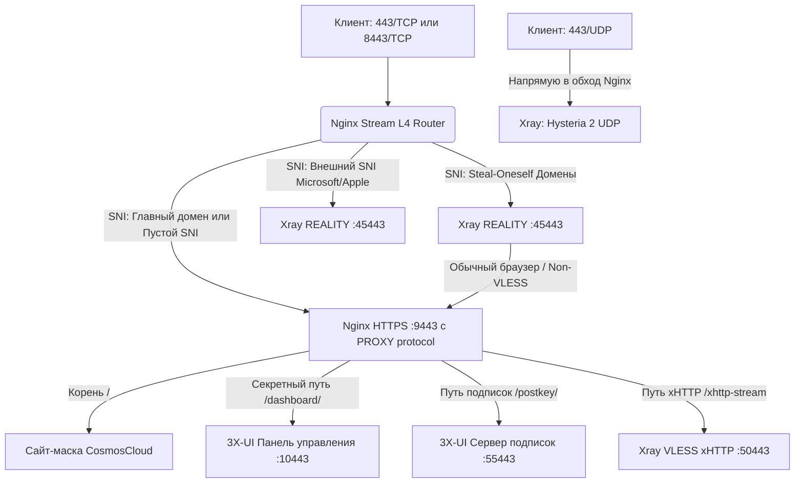

# 🛡️ Hardened VPS & Nginx L4 Stream Router Mask for 3X-UI (v3.3.0 Universal Dual-Mode)

Проект предназначен для автоматизированного развёртывания на чистых операционных системах **Ubuntu (20.04+)** и **Debian (11+)**. Он объединяет скрипт усовершенствованной защиты ОС (`secure-vps.sh`) и официальный L4 Stream-маршрутизатор Nginx (`setup_mask.sh` v3.3.0) с поддержкой панели управления **3X-UI**.

Система оптимизирована для обеспечения максимальной производительности, минимальной задержки (ping) и защиты от активного сетевого сканирования (Active Probing) со стороны систем DPI.

---

## 🌟 Ключевые особенности и архитектурные сценарии

Процесс установки состоит из двух независимых шагов: защиты базового окружения Linux и настройки высокоскоростной маршрутизации Nginx.

### 👥 Выбор сценария REALITY (в скрипте `setup_mask.sh`)

Скрипт v3.3.0 позволяет при установке выбрать оба, либо один из режимов развёртывания:

1. **Режим 1: Steal-Oneself (Кража у самого себя)**
   * SSL-сертификаты Let's Encrypt выпускаются на ваши собственные домены.
   * К одному порту VLESS REALITY можно привязать 1 или несколько собственных доменов.
   * Все обычные HTTPS-запросы к этим доменам прозрачно перенаправляются Xray на локальный Nginx (`127.0.0.1:9443`), где отдается валидный SSL-сертификат и сайт-маска.
2. **Режим 2: Classic External REALITY (Классический внешний камуфляж)**
   * В качестве SNI используются известные внешние ресурсы (`swdist.microsoft.com`, `www.apple.com` и др.).
   * Все ваши домены используются строго под маскировку Nginx, веб-панель 3X-UI, подписки и транспорт xHTTP.

---

### 🛡️ Этап 1: Подготовка VPS и укрепление безопасности (`secure-vps.sh`)
* **Тюнинг сетевого стека (Proxy Tuning):** Оптимизация параметров ядра через `sysctl`. Увеличиваются лимиты сетевых очередей (`somaxconn`, `backlog`), расширяются TCP-буферы (`rmem`, `wmem`), отключается механизм TCP Slow Start после простоя.
* **Системный мониторинг и утилиты:** Опциональная установка диагностических инструментов (`htop`, `btop`, `iperf3`, `iftop`, `tcpdump`, `jq`, `tmux`, `ncdu`, `vnstat` и др.).
* **Активация TCP BBR и отключение IPv6:** Минимизация сетевых задержек за счет алгоритма BBR и полная изоляция IPv6 на уровне ядра и UFW для предотвращения утечек DNS.
* **Строгая политика UFW и Fail2ban:** Блокировка входящих соединений по умолчанию, защита кастомного SSH-порта, фильтрация нежелательного трафика и автоматическая блокировка злоумышленников через Fail2ban.
* **Управление SSH и ключами:** Генерация ключей Ed25519 или импорт пользовательского публичного ключа с опциональным отключением авторизации по паролю.
* **Интеграция 3X-UI:** Автоматическая установка панели с работой через `localhost` без лишних локальных SSL (терминацию берет на себя Nginx).

---

### 🚀 Этап 2: L4 Stream Router и маскировка (`setup_mask.sh` v3.3.0)
* **Мультиплексирование на портах TCP 443 и 8443:** Nginx Stream анализирует SNI-заголовки запросов (`ssl_preread`) без расшифровки TLS-потока:
  * Запросы к **главному домену** или без SNI уходят на локальный HTTPS-бэкенд Nginx (порт 9443).
  * Запросы к **доменам Steal-Oneself** направляются в Xray REALITY на соответствующие внутренние порты.
  * Запросы к **секретному пути панели** и **пути подписок** проксируются на внутренние порты 3X-UI.
* **Шлюз VLESS xHTTP (stream-one / stream-up):** Интеграция транспорта xHTTP через `grpc_pass` (gRPC h2c) или HTTP/1.1 Chunked Proxy без двойного TLS-шифрования.
* **Мультидоменный SSL (Multi-Cert Let's Encrypt):** Выпуск независимых сертификатов для всех доменов через Certbot с автонастройкой прав (`644`) и `deploy-hooks`.
* **Визуальный камуфляж (CosmosCloud):** Имитация интерфейса авторизации и API-запросов облачного сервиса с передачей заголовочных масок.

---

## 📊 Схема движения трафика



---

## 🚀 Быстрый запуск (Два шага)

### Шаг 1: Подготовка VPS и установка 3X-UI
Запустите скрипт оптимизации системы и защиты ОС на чистом сервере:
```bash
wget https://raw.githubusercontent.com/Itman75/Nginx-L4-Stream-Router-Mask-for-3x-ui/main/secure-vps.sh
chmod +x secure-vps.sh
./secure-vps.sh
```

### Шаг 2: Установка L4-роутера и маскировки
Запустите интерактивный скрипт маршрутизации трафика:
```bash
wget https://raw.githubusercontent.com/Itman75/Nginx-L4-Stream-Router-Mask-for-3x-ui/main/setup_mask.sh
chmod +x setup_mask.sh
./setup_mask.sh
```

---

## 🛠 Обязательная настройка после установки

> [!IMPORTANT]
> **ПРАВИЛО РАСПРЕДЕЛЕНИЯ СЕРТИФИКАТОВ:**
> Внутри панели 3X-UI **пути к файлам SSL-сертификатов везде остаются пустыми** (включая инбаунд xHTTP, подписки и панель), так как TLS-шифрование обеспечивает Nginx.
> **Исключение:** Инбаунд Hysteria 2 (UDP). Для него в настройках 3X-UI указываются прямые пути к сертификатам Let's Encrypt.

---

### 1. Настройка инбаунда VLESS REALITY

#### Вариант А: Режим Steal-Oneself (Собственные домены)
* **Порт (Port):** Назначенный скриптом (например, `45443`).
* **IP для прослушивания (Listen IP):** `127.0.0.1`
* **Accept Proxy Protocol (xver):** `1 (Включить)` ⚠️
* **Безопасность (Security):** `Reality`
* **Цель (Dest):** `127.0.0.1:9443` ⚠️ (Локальный HTTPS Nginx)
* **Proxy Protocol для Dest (xver):** `1 (Включить)` ⚠️
* **Server Names (SNI):** Ваши домены Steal-Oneself (по 1 домену на строку).

##### JSON-шаблон (Steal-Oneself):
```json
{
  "listen": "127.0.0.1",
  "port": 45443,
  "protocol": "vless",
  "tag": "in-steal-reality",
  "settings": {
    "clients": [
      {
        "id": "ваш-uuid-клиента",
        "flow": "xtls-rprx-vision"
      }
    ],
    "decryption": "none"
  },
  "streamSettings": {
    "network": "tcp",
    "tcpSettings": {
      "acceptProxyProtocol": true
    },
    "security": "reality",
    "realitySettings": {
      "show": false,
      "xver": 1,
      "dest": "127.0.0.1:9443",
      "serverNames": [
        "your-steal-domain.com",
        "your-steal-domain2.com"
      ],
      "privateKey": "ВАШ_PRIVATE_KEY",
      "shortIds": [
        "16",
        "8888"
      ]
    }
  }
}
```

---

#### Вариант Б: Режим Classic External REALITY (Microsoft / Apple)
* **Порт (Port):** Назначенный скриптом (например, `45443`).
* **IP для прослушивания (Listen IP):** `127.0.0.1`
* **Accept Proxy Protocol (xver):** `1 (Включить)`
* **Безопасность (Security):** `Reality`
* **Цель (Target/Dest):** `swdist.microsoft.com:443` (или `www.apple.com:443`)
* **Proxy Protocol для Dest:** `0 (Выключить)`
* **Server Names (SNI):** `swdist.microsoft.com`

##### JSON-шаблон (Classic External):
```json
{
  "listen": "127.0.0.1",
  "port": 45443,
  "protocol": "vless",
  "tag": "in-classic-reality",
  "settings": {
    "clients": [
      {
        "id": "ваш-uuid-клиента",
        "flow": "xtls-rprx-vision"
      }
    ],
    "decryption": "none"
  },
  "streamSettings": {
    "network": "tcp",
    "tcpSettings": {
      "acceptProxyProtocol": true
    },
    "security": "reality",
    "realitySettings": {
      "show": false,
      "xver": 0,
      "dest": "swdist.microsoft.com:443",
      "serverNames": [
        "swdist.microsoft.com"
      ],
      "privateKey": "ВАШ_PRIVATE_KEY",
      "shortIds": [
        "16",
        "8888"
      ]
    }
  }
}
```

---

### 2. Настройка инбаунда Hysteria 2 (UDP)

* **Порт (Port):** `443` (или `8443`).
* **Протокол (Protocol):** `udp`.
* **IP для прослушивания (Listen IP):** `0.0.0.0`.
* **Безопасность (Security):** `TLS`.
* **Пути к сертификатам:** Файлы Let's Encrypt, выпущенные на Шаге 2.

##### JSON-шаблон Hysteria 2:
```json
{
  "listen": "0.0.0.0",
  "port": 443,
  "protocol": "hysteria",
  "tag": "in-443-hy2",
  "settings": {
    "clients": [
      {
        "id": "ваш-пароль-клиента"
      }
    ],
    "version": 2
  },
  "streamSettings": {
    "network": "hysteria",
    "hysteriaSettings": {
      "version": 2,
      "udpIdleTimeout": 60
    },
    "security": "tls",
    "tlsSettings": {
      "serverName": "your.primary.domain",
      "minVersion": "1.3",
      "maxVersion": "1.3",
      "certificates": [
        {
          "certificateFile": "/etc/letsencrypt/live/your.primary.domain/fullchain.pem",
          "keyFile": "/etc/letsencrypt/live/your.primary.domain/privkey.pem",
          "useFile": true
        }
      ],
      "alpn": [
        "h3"
      ]
    }
  }
}
```

---

### 3. Настройка инбаунда VLESS xHTTP (TCP)

1. **Протокол:** `vless` | **Транспорт (Network):** `xhttp`.
2. **Порт (Port):** Порт xHTTP (по умолчанию `50443`).
3. **IP для прослушивания:** `127.0.0.1`.
4. **Путь (Path):** Секретный путь (по умолчанию `/xhttp-stream`).
5. **Режим (Mode):** `stream-one` (или `stream-up` в зависимости от выбора на Шаге 2).
6. **Безопасность (Security):** `none` (TLS терминирует Nginx).
7. **Accept Proxy Protocol:** `false` ⚠️ (Выключено).

##### JSON-шаблон VLESS xHTTP:
```json
{
  "listen": "127.0.0.1",
  "port": 50443,
  "protocol": "vless",
  "tag": "in-50443-xhttp",
  "settings": {
    "clients": [
      {
        "id": "ваш-uuid-клиента"
      }
    ],
    "decryption": "none"
  },
  "sniffing": {
    "enabled": true,
    "destOverride": [
      "http",
      "tls",
      "quic"
    ]
  },
  "streamSettings": {
    "network": "xhttp",
    "xhttpSettings": {
      "path": "/xhttp-stream",
      "host": "your.primary.domain",
      "mode": "stream-one",
      "xPaddingBytes": "100-1000",
      "xPaddingObfsMode": true
    },
    "security": "none"
  }
}
```

---

### 4. Настройка подписок (Subscriptions)

1. Перейдите в **Настройки панели** -> **Настройки подписок**.
2. **URL обратного прокси:** `https://your.primary.domain/postkey/`
3. **Путь подписки:** `/postkey/`
4. **Порт подписки:** `55443` (Listen IP: `127.0.0.1`).
5. Пути к SSL-сертификатам в подписках оставьте **пустыми**.
6. Нажмите **Сохранить настройки** и выполните **Перезапустить панель**.

---

## 🔒 Таблица портов и правил UFW

После завершения развертывания правила брандмауэра UFW распределяются по следующей схеме:

| Порт / Протокол | Направление | Внешний доступ (WAN) | Назначение |
| :--- | :--- | :--- | :--- |
| `[Ваш SSH порт]/TCP` | Входящий | **Разрешен** | Администрирование VPS |
| `80/TCP` | Входящий | **Разрешен** | Проверки Let's Encrypt (Certbot HTTP-01) |
| `443/TCP` | Входящий | **Разрешен** | Точка входа Nginx Stream (Маска, Панель, Подписки, xHTTP, REALITY) |
| `443/UDP` | Входящий | **Разрешен** | Прямой доступ к Xray (Hysteria 2) |
| `8443/TCP` | Входящий | **Разрешен** | Резервная точка входа Nginx Stream |
| `8443/UDP` | Входящий | **Разрешен** | Резервный порт Hysteria 2 |
| `9443/TCP` | Локальный | **Заблокирован** | Локальный HTTPS Nginx (Маска, обработка PROXY protocol) |
| `10443/TCP` | Локальный | **Заблокирован** | Внутренний интерфейс 3X-UI |
| `50443/TCP` | Локальный | **Заблокирован** | Локальный шлюз VLESS xHTTP |
| `55443/TCP` | Локальный | **Заблокирован** | Локальный сервер подписок 3X-UI |
| `[Порты REALITY]/TCP` | Локальный | **Заблокирован** | Порты инбаундов REALITY (`45443` и др., доступ через Nginx Stream) |

---

*Программное обеспечение предоставляется по принципу «как есть» (As Is) исключительно в ознакомительных и образовательных целях.*
```
