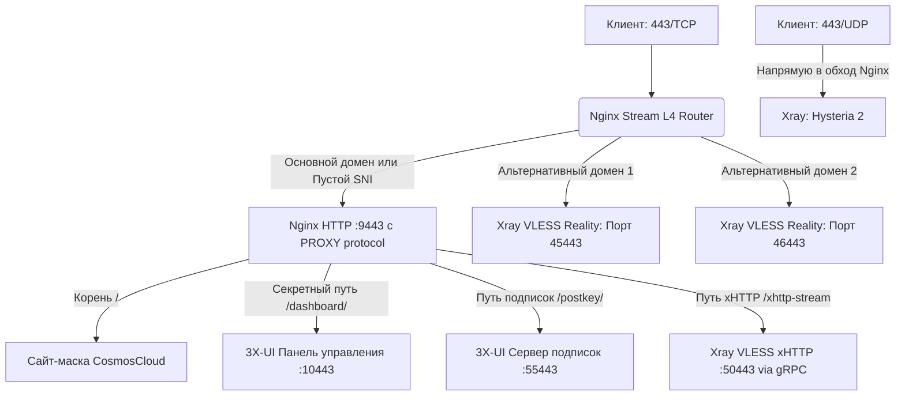

# 🛡️ Hardened VPS & Nginx L4 Stream Router Mask for 3X-UI (v3.1.1 Multi-Cert)

 Проект ориентирован для развёртывания на голые ОС **Ubuntu (20.04+)** и **Debian (11+)**, использует связку из усовершенствованного скрипта безопасности (`secure-vps.sh`) и официальной сборки **Nginx (Stream L4 Hybrid Router)** с поддержкой панели управления **3X-UI**.

Система оптимизирована для достижения максимальной пропускной способности, минимизации сетевых задержек и надежной защиты от активного сетевого сканирования (Active Probing) со стороны систем DPI.

---

## 🌟 Ключевые особенности и архитектура безопасности

Процесс развертывания разделен на два последовательных изолированных этапа: подготовку защищенного окружения ОС и настройку гибридной маршрутизации трафика.

### 1. Этап 1: Подготовка VPS и укрепление безопасности (`secure-vps.sh`)
* **Тюнинг сетевого стека (Proxy Tuning):** Оптимизация параметров ядра через `sysctl`. Для предотвращения потерь пакетов при пиковых нагрузках увеличиваются лимиты сетевых очередей (`somaxconn`, `backlog`), расширяются TCP-буферы (`rmem`, `wmem`), а также деактивируется механизм TCP Slow Start после простоя.
* **Системный мониторинг и утилиты:** Опциональная установка набора диагностических инструментов (`htop`, `btop`, `iperf3`, `iftop`, `tcpdump`, `jq`, `tmux`, `ncdu`, `vnstat` и др.).
* **Активация TCP BBR и отключение IPv6:** Минимизация сетевых задержек за счет алгоритма контроля перегрузок TCP BBR и полная изоляция IPv6 на уровне ядра и брандмауэра UFW для защиты от утечек DNS.
* **Строгая политика UFW и Fail2ban:** Блокировка входящих соединений по умолчанию, защита кастомного SSH-порта, фильтрация нежелательного трафика и автоматическая блокировка злоумышленников через Fail2ban.
* **Управление SSH и ключами:** Поддержка генерации ключей Ed25519 или импорта пользовательского публичного ключа с последующим (опциональным) отключением парольной аутентификации.
* **Интеграция 3X-UI:** Автоматическая установка панели управления нужной версии с настройкой работы через `localhost` без локальных SSL-сертификатов (для корректной интеграции с внешним Nginx).

### 2. Этап 2: Гибридный L4-роутер и маскировка (`setup_mask.sh` / v3.1.1)
* **Мультиплексирование на порту TCP 443 (резервный — 8443):** Модуль Nginx Stream анализирует SNI-заголовки запросов (`ssl_preread`) без расшифровки TLS-потока:
  * Запросы к **основному домену** или без SNI перенаправляются на локальный бэкенд маскировочного сайта.
  * Запросы к **секретному пути панели** и **пути подписок** проксируются на соответствующие внутренние порты 3X-UI.
  * Запросы к **альтернативным доменам** прозрачно маршрутизируются на порты инбаундов VLESS Reality.
* **Шлюз VLESS xHTTP (h2c/gRPC):** Интеграция высокопроизводительного транспорта xHTTP через локальный шлюз `grpc_pass` без двойного шифрования (TLS-in-TLS).
* **Мультидоменный SSL (Multi-Cert Let's Encrypt):** Независимый выпуск и автоматическое обновление сертификатов для главного и дополнительных доменов через Certbot с корректной настройкой прав доступа (`644`) и автоматическими `deploy-hooks`.
* **Продвинутая маскировка (CosmosCloud):** Имитация интерфейса авторизации и API-запросов защищенного облачного сервиса с передачей кастомных заголовков.

---

## 📊 Схема движения трафика



---

## 🚀 Быстрый запуск (Два шага)

### Шаг 1: Подготовка сервера и установка 3X-UI
Запустите скрипт обновления системы, установки утилит и базовой настройки безопасности ОС на чистом сервере:
```bash
wget https://raw.githubusercontent.com/Itman75/Nginx-L4-Stream-Router-Mask-for-3x-ui/main/secure-vps.sh
chmod +x secure-vps.sh
./secure-vps.sh
```
> **Результат выполнения:** Опциональное обновление ОС, установка утилит администрирования, активация BBR, отключение IPv6, создание безопасного sudo-пользователя, импорт или генерация SSH-ключей Ed25519, изменение порта SSH, отключение парольного входа, базовая настройка UFW, Fail2ban и установка панели 3X-UI (без локальных SSL-сертификатов, с проксированием через localhost).

### Шаг 2: Установка L4-роутера и настройка маскировки
Запустите интерактивный скрипт маршрутизации трафика:
```bash
wget https://raw.githubusercontent.com/Itman75/Nginx-L4-Stream-Router-Mask-for-3x-ui/main/setup_mask.sh
chmod +x setup_mask.sh
./setup_mask.sh
```
> **Результат выполнения:** Подключение официального репозитория Nginx, установка Certbot, выпуск сертификатов Let's Encrypt для привязанных доменов, развертывание сайта-маскировки CosmosCloud, конфигурация Stream и HTTP серверов Nginx с интеграцией PROXY-протокола.

---

## 🛠 Обязательная настройка после установки

> [!IMPORTANT]
> **ПРАВИЛО РАСПРЕДЕЛЕНИЯ СЕРТИФИКАТОВ:**
> Внутри панели 3X-UI **пути к файлам SSL-сертификатов везде должны оставаться пустыми** (включая инбаунд xHTTP, подписки и панель). Внешнее TLS-шифрование полностью обеспечивается на стороне Nginx [1.1.2].
> **Исключение:** Инбаунд Hysteria 2 (UDP). Поскольку этот трафик обрабатывается в обход Nginx, в его настройках необходимо явно указать пути к `.pem` файлам сертификатов.

---

### 1. Настройка инбаундов VLESS REALITY


* **Порт (Port):** Локальный порт, назначенный скриптом на Шаге 2 (например, `45443`).
* **IP для прослушивания (Listen IP):** `127.0.0.1` (скрывает порт Reality от внешнего сканирования).
* **Поток (Stream) -> Транспорт:** `TCP` (или `RAW`).
* **Proxy Protocol:** Включен (`true`). 
* **Безопасность (Security):** `Reality`.
* **Xver (Proxy Protocol к декою):** `1` (PROXY protocol v1).
* **Цель (Dest):** `127.0.0.1:9443`.

#### Шаблон конфигурации inbound VLESS Reality (JSON):
```json
{
  "listen": "127.0.0.1",
  "port": 45443,
  "protocol": "vless",
  "tag": "in-45443-tcp",
  "settings": {
    "clients": [
      {
        "id": "ваш-uuid-клиента",
        "flow": "xtls-rprx-vision"
      }
    ],
    "decryption": "none"
  },
  "streamSettings": {
    "network": "tcp",
    "tcpSettings": {
      "acceptProxyProtocol": true,
      "header": {
        "type": "none"
      }
    },
    "security": "reality",
    "realitySettings": {
      "show": false,
      "xver": 1,
      "target": "your.SNI.domain:443",
      "serverNames": [
        "your.SNI.domain"
      ],
      "privateKey": "blablabla",
      "minClientVer": "",
      "maxClientVer": "",
      "maxTimediff": 0,
      "shortIds": [
        "blablabla"
      ],
      "settings": {
        "publicKey": "blablabla",
        "fingerprint": "chrome",
        "spiderX": "/"
      }
    }
  }
}
```

---

### 2. Настройка инбаунда Hysteria 2 (UDP)

* **Порт (Port):** `443` (или `8443`).
* **Протокол (Protocol):** `udp`.
* **IP для прослушивания (Listen IP):** `0.0.0.0`.
* **Безопасность (Security):** `TLS` (шифрование обязательно, так как трафик идет в обход Nginx).
* **Сертификаты (TLS):** Полные пути к файлам Let's Encrypt, выпущенным Certbot на Шаге 2.

#### Шаблон конфигурации инбаунда Hysteria 2 (JSON):
```json
{
  "listen": "0.0.0.0",
  "port": 443,
  "protocol": "hysteria",
  "tag": "in-443-udp",
  "settings": {
    "clients": [
      {
        "id": "клиент-пароль"
      }
    ],
    "version": 2
  },
  "sniffing": {
    "enabled": false
  },
  "streamSettings": {
    "network": "hysteria",
    "hysteriaSettings": {
      "version": 2,
      "udpIdleTimeout": 60,
      "masquerade": {
        "type": "proxy",
        "dir": "",
        "url": "http://127.0.0.1:80",
        "rewriteHost": false,
        "insecure": false,
        "content": "",
        "headers": {},
        "statusCode": 0
      }
    },
     "security": "tls",
    "tlsSettings": {
      "serverName": "your.primary.domain",
      "minVersion": "1.3",
      "maxVersion": "1.3",
      "certificates": [
        {
          "certificateFile": "/etc/letsencrypt/live/your.primary.domain/fullchain.pem",
          "keyFile": "/etc/letsencrypt/live/your.primary.domain/privkey.pem",
          "useFile": true
        }
      ],
      "alpn": [
        "h3"
      ]
    }
  }
}
```


### 3. Настройка инбаунда VLESS xHTTP (TCP)

Для организации подключения по устойчивому к блокировкам транспорту xHTTP (SplitHTTP) выполните следующие действия:

1. Создайте подключение типа **`vless`** со следующими параметрами:
   * **Порт (Port):** Внутренний порт xHTTP, заданный на Шаге 2 (по умолчанию `50443`).
   * **IP для прослушивания (Listen IP):** `127.0.0.1` (изолирует порт внутри сервера).
   * **Сеть (Network):** Выберите **`xhttp`**.
2. В расширенных параметрах транспорта задайте настройки:
   * **Путь (Path):** Секретный путь xHTTP, заданный на Шаге 2 (по умолчанию `/xhttp-stream`).
   * **Хост (Host):** Ваш основной домен (например, `your.primary.domain`).
   * **Режим (Mode):** Строго **`stream-one`** *(Обязательный параметр для корректной gRPC h2c-интеграции со шлюзом Nginx)*.
   * **Padding Bytes:** Диапазон рандомизации пакетов, например `100-1000`.
   * **Padding Obfs Mode:** Включен (`true`).
3. **Безопасность (Security):** Установите значение **`none`** *(так как TLS-терминация трафика полностью обеспечивается веб-сервером Nginx на порту 443)*.
4. **Accept Proxy Protocol:** Выключен (`false`).
5. Рекомендуется активировать **Сниффинг (Sniffing)** для протоколов `http` и `tls` во вкладке сопутствующих параметров для корректной маршрутизации запросов.

---
---

#### Шаблон конфигурации inbound VLESS xHTTP (JSON):
```json
{
  "listen": "127.0.0.1",
  "port": 50443,
  "protocol": "vless",
  "tag": "in-50443-tcp",
  "settings": {
    "clients": [
      {
        "id": "ваш-uuid-клиента"
      }
    ],
    "decryption": "none"
  },
  "sniffing": {
    "enabled": true,
    "destOverride": [
      "http",
      "tls",
      "quic"
    ],
    "metadataOnly": false
  },
  "streamSettings": {
    "network": "xhttp",
    "xhttpSettings": {
      "path": "/xhttp-stream",
      "host": "your.primary.domain",
      "mode": "stream-one",
      "xPaddingBytes": "100-1000",
      "xPaddingObfsMode": true,
      "xPaddingKey": "",
      "xPaddingHeader": "",
      "xPaddingPlacement": "",
      "xPaddingMethod": "",
      "sessionIDPlacement": "",
      "sessionIDKey": "",
      "sessionIDTable": "",
      "sessionIDLength": "",
      "seqPlacement": "",
      "seqKey": "",
      "uplinkDataPlacement": "",
      "uplinkDataKey": "",
      "scMaxEachPostBytes": "",
      "noSSEHeader": false,
      "scMaxBufferedPosts": 30,
      "scStreamUpServerSecs": "20-80",
      "serverMaxHeaderBytes": 0,
      "uplinkHTTPMethod": "",
      "headers": {},
      "scMinPostsIntervalMs": "",
      "uplinkChunkSize": 0,
      "noGRPCHeader": false,
      "enableXmux": true
    },
    "security": "none"
  }
}
```
### 4. Настройка системы подписок (Subscriptions)

Для организации безопасного и маскированного обновления клиентских конфигураций выполните следующие действия:

1. Перейдите в **Настройки панели** -> вкладка **Настройки подписок**.
2. В поле **URI обратного прокси (Subscription URL template)** укажите основной домен без порта (Nginx перенаправит трафик с порта 443):
   ```text
   https://your.primary.domain/postkey/
   ```
3. Убедитесь, что **URI-путь подписки (Subscription path)** имеет значение: `/postkey/`.
4. **Порт подписки (Subscription port):** Укажите порт подписок, заданный на Шаге 2 (по умолчанию `55443`). Порт будет открыт локально (`127.0.0.1`) для проксирования трафика из Nginx.
5. Пути к SSL-сертификатам в настройках подписок оставьте **пустыми**.
6. Нажмите **Сохранить настройки** и выполните команду **Перезапустить панель**.


---

## 🔒 Примерная таблица портов и правил фильтрации (UFW) (при развёртывании порты инбаундов могут выбираться Вами, либо использовать умолчания)

После развертывания брандмауэр UFW разграничивает доступ к ресурсам по следующей схеме:

| Порт / Протокол | Направление | Внешний доступ (WAN) | Назначение |
| :--- | :--- | :--- | :--- |
| `[Ваш порт SSH]/TCP` | Входящий | **Разрешен** | Администрирование сервера |
| `80/TCP` | Входящий | **Разрешен** | Для выпуска/продления сертификатов Let's Encrypt |
| `443/TCP` | Входящий | **Разрешен** | Единая точка входа Nginx Stream (Сайт, Панель, Подписки, xHTTP, VLESS) |
| `443/UDP` | Входящий | **Разрешен** | Прямой доступ к Xray (Hysteria 2) |
| `8443/TCP` | Входящий | **Разрешен** | Резервная точка входа Nginx Stream |
| `8443/UDP` | Входящий | **Разрешен** | Прямой доступ к Xray (Hysteria 2 - Резервный) |
| `9443/TCP` | Локальный | **Заблокирован** | Локальный HTTPS-бэкенд Nginx (сайт-маска, обработка PROXY protocol) |
| `10443/TCP` | Локальный | **Заблокирован** | Внутренний веб-интерфейс 3X-UI |
| `50443/TCP` | Локальный | **Заблокирован** | Локальный шлюз VLESS xHTTP (доступ только через домен Nginx) |
| `55443/TCP` | Локальный | **Заблокирован** | Локальный сервер подписок 3X-UI |
Так-же будут добавлены, выбранные Вами в ходе развёртывания скриптом, локальные заблокированные порты для инбаундов.
---

*Программное обеспечение предоставляется по принципу «как есть» (As Is) исключительно в ознакомительных и образовательных целях для демонстрации принципов разграничения сетевого трафика на транспортном и прикладном уровнях модели OSI.*
