# 🛡️ Hardened VPS & Nginx L4 Stream Router Mask for 3X-UI (v4.1.0 Multi-Port Engine)
### Автоматизированный интерактивный деплой защищенного сервера, L4-маршрутизации Nginx, xHTTP и REALITY-камуфляжа (Мультипортовый движок v4.1.0)
Предлагаемая конфигурация ориентирована для развёртывания на чистых ОС **Ubuntu (20.04 / 22.04 / 24.04)** и **Debian (11 / 12)**. 

Проект развёртывается скриптами усиления безопасности ОС с интеграцией панели управления **3X-UI** (`secure-vps.sh`) и официальный L4 Stream-маршрутизатор Nginx (`setup_mask.sh` v4.1.0), с защитой от активного сетевого сканирования (Active Probing) со стороны систем DPI и полной поддержкой транспортов VLESS REALITY, xHTTP и Hysteria 2.

---

## 🌟 Ключевые особенности v4.1.0 Multi-Port Engine

Проект поддерживает **параллельное или раздельное использование** двух ключевых архитектурных сценариев REALITY на одном VPS:

### 1. Сценарий 1: Steal-Oneself REALITY (Кража у самого себя)
* Выпуск легитимных SSL-сертификатов Let's Encrypt на ваши собственные домены.
* К каждому порту VLESS REALITY привязывается 1 или несколько собственных доменов.
* Все стандартные HTTPS-запросы к этим доменам прозрачно перенаправляются Xray-ом на локальный Nginx (`127.0.0.1:9443`) с передачей `PROXY protocol`, где отдается валидный SSL-сертификат и визуальный камуфляж.

### 2. Сценарий 2: Classic External REALITY (Внешний камуфляж)
* Использование известных внешних ресурсов (`www.samsung.com`, `www.microsoft.com` и др.) в качестве SNI.
* Каждому внешнему SNI назначается свой выделенный локальный порт (`47443`, `48443` и т.д.), что исключает случайную балансировку (Round-Robin) и предотвращает таймауты подключения.

### 3. Шлюз VLESS xHTTP и Hysteria 2
* **xHTTP:** Проксирование через `grpc_pass` (HTTP/2 h2c gRPC-Tunnel `stream-one`) или HTTP/1.1 Chunked Proxy (`stream-up`). SSL терминируется на Nginx.
* **Hysteria 2 (UDP):** Прямая обработка UDP-трафика на порту `443` с использованием выпускаемых сертификатов Let's Encrypt.

### 4. Автоматизация подписок (3X-UI Hosts)
* Полная интеграция с разделом **«Хосты» (Hosts)** в 3X-UI: автоматическое переопределение всех генерируемых ссылок подписки на внешний домен и порт `443`.

---

## 📊 Схема движения трафика

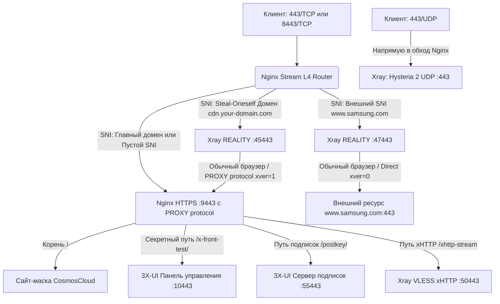
```mermaid
graph TD
    Client443TCP[Клиент: 443/TCP или 8443/TCP] --> NginxStream(Nginx Stream L4 Router)
    Client443UDP[Клиент: 443/UDP] -->|Напрямую в обход Nginx| XrayHysteria[Xray: Hysteria 2 UDP :443]

    NginxStream -->|SNI: Главный домен или Пустой SNI| NginxHTTP[Nginx HTTPS :9443 с PROXY protocol]
    NginxStream -->|SNI: Steal-Oneself Домен cdn.your-domain.com| XrayStealREALITY[Xray REALITY :45443]
    NginxStream -->|SNI: Внешний SNI www.samsung.com| XrayClassicREALITY[Xray REALITY :47443]

    XrayStealREALITY -->|Обычный браузер / PROXY protocol xver=1| NginxHTTP
    XrayClassicREALITY -->|Обычный браузер / Direct xver=0| ExternalSite[Внешний ресурс www.samsung.com:443]
    
    NginxHTTP -->|Корень /| DecoySite[Сайт-маска CosmosCloud]
    NginxHTTP -->|Секретный путь /x-front-test/| Panel3X[3X-UI Панель управления :10443]
    NginxHTTP -->|Путь подписок /postkey/| PanelSub[3X-UI Сервер подписок :55443]
    NginxHTTP -->|Путь xHTTP /xhttp-stream| XrayXHTTP[Xray VLESS xHTTP :50443]
```

---

## 🛠️ Этап 1: Подготовка VPS и защита ОС (`secure-vps.sh`)

На данном этапе производится базовое укрепление безопасности ОС Ubuntu 24.04 / Debian 12, настройка BBR, отключение IPv6, перенос SSH на нестандартный порт, авторизация по ключам Ed25519, активизация UFW и первичная инсталляция панели **3X-UI** без локального SSL.

Выполните на чистом сервере под пользователем `root`:

```bash
wget https://raw.githubusercontent.com/Itman75/Nginx-L4-Stream-Router-Mask-for-3x-ui/main/secure-vps.sh
chmod +x secure-vps.sh
./secure-vps.sh
```

### Галерея выполнения Этапа 1:

| Скачивание и запуск | Оптимизация сети BBR/IPv6 | Настройка SSH и Ключей |
| :---: | :---: | :---: |
| 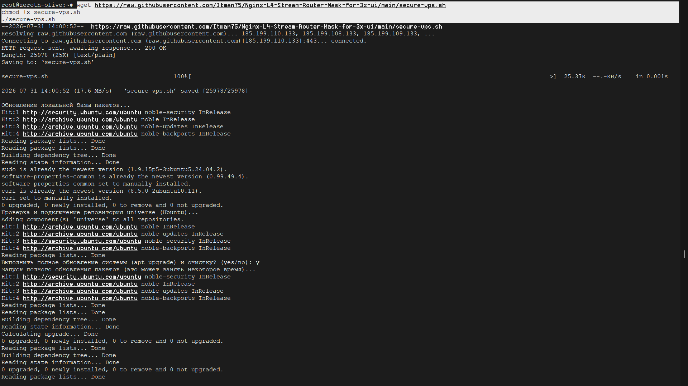 | 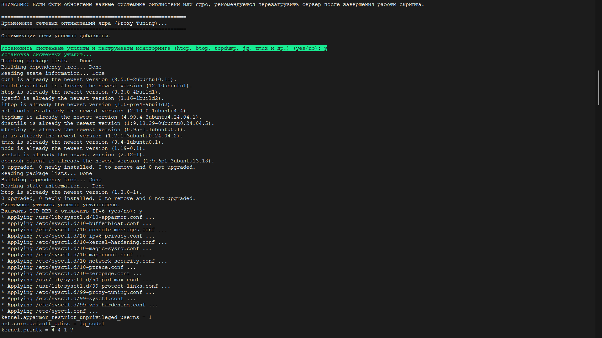 | 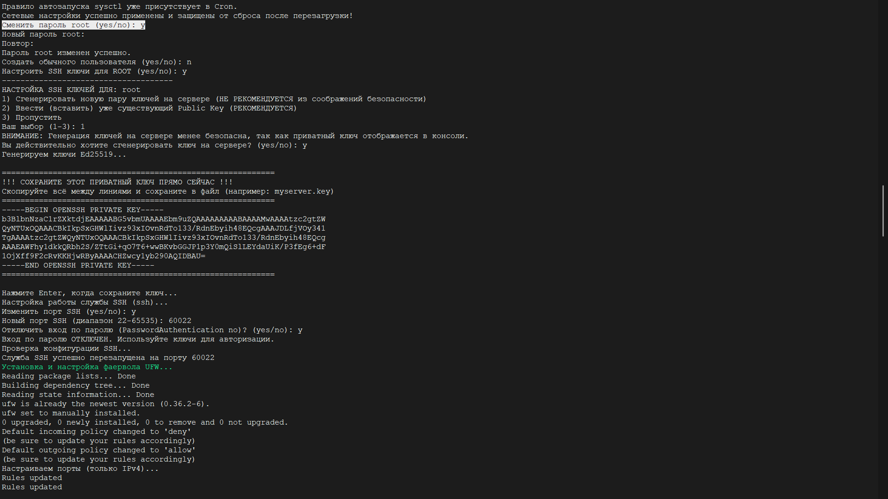 |

| Настройка UFW и Fail2ban | Запуск 3X-UI Инсталлятора | Итоговый отчёт защиты |
| :---: | :---: | :---: |
| 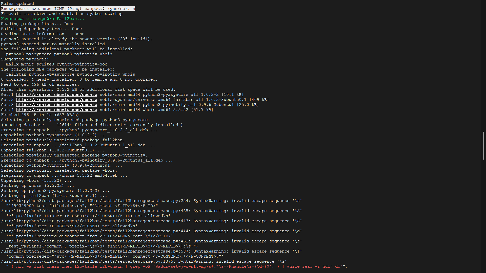 | 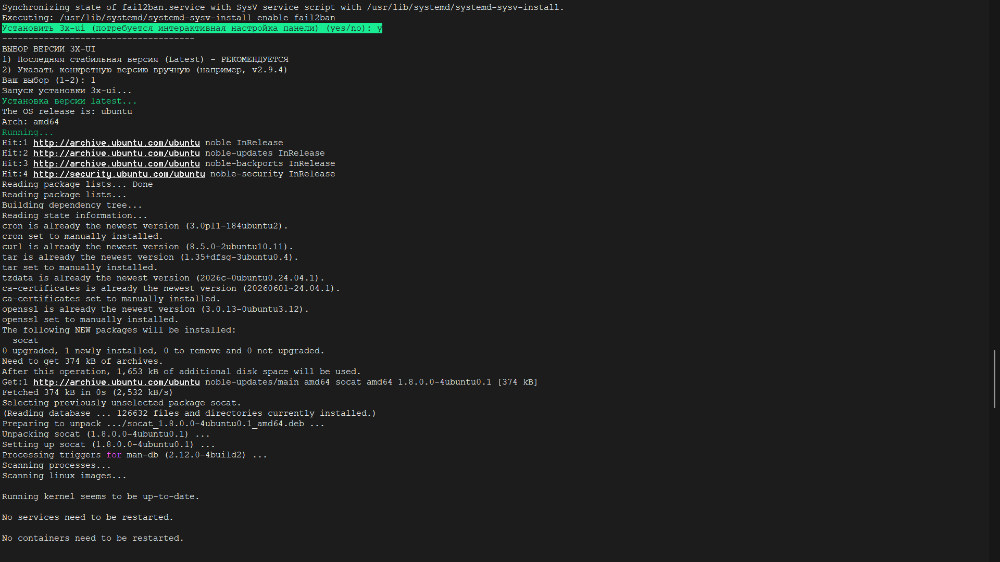 | 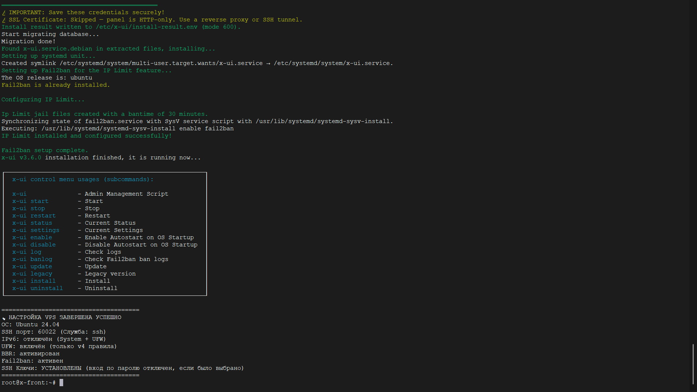 |

**Рекомендуемые ответы при выполнении `secure-vps.sh`:**
* Обновление системы (apt upgrade) и очистка: `y`
* Установка системных утилит (htop, btop и др.): `y`
* Включить TCP BBR и отключить IPv6: `y`
* Сменить пароль root: `y` (или `n`)
* Создать обычного пользователя: `n`
* Настроить SSH ключи для ROOT: `y` -> Выбор `1` (Сгенерировать Ed25519) или `2` (Вставить свой Public Key). *При выборе 1 сохраните приватный ключ!*
* Изменить порт SSH: `y` -> Порт `60022`
* Отключить вход по паролю: `y`
* Блокировать ICMP (Ping): `n`
* Установить 3x-ui: `y` -> Выбор `1` (Latest)
* Установка 3X-UI в инсталляторе:
  * Customize Panel Port: `y` -> Порт `10443`
  * SSL Certificate Setup: **`4`** *(Skip SSL — пропустить, так как TLS терминирует Nginx)*

---

## 🚀 Этап 2: L4 Stream Router и Маскировка Nginx (`setup_mask.sh` v4.1.0)

На данном этапе разворачивается L4 Stream маршрутизатор Nginx, выпускаются SSL-сертификаты Let's Encrypt для всех ваших доменов, создается маскировочный сайт CosmosCloud и настраивается согласование внутренних путей с панелью 3X-UI.

Запустите интерактивный скрипт маршрутизации трафика:

```bash
wget https://raw.githubusercontent.com/Itman75/Nginx-L4-Stream-Router-Mask-for-3x-ui/main/setup_mask.sh
chmod +x setup_mask.sh
./setup_mask.sh
```

### Галерея выполнения Этапа 2:

| Ввод доменов и портов REALITY | Технические порты и режимы | Выпуск SSL Let's Encrypt | Итоговые инструкции терминала |
| :---: | :---: | :---: | :---: |
| 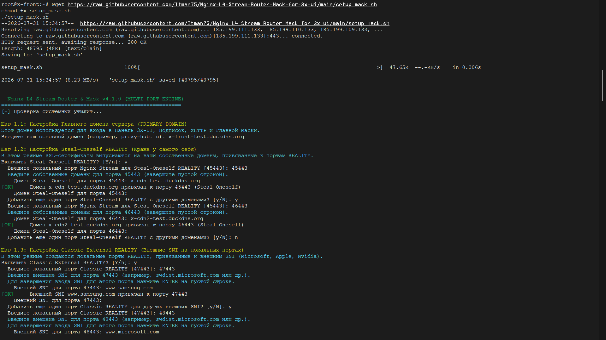 | 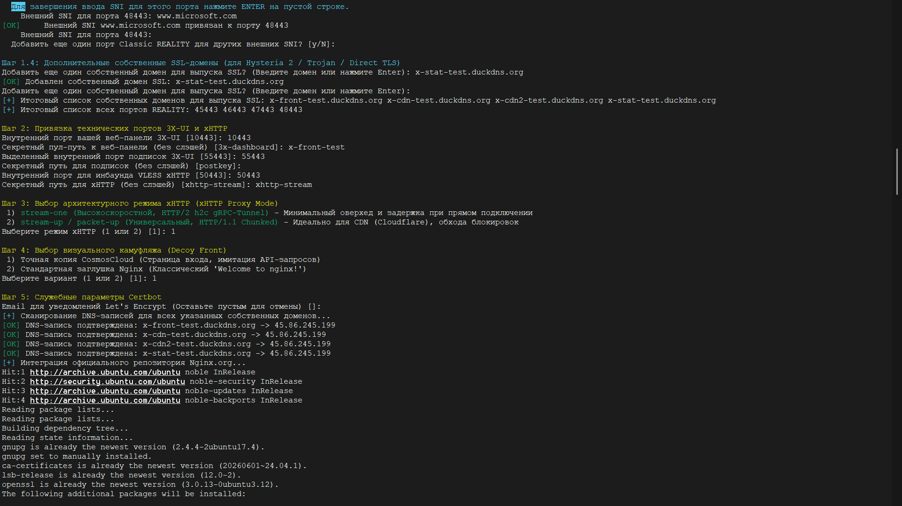 | 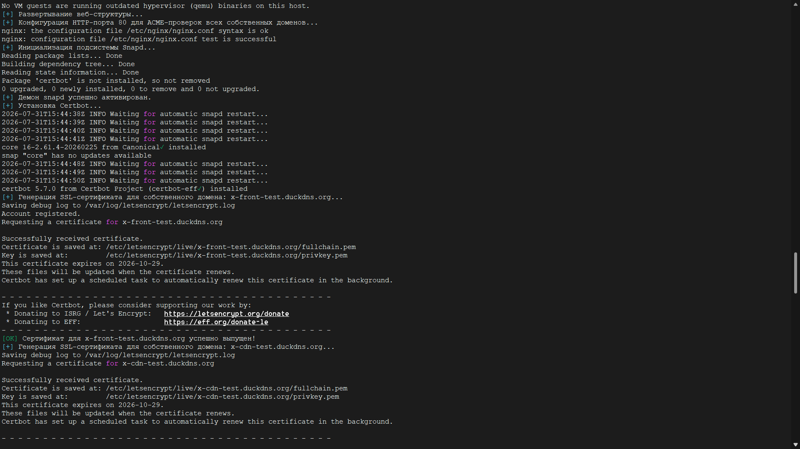 | 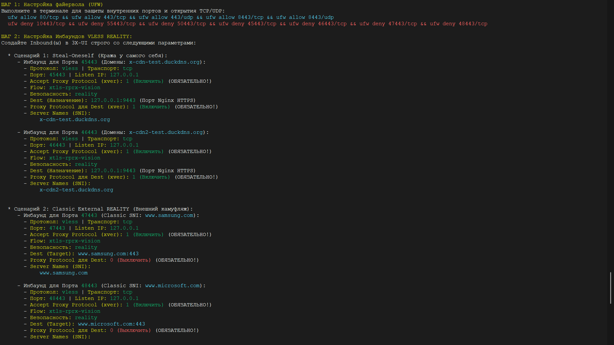 |

**Пример ввода параметров в `setup_mask.sh`:**
* **PRIMARY_DOMAIN (Главный домен):** `your-primary-domain.com`
* **Steal-Oneself REALITY:** `y`
  * Локальный порт Nginx Stream: `45443`
  * Домены для 45443: `cdn.your-domain.com`
  * Добавить еще порт Steal-Oneself? `y` -> Порт `46443`, Домены: `cdn2.your-domain.com` -> Закончить: `n`
* **Classic External REALITY:** `y`
  * Локальный порт Classic REALITY: `47443`, SNI: `www.samsung.com`
  * Добавить еще порт Classic REALITY? `y` -> Порт `48443`, SNI: `www.microsoft.com` -> Закончить: `n`
* **Дополнительные SSL-домены:** `stat.your-domain.com` *(нажмите Enter для завершения)*
* **Внутренний порт 3X-UI:** `10443`
* **Секретный путь к панели:** `x-front-test`
* **Внутренний порт подписок:** `55443`
* **Секретный путь подписок:** `postkey`
* **Внутренний порт xHTTP:** `50443`
* **Секретный путь xHTTP:** `xhttp-stream`
* **Режим xHTTP:** `1` *(stream-one)*
* **Визуальный камуфляж:** `1` *(CosmosCloud)*
* **Email Certbot:** `Enter` *(пропустить)*

---

### Настройка брандмауэра UFW (После setup_mask.sh)

Сразу после завершения `setup_mask.sh` выполните команды файервола для защиты внутренних портов:

```bash
# Разрешаем внешние веб-порты
ufw allow 80/tcp && ufw allow 443/tcp && ufw allow 443/udp && ufw allow 8443/tcp && ufw allow 8443/udp

# Блокируем прямой доступ к внутренним техническим портам
ufw deny 10443/tcp && ufw deny 55443/tcp && ufw deny 50443/tcp && ufw deny 45443/tcp && ufw deny 46443/tcp && ufw deny 47443/tcp && ufw deny 48443/tcp
```

---

## ⚙️ Настройка 3X-UI в Веб-Интерфейсе

### 1. Первичная синхронизация настроек панели

| Авторизация по прямому IP | Изменение URI-пути панели | Настройка подписок без SSL |
| :---: | :---: | :---: |
| 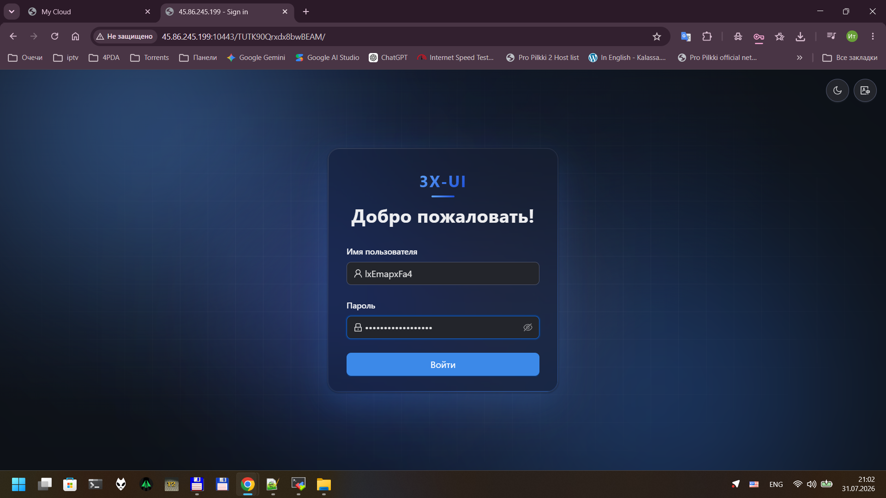 | 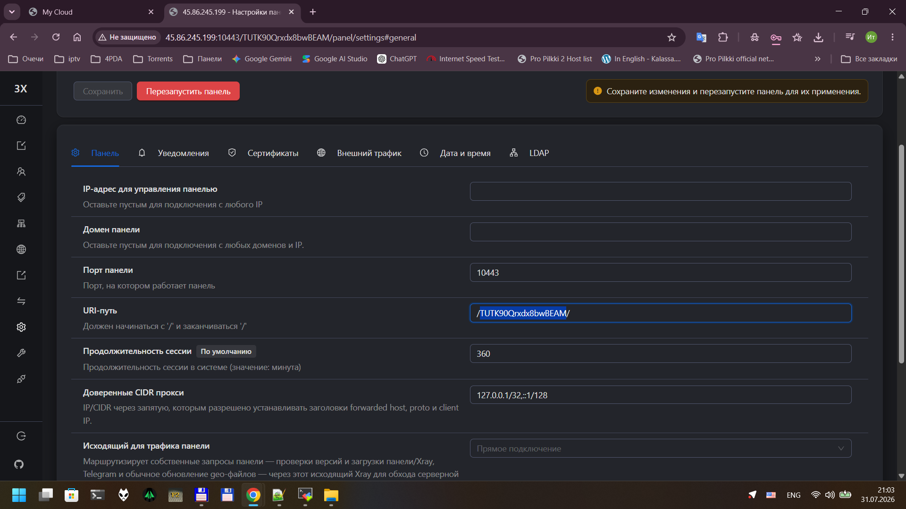 | 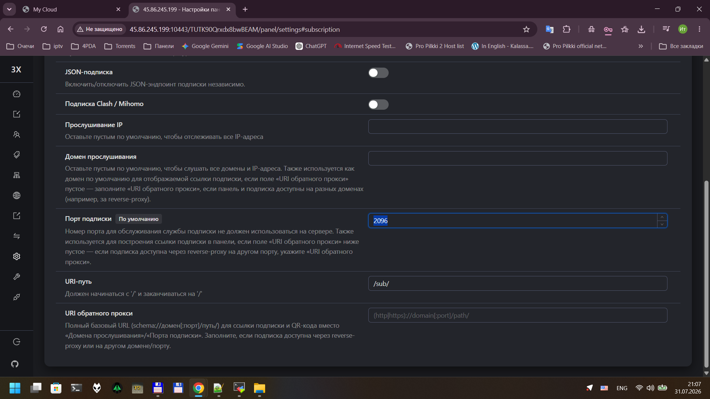 |

1. Откройте панель по временному прямому IP: `http://YOUR_SERVER_IP:10443/ВАШ_ВРЕМЕННЫЙ_ПУТЬ/panel`
2. Перейдите в **Настройки панели** -> **Панель**:
   * **URI-путь:** укажите `/x-front-test/` (согласованный путь с `setup_mask.sh`).
   * Нажмите **Сохранить**.
3. Перейдите в **Настройки панели** -> **Подписка**:
   * Вкладка **Сертификаты**: Поля *Путь к файлу публичного ключа* и *Путь к файлу приватного ключа* оставьте **ПУСТЫМИ**!
   * **Порт подписки:** `55443`
   * **URI-путь:** `/postkey/`
   * **URI обратного прокси:** `https://your-primary-domain.com/postkey/`
   * Нажмите **Сохранить** и выберите **Перезапустить панель**.

> [!SUCCESS]
> Теперь вход в панель доступен по защищенному доменному адресу HTTPS: `https://your-primary-domain.com/x-front-test/`

---

### 2. Конфигурирование Инбаундов Xray

Создайте 4 входящих подключения в разделе **Входящие (Inbounds)**:

#### A. Инбаунд `VLESS_STEAL` (Steal-Oneself REALITY)
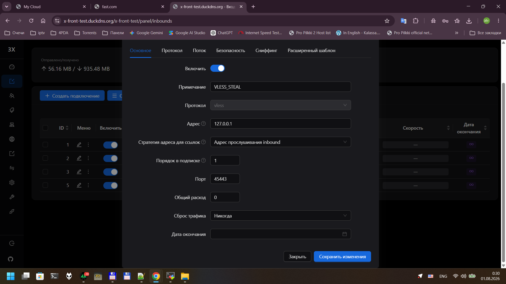
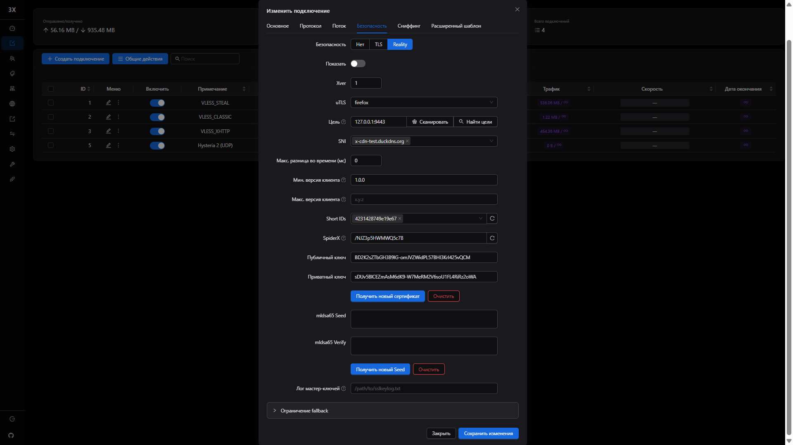

* **Основное:** Порт `45443` | Listen IP `127.0.0.1` | Протокол `vless`
* **Поток:** Транспорт `RAW` (TCP) | Proxy Protocol `true` ⚠️
* **Безопасность:** `Reality` | uTLS `firefox`
* **Xver:** **`1`** ⚠️ *(Обязательно 1!)*
* **Цель (Dest):** `127.0.0.1:9443` ⚠️
* **SNI (Server Names):** `cdn.your-domain.com`
* **Сниффинг:** `true` (`HTTP`, `TLS`)

---

#### B. Инбаунд `VLESS_CLASSIC` (Classic External REALITY)

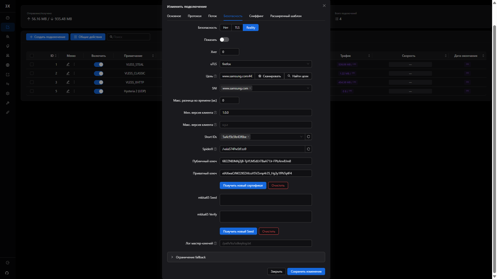

* **Основное:** Порт `47443` | Listen IP `127.0.0.1` | Протокол `vless`
* **Поток:** Транспорт `RAW` (TCP) | Proxy Protocol `true` ⚠️
* **Безопасность:** `Reality` | uTLS `firefox`
* **Xver:** **`0`** ⚠️ *(Обязательно 0!)*
* **Цель (Target):** `www.samsung.com:443`
* **SNI (Server Names):** `www.samsung.com`
* **Сниффинг:** `true` (`HTTP`, `TLS`)

---

#### C. Инбаунд `VLESS_XHTTP` (gRPC / HTTP Proxy)


* **Основное:** Порт `50443` | Listen IP `127.0.0.1` | Протокол `vless`
* **Протокол:** Генерация ключей `ML-KEM-768 (native)`
* **Поток:** Транспорт `XHTTP` | Путь `/xhttp-stream` | Режим `stream-one`
* **Безопасность:** **`none`** ⚠️ *(TLS снимает Nginx)* | Accept Proxy Protocol `false`
* **Сниффинг:** `true` (`HTTP`, `TLS`, `QUIC`)

---

#### D. Инбаунд `Hysteria 2 (UDP)`
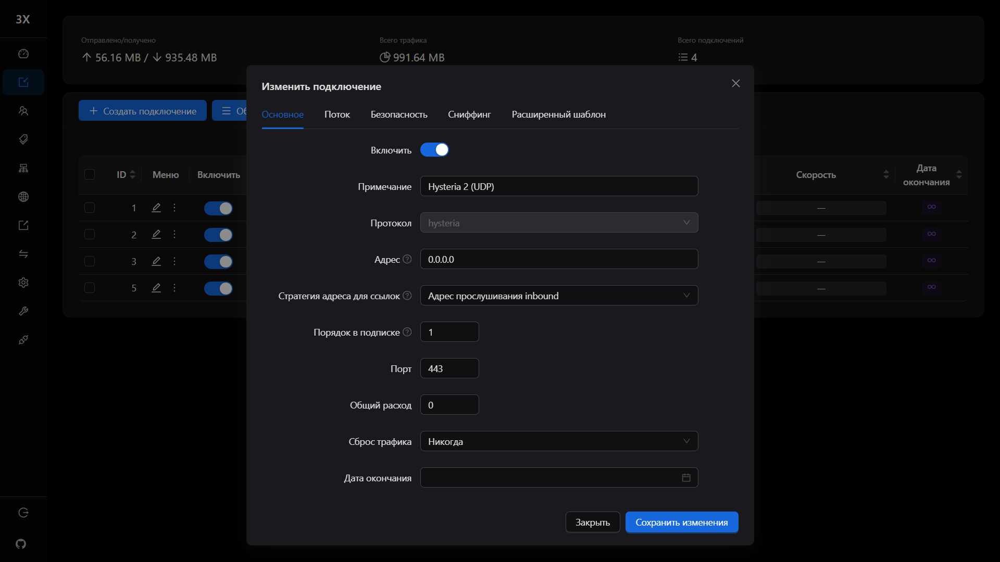
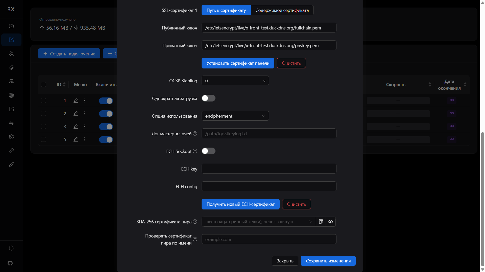

* **Основное:** Порт **`443`** | Listen IP `0.0.0.0` | Протокол `hysteria` (v2)
* **Поток:** Masquerade `proxy` -> `http://127.0.0.1:80` | Congestion `BBR`
* **Безопасность:** `TLS` | SNI `your-primary-domain.com` | ALPN `h3`
* **Пути к сертификатам:** 
  * Публичный ключ: `/etc/letsencrypt/live/your-primary-domain.com/fullchain.pem`
  * Приватный ключ: `/etc/letsencrypt/live/your-primary-domain.com/privkey.pem`
* **Сниффинг:** `true` (`HTTP`, `TLS`, `QUIC`)

---

### Обзор созданных входящих подключений (ALL_INBOUNDS):
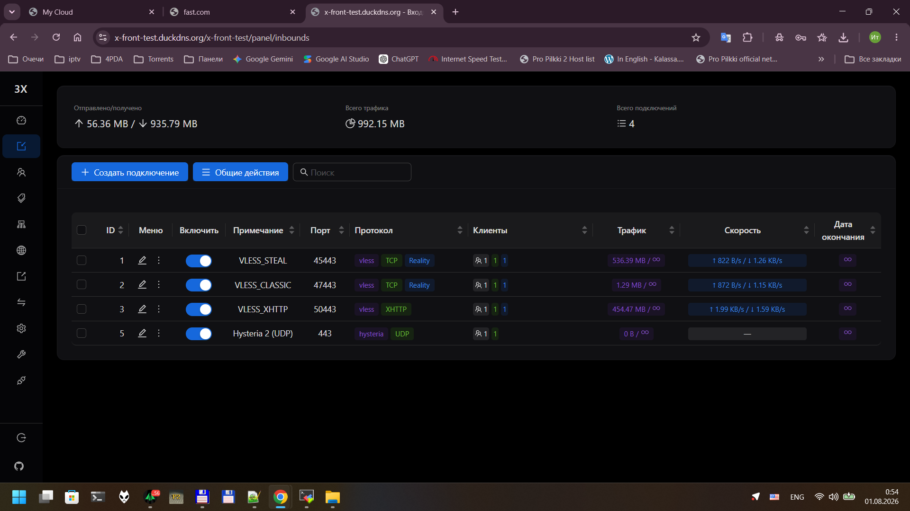

---

### 3. Создание Клиентов и привязка к инбаундам
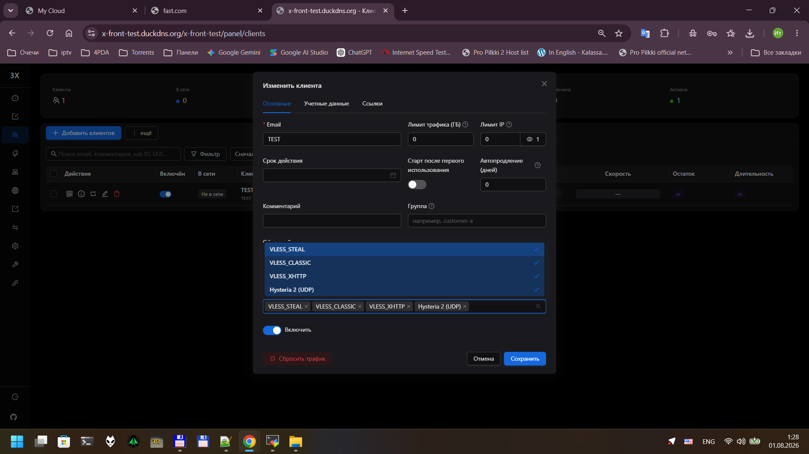
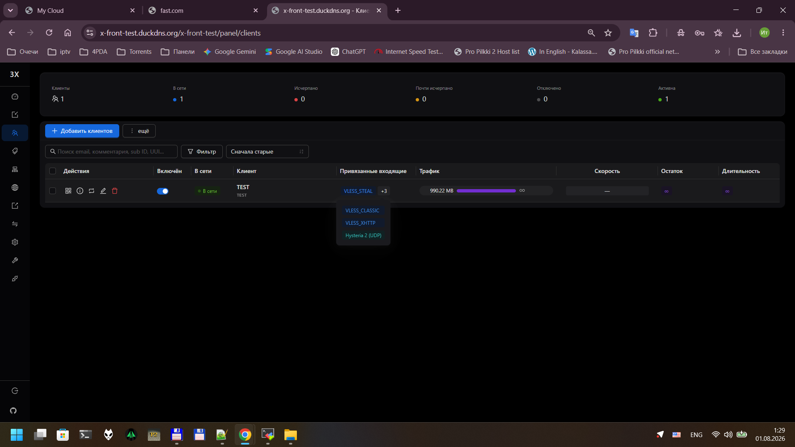

1. Перейдите в раздел **Клиенты** -> **Добавить клиента**.
2. **Email / Имя:** `TEST`
3. **Привязанные входящие:** Отметьте все 4 инбаунда (`VLESS_STEAL`, `VLESS_CLASSIC`, `VLESS_XHTTP`, `Hysteria 2 (UDP)`).
4. **Flow:** Выберите `xtls-rprx-vision`.
5. Нажмите **Сохранить**.

---

### 4. Настройка переопределения подписок (Раздел Хосты) 💡

 Чтобы ссылки клиентов автоматического импорта велели на ваш внешний домен и порт `443`:

| Выбор входов для Хоста | Назначение адреса и порта 443 | Сохранение типа безопасности | Финальный вид таблицы Хостов |
| :---: | :---: | :---: | :---: |
| 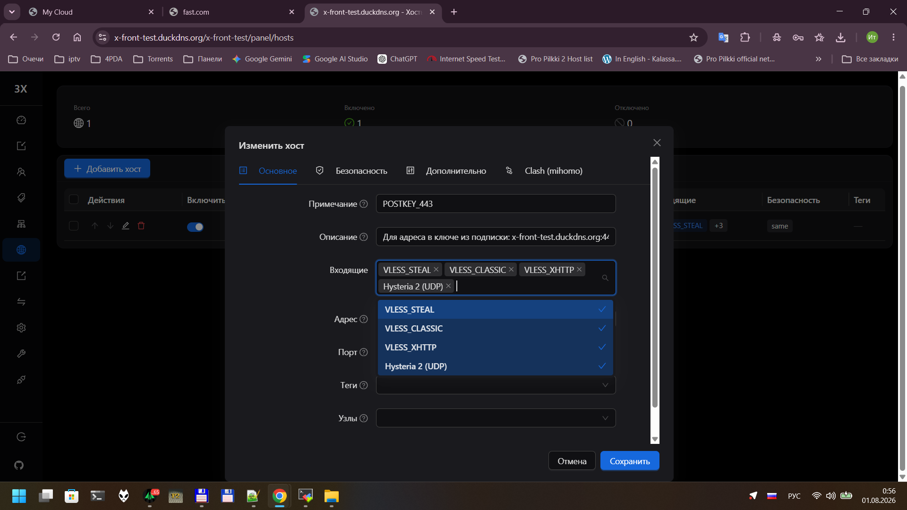 | 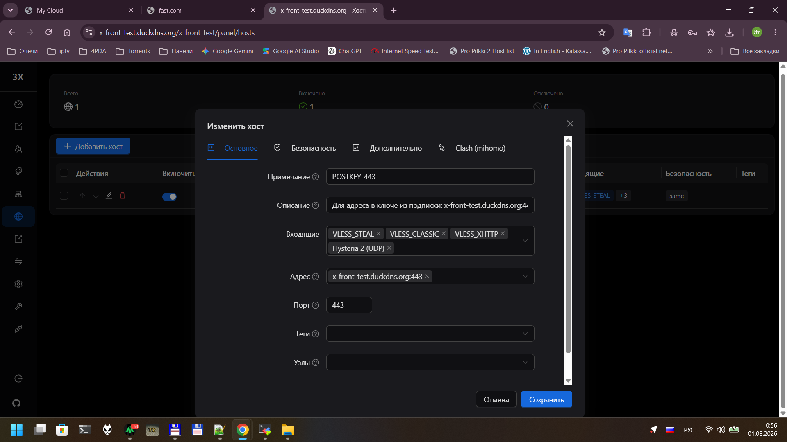 | 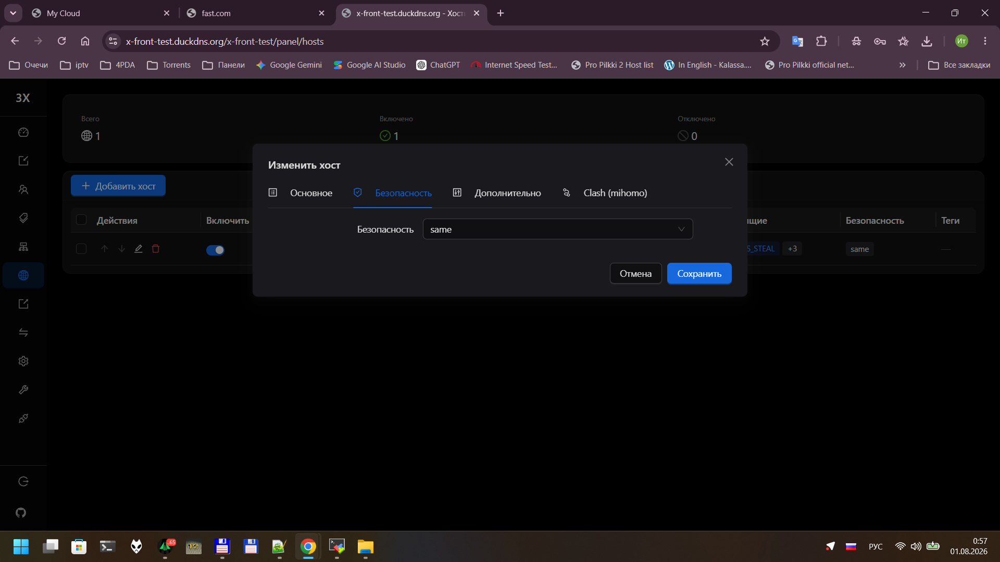 | 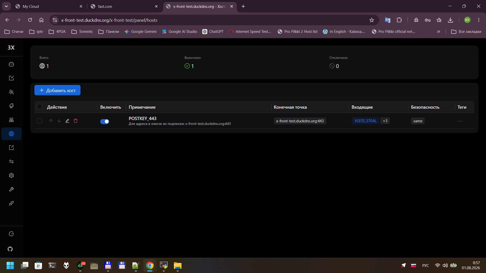 |

1. Перейдите в раздел **Хосты** (Иконка глобуса `🌐`).
2. Нажмите **Добавить хост**:
   * **Примечание:** `POSTKEY_443`
   * **Описание:** `Для адреса в ключе из подписки: your-primary-domain.com:443`
   * **Входящие:** Выделите все 4 инбаунда (`VLESS_STEAL`, `VLESS_CLASSIC`, `VLESS_XHTTP`, `Hysteria 2 (UDP)`).
   * **Адрес (Target Address):** `your-primary-domain.com:443`
   * **Порт:** `443`
   * **Безопасность:** `same`
3. Нажмите **Сохранить**.

---

## 🌐 Проверка работы камуфляжного веб-сайта (Decoy Front)

При обычном заходе браузером на ваш главный домен `https://your-primary-domain.com` отдается интерактивный сайт-маска CosmosCloud:

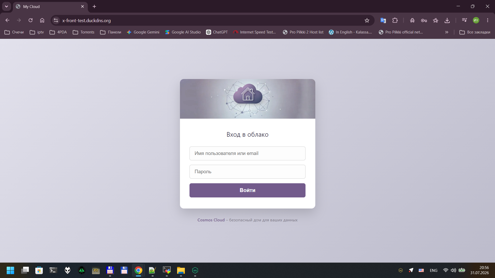

---

## 🔒 Таблица портов и правил UFW

| Порт / Протокол | Направление | Внешний доступ (WAN) | Назначение |
| :--- | :--- | :--- | :--- |
| `60022/TCP` | Входящий | **Разрешен** | Защищенное SSH-подключение |
| `80/TCP` | Входящий | **Разрешен** | ACME-проверки Let's Encrypt (Certbot HTTP-01) |
| `443/TCP` | Входящий | **Разрешен** | Точка входа Nginx Stream (Маска, Панель, Подписки, xHTTP, REALITY) |
| `443/UDP` | Входящий | **Разрешен** | Прямой доступ к Xray (Hysteria 2) |
| `8443/TCP` | Входящий | **Разрешен** | Резервная точка входа Nginx Stream |
| `8443/UDP` | Входящий | **Разрешен** | Резервный порт Hysteria 2 |
| `9443/TCP` | Локальный | **Заблокирован** | Локальный HTTPS Nginx (Маска, обработка PROXY protocol) |
| `10443/TCP` | Локальный | **Заблокирован** | Внутренний интерфейс 3X-UI |
| `50443/TCP` | Локальный | **Заблокирован** | Локальный шлюз VLESS xHTTP |
| `55443/TCP` | Локальный | **Заблокирован** | Локальный сервер подписок 3X-UI |
| `45443/TCP`, `46443/TCP` | Локальный | **Заблокирован** | Порты инбаундов Steal-Oneself REALITY |
| `47443/TCP`, `48443/TCP` | Локальный | **Заблокирован** | Порты инбаундов Classic External REALITY |

---

## 📄 Полные JSON-шаблоны Инбаундов Xray

<details>
<summary><b>1. JSON-конфигурация VLESS REALITY Steal-Oneself (Порт 45443)</b></summary>

```json
{
  "listen": "127.0.0.1",
  "port": 45443,
  "protocol": "vless",
  "tag": "in-steal-reality",
  "settings": {
    "clients": [
      {
        "id": "YOUR_CLIENT_UUID",
        "flow": "xtls-rprx-vision"
      }
    ],
    "decryption": "none"
  },
  "sniffing": {
    "enabled": true,
    "destOverride": ["http", "tls"]
  },
  "streamSettings": {
    "network": "tcp",
    "tcpSettings": {
      "acceptProxyProtocol": true
    },
    "security": "reality",
    "realitySettings": {
      "show": false,
      "xver": 1,
      "dest": "127.0.0.1:9443",
      "serverNames": [
        "cdn.your-domain.com"
      ],
      "privateKey": "YOUR_PRIVATE_KEY",
      "shortIds": [
        "4231428749e19e67"
      ]
    }
  }
}
```
</details>

<details>
<summary><b>2. JSON-конфигурация Classic External REALITY (Порт 47443)</b></summary>

```json
{
  "listen": "127.0.0.1",
  "port": 47443,
  "protocol": "vless",
  "tag": "in-classic-reality",
  "settings": {
    "clients": [
      {
        "id": "YOUR_CLIENT_UUID",
        "flow": "xtls-rprx-vision"
      }
    ],
    "decryption": "none"
  },
  "sniffing": {
    "enabled": true,
    "destOverride": ["http", "tls"]
  },
  "streamSettings": {
    "network": "tcp",
    "tcpSettings": {
      "acceptProxyProtocol": true
    },
    "security": "reality",
    "realitySettings": {
      "show": false,
      "xver": 0,
      "dest": "www.samsung.com:443",
      "serverNames": [
        "www.samsung.com"
      ],
      "privateKey": "YOUR_PRIVATE_KEY",
      "shortIds": [
        "5a4cf5b5fe43f6be"
      ]
    }
  }
}
```
</details>

<details>
<summary><b>3. JSON-конфигурация VLESS xHTTP (Порт 50443)</b></summary>

```json
{
  "listen": "127.0.0.1",
  "port": 50443,
  "protocol": "vless",
  "tag": "in-xhttp",
  "settings": {
    "clients": [
      {
        "id": "YOUR_CLIENT_UUID"
      }
    ],
    "decryption": "none"
  },
  "sniffing": {
    "enabled": true,
    "destOverride": ["http", "tls", "quic"]
  },
  "streamSettings": {
    "network": "xhttp",
    "xhttpSettings": {
      "path": "/xhttp-stream",
      "mode": "stream-one",
      "xPaddingBytes": "100-1000",
      "xPaddingObfsMode": true,
      "xmux": {
        "maxConcurrency": 16,
        "cMaxReuseTimes": 256
      }
    },
    "security": "none"
  }
}
```
</details>

<details>
<summary><b>4. JSON-конфигурация Hysteria 2 UDP (Порт 443)</b></summary>

```json
{
  "listen": "0.0.0.0",
  "port": 443,
  "protocol": "hysteria",
  "tag": "in-hysteria2",
  "settings": {
    "clients": [
      {
        "id": "YOUR_HYSTERIA_AUTH_PASSWORD"
      }
    ],
    "version": 2
  },
  "sniffing": {
    "enabled": true,
    "destOverride": ["http", "tls", "quic"]
  },
  "streamSettings": {
    "network": "hysteria",
    "hysteriaSettings": {
      "version": 2,
      "udpIdleTimeout": 60,
      "masquerade": "http://127.0.0.1:80"
    },
    "security": "tls",
    "tlsSettings": {
      "serverName": "your-primary-domain.com",
      "minVersion": "1.3",
      "maxVersion": "1.3",
      "certificates": [
        {
          "certificateFile": "/etc/letsencrypt/live/your-primary-domain.com/fullchain.pem",
          "keyFile": "/etc/letsencrypt/live/your-primary-domain.com/privkey.pem",
          "useFile": true
        }
      ],
      "alpn": ["h3"]
    }
  }
}
```
</details>

---

*Программное обеспечение предоставляется по принципу «как есть» (As Is) исключительно в ознакомительных и образовательных целях.*
```
