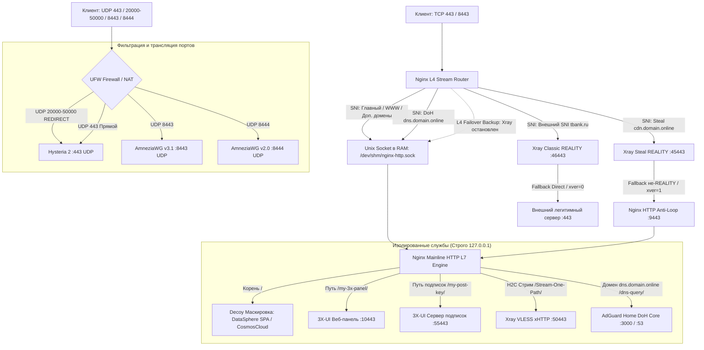

# 🛡️ Hardened Master Engine v2.0 Universal (Public Edition)
### Монолитный автоустановщик: OS Hardening + BBR + Nginx L4/L7 Stream + 3X-UI v3.8.5 + Xray v26.7.28 Pinned + VLESS xHTTP (Native H2C) + ML-KEM-768 + Reality + AdGuard Home DoH + Port Hopping

[](https://ubuntu.com)
[](https://github.com/XTLS/Xray-core)
[](https://github.com/mhsanaei/3x-ui)
[](https://github.com/Itman75/Nginx-L4-Stream-Router-Mask-for-3x-ui)
[](LICENSE)

<p align="center">
  <b>Комплексный автоустановщик высокопроизводительной, отказоустойчивой и скрытной прокси-инфраструктуры.</b><br>
  Разворачивается «из коробки» за 5 минут в диалоговом режиме без необходимости ручной настройки веб-интерфейса панели.
</p>

[Ключевые возможности](#-ключевые-возможности-релиза-v20) •
[Схема движения трафика](#-архитектура-движения-трафика) •
[Быстрый старт](#-быстрый-старт) •
[Параметры опросника](#-интерактивные-параметры-мастера-установки) •
[JSON-шаблоны инбаундов](#-эталонные-json-шаблоны-инбаундов-xray) •
[Клиентские подписки](#-клиентские-подписки-и-совместимость) •
[Настройка роутеров](#-интеграция-adguard-home-doh-с-роутерами) •
[Диагностика](#-диагностика-и-обслуживание) •
[Бэкап и восстановление](#-резервное-копирование-и-восстановление)

---

## ⚙️ Ключевые возможности релиза v2.0

* **Два режима установки (Dual-Mode):**
  * **Clean Install (1)** — установка с нуля для чистых VPS с автоматической генерацией мультипротокольного клиента `Test`.
  * **Safe Migration (2)** — обновление сетевого стека Nginx и ядра Xray на уже работающих серверах со **100% сохранением базы данных, всех существующих клиентов, UUID, ключей, паролей и счетчиков трафика**.
* **Закрепление ядра Xray-core v26.7.28 (Pinned):** Загрузка и атомарная подмена бинарника до первого запуска службы. Панель 3X-UI сразу отображает активный статус: `● Xray · Запущен v26.7.28`.
* **VLESS xHTTP (Полнодуплексный H2C Stream-One):**
  * Сквозное проксирование через Nginx Mainline по протоколу HTTP/2 (`proxy_http_version 2;`) без даунгрейда до HTTP/1.1.
  * Тюнинг буферов окна `http2_recv_buffer_size 16m;` и `http2_max_concurrent_streams 512;`.
  * Устранение проблемы завершающего слэша (Trailing Slash): регулярное выражение Nginx перехватывает запросы как со слэшем на конце, так и без него.
  * Пул соединений XMUX (`maxConcurrency: 0`, `maxConnections: 1-3`, `noSSEHeader: true`) и рандомизированный паддинг пакетов (`xPaddingBytes: 100-500`).
* **Постквантовое шифрование ML-KEM-768:** Нативная генерация симметричной квантово-устойчивой ключевой пары через команду `$XRAY_BIN vlessenc` с интеграцией в инбаунд xHTTP.
* **Steal-Oneself REALITY с защитой Anti-Loop (Порт 9443):** Камуфляж под собственный поддомен `cdn.`. Трафик сканеров цензуры и обычных браузеров прозрачно пересылается Xray на локальный слушатель Nginx `127.0.0.1:9443` с PROXY protocol (`xver: 1`), исключая петлю бесконечной пересылки.
* **Classic External REALITY:** Параллельная маскировка под внешние доверенные SNI (`tbank.ru`, `gateway.icloud.com` и др.) с прямым сбросом неавторизованных пакетов (`xver: 0`).
* **Разблокировка клиентов (`minClientVer: "1.0.0"`):** Устранение жесткого барьера ядра Xray, сбрасывавшего мобильные клиенты и роутеры на сайт-заглушку.
* **Синхронизация структуры БД 3X-UI v3.8.5:** Автоматическое наполнение таблиц `clients`, `client_inbounds` (со связкой `flow_override: xtls-rprx-vision`), `hosts` и `client_traffics` (строго 1 запись на email для предотвращения сбоя `UNIQUE constraint`).
* **Адаптивные мультиформатные подписки:**
  * Автоопределение Clash/Mihomo (`subClashAutoDetect = "true"`): базовая ссылка автоматически отдает YAML-конфиг при запросе совместимого клиента.
  * Принудительный массив JSON (`subJsonAlwaysArray = "true"`): исключает ошибку парсинга одиночных нод в Sing-box/Happ.
* **Hysteria 2 + Port Hopping:** Высокоскоростной QUIC-транспорт на порту `443/udp` с персистентным пулом ротации портов `20000:50000/udp` в таблице `*nat` брандмауэра UFW (защита от провайдерского троттлинга).
* **AmneziaWG (WG3 + Legacy):** AmneziaWG v3.1 для смартфонов и ПК (порт 8443, MTU 1320) и v2.0/Legacy для роутеров Keenetic/OpenWrt (порт 8444, MTU 1360).
* **Приватный AdGuard Home DoH:** Защищенный резолвер со Split-DNS на поддомене `dns.` с авторизацией по токенам `ClientID` (`home-router`).
* **Сетевой Hardening ОС:** Алгоритм TCP BBR + fq, буферы сокетов 16 МБ, персистентный TCP MSS Clamping (`--clamp-mss-to-pmtu`), деактивация IPv6 в `sysctl` и загрузчике GRUB (`ipv6.disable=1`), защита Fail2ban.

---

## 📊 Архитектура движения трафика



---

## 🚀 Быстрый старт

### Требования к серверу:
* **ОС:** Чистая установка **Ubuntu (22.04 / 24.04 / 26.04)** или **Debian (12 / 13)**.
* **Права:** Суперпользователь `root`.
* **Домены:** Минимум 3 сертификата: **1 домен** (yourdomain.online - основной для Nginx и маскировки) и **2 поддомена** (`cdn.yourdomain.online` для Steal REALITY и `dns.yourdomain.online` для AdGuard Home DoH).

> [!CAUTION]
> ### ⚠️ Важно: Режим работы DNS в Cloudflare
> Все DNS A-записи (`yourdomain`, `cdn`, `dns`) в панели Cloudflare **обязаны** находиться строго в режиме **DNS-Only (Серое облако)**.  
> Проксирование Cloudflare (Оранжевое облако) блокирует L4 SNI-маршрутизацию, протокол REALITY и H2C-стриминг xHTTP.

### Команда развертывания:

```bash
bash <(curl -fsSL https://raw.githubusercontent.com/Itman75/Nginx-L4-Stream-Router-Mask-for-3x-ui/main/install.sh)
```

или через `wget`:

```bash
wget -qO- https://raw.githubusercontent.com/Itman75/Nginx-L4-Stream-Router-Mask-for-3x-ui/main/install.sh | bash
```

---

## 📋 Интерактивные параметры мастера установки

| Шаг | Параметр | По умолчанию | Описание |
| :--- | :--- | :--- | :--- |
| **—** | **Режим работы** | `2` (при наличии БД) | `1` — Clean Install (С нуля), `2` — Safe Migration (Обновление с сохранением базы и пользователей). |
| **0** | **Сетевой профиль** | Автодетект | `1` — РФ (Яндекс DNS, DoH over TCP, зеркала), `2` — Зарубежный (Cloudflare DNS, DoQ). |
| **1** | **Основной домен** | — | Ваш домен (например, `yourdomain.online`). |
| **1** | **Email для SSL** | Enter (без почты) | Для сервисных уведомлений Let's Encrypt. |
| **2** | **Системный Hardening** | `y` | BBR, fq, отключение IPv6, лимиты somaxconn, Fail2ban. |
| **2** | **Порт SSH** | Текущий активный | Возможность смены порта SSH и генерации ключей Ed25519. |
| **3** | **Порты и пути панели 3X-UI** | `:10443`, `/my-3x-panel/` | Внутренний сокет и секретный URI веб-интерфейса. |
| **3** | **Сервер подписок** | `:55443`, `/my-post-key/` | Внутренний сокет и секретный префикс раздачи подписок. |
| **3** | **VLESS xHTTP Inbound** | `:50443`, `/Stream-One-Path/` | Локальный H2C-порт и URI стрима xHTTP. |
| **4** | **Steal-Oneself REALITY** | `y` (`:45443`) | Поддомен `cdn.yourdomain.online`, Anti-Loop Fallback на `:9443`. |
| **4** | **Classic REALITY** | `y` (`:46443`) | Автотест пула внешних SNI (`tbank.ru`, `gateway.icloud.com`). |
| **6** | **Hysteria 2 (UDP)** | `y` (`:443`, Режим 2) | QUIC-транспорт. Режим 2 включает Port Hopping (`20000-50000/udp`). |
| **6** | **AmneziaWG v3.1 / v2.0** | `y` (`:8443` / `:8444`) | WG3 для ПК/смартфонов (MTU 1320) и Legacy для роутеров (MTU 1360). |
| **7** | **AdGuard Home DoH** | `y` (`dns.yourdomain.online`)| Приватный DoH-резолвер с защитой токеном ClientID (`home-router`). |
| **8** | **Сайт-маскировка** | `1` | `1` — DataSphere Analytics SPA (Live SLA ±10%), `2` — CosmosCloud, `3` — Nginx Stub. |
| **8** | **Метод SSL** | `1` | `1` — Нативный Certbot HTTP-01 без Snapd, `2` — acme.sh DNS-01 (Cloudflare API). |

> [!IMPORTANT]
> **Действие после завершения установки:**  
> 1. Откройте **новое** окно терминала и проверьте доступ по SSH к настроенному порту.  
> 2. В основном окне выполните команду: `reboot`.  
> После перезагрузки сетевые оптимизации ядра, правила брандмауэра и службы активируются в штатном режиме.

---

## 📄 Эталонные JSON-шаблоны инбаундов Xray

<details>
<summary><b>1. JSON: VLESS REALITY Steal-Oneself (Порт 45443, Anti-Loop Target 127.0.0.1:9443, xver 1)</b></summary>

```json
{
  "listen": "127.0.0.1",
  "port": 45443,
  "protocol": "vless",
  "tag": "in-steal-reality",
  "settings": {
    "clients": [
      {
        "id": "ВАШ_UUID",
        "flow": "xtls-rprx-vision",
        "email": "Test",
        "subId": "SUB_Test",
        "enable": true
      }
    ],
    "decryption": "none"
  },
  "sniffing": {
    "enabled": true,
    "destOverride": ["http", "tls", "quic", "fakedns"]
  },
  "streamSettings": {
    "network": "tcp",
    "security": "reality",
    "tcpSettings": {
      "acceptProxyProtocol": true,
      "header": {
        "type": "none"
      }
    },
    "realitySettings": {
      "show": false,
      "xver": 1,
      "target": "127.0.0.1:9443",
      "dest": "127.0.0.1:9443",
      "serverNames": [
        "cdn.yourdomain.online"
      ],
      "privateKey": "ВАШ_PRIVATE_KEY",
      "minClientVer": "1.0.0",
      "maxClientVer": "",
      "maxTimediff": 0,
      "shortIds": [
        "ВАШ_16_HEX_SHORT_ID"
      ],
      "settings": {
        "publicKey": "ВАШ_PUBLIC_KEY",
        "fingerprint": "firefox",
        "serverName": "",
        "spiderX": "/"
      }
    }
  }
}
```
</details>

<details>
<summary><b>2. JSON: VLESS REALITY Classic External (Порт 46443, Внешний Target:443, xver 0)</b></summary>

```json
{
  "listen": "127.0.0.1",
  "port": 46443,
  "protocol": "vless",
  "tag": "in-classic-reality",
  "settings": {
    "clients": [
      {
        "id": "ВАШ_UUID",
        "flow": "xtls-rprx-vision",
        "email": "Test",
        "subId": "SUB_Test",
        "enable": true
      }
    ],
    "decryption": "none"
  },
  "sniffing": {
    "enabled": true,
    "destOverride": ["http", "tls", "quic", "fakedns"]
  },
  "streamSettings": {
    "network": "tcp",
    "security": "reality",
    "tcpSettings": {
      "acceptProxyProtocol": true,
      "header": {
        "type": "none"
      }
    },
    "realitySettings": {
      "show": false,
      "xver": 0,
      "target": "tbank.ru:443",
      "dest": "tbank.ru:443",
      "serverNames": [
        "tbank.ru"
      ],
      "privateKey": "ВАШ_PRIVATE_KEY",
      "minClientVer": "1.0.0",
      "maxClientVer": "",
      "maxTimediff": 0,
      "shortIds": [
        "ВАШ_16_HEX_SHORT_ID"
      ],
      "settings": {
        "publicKey": "ВАШ_PUBLIC_KEY",
        "fingerprint": "firefox",
        "serverName": "",
        "spiderX": "/"
      }
    }
  }
}
```
</details>

<details>
<summary><b>3. JSON: VLESS xHTTP Stream-One + ML-KEM-768 + XMUX + Vision (Порт 50443)</b></summary>

```json
{
  "listen": "127.0.0.1",
  "port": 50443,
  "protocol": "vless",
  "tag": "in-xhttp-stream",
  "settings": {
    "clients": [
      {
        "id": "ВАШ_UUID",
        "flow": "xtls-rprx-vision",
        "email": "Test",
        "subId": "SUB_Test",
        "enable": true
      }
    ],
    "decryption": "ВАШ_ML_KEM_768_DECRYPTION_KEY",
    "encryption": "ВАШ_ML_KEM_768_ENCRYPTION_KEY"
  },
  "sniffing": {
    "enabled": true,
    "destOverride": ["http", "tls", "quic", "fakedns"]
  },
  "streamSettings": {
    "network": "xhttp",
    "xhttpSettings": {
      "path": "/Stream-One-Path/",
      "host": "yourdomain.online",
      "mode": "stream-one",
      "noSSEHeader": true,
      "xPaddingBytes": "100-500",
      "xPaddingObfsMode": true,
      "xPaddingKey": "X-Amz-Meta-Trace",
      "xmux": {
        "maxConcurrency": "0",
        "maxConnections": "1-3",
        "cMaxReuseTimes": "300-600",
        "hKeepAlivePeriod": 600
      }
    },
    "security": "none"
  }
}
```
</details>

<details>
<summary><b>4. JSON: Hysteria 2 UDP (Порт 443 + Port Hopping 20000-50000)</b></summary>

```json
{
  "listen": "0.0.0.0",
  "port": 443,
  "protocol": "hysteria",
  "tag": "in-hysteria2",
  "settings": {
    "clients": [
      {
        "id": "ВАШ_ПАРОЛЬ_АВТОРИЗАЦИИ",
        "auth": "ВАШ_ПАРОЛЬ_АВТОРИЗАЦИИ",
        "email": "Test",
        "subId": "SUB_Test",
        "enable": true
      }
    ],
    "version": 2
  },
  "sniffing": {
    "enabled": true,
    "destOverride": ["http", "tls", "quic", "fakedns"]
  },
  "streamSettings": {
    "network": "hysteria",
    "hysteriaSettings": {
      "version": 2,
      "udpIdleTimeout": 60,
      "masquerade": {
        "type": "proxy",
        "url": "http://127.0.0.1:80"
      }
    },
    "security": "tls",
    "tlsSettings": {
      "serverName": "yourdomain.online",
      "minVersion": "1.3",
      "maxVersion": "1.3",
      "certificates": [
        {
          "certificateFile": "/etc/letsencrypt/live/yourdomain.online/fullchain.pem",
          "keyFile": "/etc/letsencrypt/live/yourdomain.online/privkey.pem"
        }
      ],
      "alpn": [
        "h3"
      ]
    }
  }
}
```
</details>

<details>
<summary><b>5. JSON: AmneziaWG v3.1 (Transport Protection — Порт 8443)</b></summary>

```json
{
  "listen": "0.0.0.0",
  "port": 8443,
  "protocol": "amneziawg",
  "tag": "in-8443-udp",
  "settings": {
    "clients": [
      {
        "privateKey": "CLIENT_PRIVATE_KEY",
        "publicKey": "CLIENT_PUBLIC_KEY",
        "allowedIPs": [
          "10.8.1.3/32"
        ],
        "email": "Test",
        "subId": "SUB_Test",
        "enable": true
      }
    ],
    "server": {
      "contentPaddingAddition": "3-16",
      "disableCookies": true,
      "h1": "",
      "h2": "",
      "h3": "",
      "h4": "",
      "jc": 4,
      "jmax": 160,
      "jmin": 50,
      "keepaliveTimeout": "8-10",
      "maxHandshakeAttempts": "21-26",
      "mtu": 1320,
      "primaryDns": "8.8.8.8",
      "privateKey": "SERVER_PRIVATE_KEY",
      "publicKey": "SERVER_PUBLIC_KEY",
      "randomTrailers": false,
      "rejectAfterTime": "178-211",
      "rekeyAfterTime": "107-135",
      "rekeyTimeout": "3-4",
      "s1": 45,
      "s2": 60,
      "s3": 24,
      "s4": 16,
      "secondaryDns": "8.8.4.4",
      "subnetCidr": 24,
      "subnetIp": "10.8.1.0"
    }
  }
}
```
</details>

<details>
<summary><b>6. JSON: AmneziaWG v2.0 / Legacy (Для Роутеров Keenetic/OpenWrt — Порт 8444)</b></summary>

```json
{
  "listen": "0.0.0.0",
  "port": 8444,
  "protocol": "amneziawg",
  "tag": "in-awg-v2-legacy",
  "settings": {
    "clients": [
      {
        "privateKey": "CLIENT_PRIVATE_KEY",
        "publicKey": "CLIENT_PUBLIC_KEY",
        "allowedIPs": [
          "10.8.2.3/32"
        ],
        "email": "Test",
        "subId": "SUB_Test",
        "enable": true
      }
    ],
    "server": {
      "h1": "149419586",
      "h2": "878791997",
      "h3": "1251051976",
      "h4": "1657628296",
      "jc": 4,
      "jmax": 160,
      "jmin": 50,
      "mtu": 1360,
      "primaryDns": "8.8.8.8",
      "secondaryDns": "8.8.4.4",
      "privateKey": "SERVER_PRIVATE_KEY",
      "publicKey": "SERVER_PUBLIC_KEY",
      "subnetCidr": 24,
      "subnetIp": "10.8.2.0"
    }
  }
}
```
</details>

---

## 📱 Клиентские подписки и совместимость

Все реквизиты доступа сохраняются в защищенный файл: **`/root/vpn_credentials.txt`** (`chmod 600`).  
В режиме чистой установки генерируется клиент **Test** со следующими ссылками:

* **Адаптивная подписка (Base64 / Clash Auto-Detect):**  
  `https://yourdomain.online/my-post-key/SUB_Test`  
  *(При вставке в Clash/Mihomo автоматически отдает Clash YAML, в v2rayNG — Base64, в браузере — страницу с QR-кодами).*
* **Выделенная ссылка Clash / Mihomo YAML:**  
  `https://yourdomain.online/sub-clash/SUB_Test` *(или с параметром `?clash=1`)*
* **JSON-подписка (Sing-box / Happ / SFI / Karing):**  
  `https://yourdomain.online/my-post-key/sub-json/SUB_Test`

### Совместимость клиентских приложений:

| Клиент | Платформа | VLESS xHTTP + ML-KEM | VLESS REALITY | Hysteria 2 | AmneziaWG | Формат подписки |
| :--- | :--- | :---: | :---: | :---: | :---: | :--- |
| **Clash Verge Rev** / **Mihomo Party** | Windows, macOS, Linux | ✔️ | ✔️ | ✔️ | ❌ | Clash YAML |
| **Flclash** / **Karing** | Android, iOS, Windows, macOS | ✔️ | ✔️ | ✔️ | ❌ | Clash YAML / Base64 |
| **Happ Proxy** / **Streisand** | iOS, iPadOS | ✔️ | ✔️ | ✔️ | ✔️ (WG3) | Clash YAML / JSON / Base64 |
| **v2rayNG** / **NekoBox** | Android | ✔️ | ✔️ | ✔️ | ✔️ | Base64 / Clash YAML |
| **v2rayN** (v6.40+) | Windows | ✔️ | ✔️ | ✔️ | ❌ | Base64 / Xray JSON |
| **Keenetic** / **OpenWrt (Podkop)** | Роутеры | ✔️ | ✔️ | ✔️ (клиент) | ✔️ (Legacy) | Ручной импорт / AWG conf |

---

## 🌐 Интеграция AdGuard Home DoH с роутерами

AdGuard Home защищен персональным идентификатором `ClientID` (по умолчанию `home-router`). Неавторизованные запросы ботов отбрасываются.

* **Панель управления:** `https://dns.yourdomain.online/`
* **DoH URL для роутеров:** `https://dns.yourdomain.online/dns-query/home-router`

### 1. Keenetic (KeeneticOS 3.x / 4.x):
1. Веб-интерфейс Keenetic -> **«Сетевые правила»** -> **«Интернет-фильтр»** (вкладка «Серверы DNS»).
2. Добавьте сервер DNS:
   * **Адрес DNS (Bootstrap):** `77.88.8.8` или `1.1.1.1` *(не указывайте IP сервера: порт 53 закрыт фаерволом снаружи)*;
   * **Протокол:** `DNS-over-HTTPS (DoH)`;
   * **URL-адрес:** `https://dns.yourdomain.online/dns-query/home-router`;
   * **SNI:** `dns.yourdomain.online`.
3. Включите опцию **«Игнорировать DNS провайдера»** и сохраните.

### 2. OpenWrt (Пакет Podkop):
1. В LuCI откройте **«Службы»** -> **«Podkop»** -> **«Настройки»**.
2. В параметрах DNS задайте:
   * **Протокол:** `DNS через HTTPS (DoH)`;
   * **DNS-сервер:** (без `https://`) `dns.yourdomain.online/dns-query/home-router`;
   * **Bootstrap DNS:** `77.88.8.8` или `1.1.1.1`.
3. Примените настройки.

---

## 🩺 Диагностика и обслуживание

```bash
# 1. Проверка синтаксиса и статуса Nginx Mainline
nginx -t && systemctl status nginx --no-pager

# 2. Проверка сокета оперативной памяти
ls -la /dev/shm/nginx-http.sock

# 3. Тест ответа веб-маскировки (HTTP/2 TLS)
curl -Iv --http2 https://yourdomain.online

# 4. Проверка шлюза xHTTP (должен отдавать 404 Not Found)
curl -Iv --http2 https://yourdomain.online/Stream-One-Path/

# 5. Тест работы приватного DoH AdGuard Home
curl -Iv "https://dns.yourdomain.online/dns-query/home-router?dns=AAABAAABAAAAAAAAA3d3dwdleGFtcGxlA2NvbQAAAQAB"

# 6. Проверка локальных сокетов служб
ss -tlnp | grep -E '10443|55443|50443|45443|46443|9443|3000'

# 7. Проверка правил UFW и активных перенаправлений NAT Port Hopping
ufw status verbose
iptables -t nat -L PREROUTING -n -v
iptables -t mangle -L FORWARD -n -v

# 8. Инспекция базы данных SQLite через CLI
sqlite3 /etc/x-ui/x-ui.db "SELECT id, remark, port, protocol FROM inbounds;"
sqlite3 /etc/x-ui/x-ui.db "SELECT id, email, sub_id FROM clients;"
```

---

## 💾 Резервное копирование и восстановление

### Создание резервной копии:
```bash
systemctl stop x-ui AdGuardHome 2>/dev/null || true
tar -czvf /root/backup_vpn_$(date +%F).tar.gz \
  /etc/nginx \
  /etc/letsencrypt \
  /etc/ssl/acme \
  /opt/AdGuardHome/AdGuardHome.yaml \
  /etc/x-ui \
  /var/www/html \
  /etc/ufw/before.rules
systemctl start x-ui AdGuardHome 2>/dev/null || true
```

### Восстановление:
```bash
systemctl stop x-ui nginx AdGuardHome 2>/dev/null || true
rm -f /etc/x-ui/x-ui.db-wal /etc/x-ui/x-ui.db-shm
tar -xzvf /root/backup_vpn_YYYY-MM-DD.tar.gz -C /
nginx -t && systemctl start nginx x-ui AdGuardHome
```

---

## 📄 Лицензия

Проект распространяется под свободной лицензией **MIT**. Подробная информация содержится в файле [LICENSE](LICENSE).
