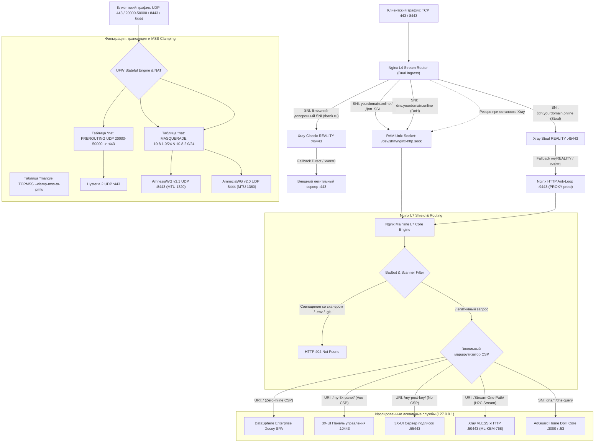

# 🛡️ Hardened Master Engine v3.1 Universal (Production Hardened Release)
### Монолитный автоустановщик: OS Hardening + BBR + Nginx L4/L7 Stream + 3X-UI + Xray v26.7.28 Pinned + VLESS xHTTP (Native H2C) + ML-KEM-768 + Multi-Port REALITY + Dynamic AGH DoH + Zonal CSP + Hardened AWG L3

[](https://ubuntu.com)
[](https://github.com/XTLS/Xray-core)
[](https://github.com/mhsanaei/3x-ui)
[](https://github.com/Itman75/Nginx-L4-Stream-Router-Mask-for-3x-ui)
[](LICENSE)

<p align="center">
  <b>Комплексный инструмент автоматизированного развертывания скрытной, устойчивой к цензуре и высокопроизводительной прокси-инфраструктуры.</b><br>
  Конфигурация ядра Xray, веб-шлюза Nginx Mainline, фаервола UFW, DNS и маскировочного сайта генерируется монолитно и атомарно в интерактивном режиме.
</p>

---

## 📑 Содержание

1. [Ключевые возможности релиза v3.1](#-ключевые-возможности-релиза-v31)
2. [Архитектура движения трафика](#-архитектура-движения-трафика)
3. [Быстрый старт и системные требования](#-быстрый-старт-и-системные-требования)
4. [Интерактивные параметры мастера установки](#-интерактивные-параметры-мастера-установки)
5. [Эталонные JSON-шаблоны инбаундов Xray](#-эталонные-json-шаблоны-инбаундов-xray)
6. [Клиентские подписки и совместимость](#-клиентские-подписки-и-совместимость)
7. [Интеграция AdGuard Home DoH с роутерами](#-интеграция-adguard-home-doh-с-роутерами)
8. [Инженерная диагностика и аудит](#-инженерная-диагностика-и-аудит)
9. [Резервное копирование и восстановление](#-резервное-копирование-и-восстановление)
10. [Лицензия](#-лицензия)

---

## ⚙️ Ключевые возможности релиза v3.1

* **Два режима развертывания (Dual-Mode):**
  * **Clean Install (1)** — первичное развертывание «с нуля» на чистых серверах с генерацией тестового мультипротокольного клиента `Test`.
  * **Safe Migration (2)** — безопасное обновление стека Nginx, правил фильтрации и ядра Xray на действующих серверах со **100% сохранением существующей базы данных SQLite, всех учетных записей, UUID, персональных ключей, истории сессий и статистики**.
* **Зональная архитектура CSP (Zonal Content Security Policy):**
  * **Публичная зона (Decoy Front):** строгий стандарт Zero-Trust (`default-src 'self'; script-src 'self'; style-src 'self'; img-src 'self' data:; object-src 'none'; base-uri 'self'; form-action 'self'; frame-ancestors 'none';`). Полный отказ от `'unsafe-inline'` и `'unsafe-eval'`.
  * **Служебная зона (Веб-панель 3X-UI):** изолированный переопределенный профиль CSP, поддерживающий реактивный рендеринг Vue.js 3 и WebSockets (`ws:`, `wss:`, `'unsafe-inline'`, `'unsafe-eval'`).
  * **Зона подписок:** отключение передачи заголовков CSP (`proxy_hide_header Content-Security-Policy`) во избежание конфликтов парсинга в клиентских приложениях.
* **Маскировочный комплекс DataSphere Analytics Enterprise:**
  * Полноценный SPA-лендинг платформы распределенных вычислений с модульной архитектурой: внешние стили (`/assets/css/datasphere.css`), внешний контроллер (`/assets/js/datasphere.js`), векторная графика SVG и метаданные OpenGraph.
  * Интеграция с **Web Cryptography API** (`window.crypto.getRandomValues`) для генерации сессионных токенов и аппаратной эмуляции метрик Anycast-кластера (SLA 99.998%, RTT < 1.2 ms, пропускная способность 100 Gbps).
  * Имитация API телеметрии (`/api/v1/datasphere/status` — HTTP 200 JSON) и корпоративной аутентификации узлов (`/api/v1/datasphere/auth` — HTTP 401 JSON).
  * Альтернативный режим: минималистичный шлюз обслуживания кластера (*Stealth Hardened Nginx Front*).
* **Многопортовая матрица REALITY (L4 Stream Ingress):**
  * **Steal-Oneself REALITY:** поддержка привязки нескольких локальных портов (по умолчанию `:45443`) и множества доверенных собственных поддоменов (`cdn.`, `edge.` и др.). Неавторизованные запросы перенаправляются на внутренний порт Nginx `127.0.0.1:9443` с PROXY protocol v1 (`xver: 1`), устраняя бесконечные петли маршрутизации (Anti-Loop Protection).
  * **Classic External REALITY:** поддержка нескольких портов (по умолчанию `:46443`) и внешних доверенных SNI. Встроенная функция `benchmark_sni` автоматически тестирует RTT и TLS 1.3 до пула хостов (`tbank.ru`, `gateway.icloud.com`, `www.samsung.com`, `dl.google.com`), выбирая оптимальный узел.
  * Снятие барьера версий клиентов: принудительная фиксация `minClientVer: "1.0.0"` и корня `spiderX: "/"`.
* **Сквозной VLESS xHTTP (Native H2C Stream-One):**
  * Полнодуплексный стриминг пакетов поверх HTTP/2 (`proxy_http_version 2;`) через локальный upstream без даунгрейда до HTTP/1.1.
  * Буферы сетевого окна: `http2_recv_buffer_size 16m;`, параллельные потоки `http2_max_concurrent_streams 512;`.
  * Пул мультиплексирования XMUX (`maxConcurrency: 0`, `maxConnections: 1-3`, `cMaxReuseTimes: 300-600`, `hKeepAlivePeriod: 600`) и рандомизированный паддинг пакетов (`xPaddingBytes: 100-500`, заголовок `X-Amz-Meta-Trace`).
  * Обработка URI без жесткой привязки к завершающему слэшу (Trailing Slash Sanitization).
* **Постквантовая криптография (Post-Quantum ML-KEM-768):**
  * Генерация симметричной квантово-устойчивой ключевой пары через утилиту ядра Xray (`vlessenc`) с интеграцией ключей `decryption` и `encryption` в инбаунд xHTTP.
* **L7 Badbot & Scanner Defense Shield:**
  * Селективная блокировка сканеров уязвимостей (`sqlmap`, `nikto`, `masscan`, `zgrab`, `nuclei`, `gobuster`, `censys`, `shodan`) и попыток поиска утечек конфигураций (`.env`, `.git`, `.php`, `phpmyadmin`) с немедленной отдачей HTTP 404.
  * Белый список для исключения ложных срабатываний: ACME (`/.well-known/`), системные подписки, xHTTP стрим, DoH запросы, служебная статика (`/assets/`).
  * Многоуровневый Rate Limiting с отдачей статуса HTTP 429: зоны `panel` (30 r/s), `subs` (10 r/s), `doh` (300 r/s).
* **Жесткое закрепление ядра Xray-core v26.7.28 (Pinned):**
  * Атомарная загрузка официального архива нужной архитектуры (x86_64 / arm64-v8a) с зеркалированием и замена бинарника в `/usr/local/x-ui/bin/xray` до старта службы.
* **Hardened AmneziaWG L3 Forwarding & NAT:**
  * Изолированные адресные пулы: **10.8.1.0/24** для AmneziaWG v3.1 (порт 8443, MTU 1320) и **10.8.2.0/24** для AmneziaWG v2.0/Legacy (порт 8444, MTU 1360).
  * Stateful-фильтрация в цепочке `ufw-before-forward` с инспекцией `conntrack --ctstate RELATED,ESTABLISHED`.
  * Персистентное выравнивание MSS в таблице `*mangle` (`-A FORWARD -p tcp --tcp-flags SYN,RST SYN -j TCPMSS --clamp-mss-to-pmtu`) для устранения сброса пакетов в сотовых сетях.
* **Hysteria 2 + Port Hopping:**
  * Транспорт UDP QUIC на порту `:443` с возможностью расширения пула ротации портов `20000:50000/udp` в таблице `*nat` UFW.
* **Адаптивный DNS и интеграция AdGuard Home:**
  * При отключенном AGH: резолв идет напрямую через системный `/etc/resolv.conf`, встроенный модуль DNS Xray отключен.
  * При активном AGH: сквозной шлюз Freedom (`direct`) содержит префиксное правило `allow 127.0.0.1:53` перед блокировкой `geoip:private`. DoH-эндпоинт защищен токеном `ClientID` для интеграции с маршрутизаторами.

---

## 📊 Архитектура движения трафика


```mermaid
flowchart TD
    ClientTCP["Клиентский трафик: TCP 443 / 8443"] --> NginxStream["Nginx L4 Stream Router (Dual Ingress)"]
    ClientUDP["Клиентский трафик: UDP 443 / 20000-50000 / 8443 / 8444"] --> UFW_Router{"UFW Stateful Engine & NAT"}

    subgraph SG_UFW ["Фильтрация, трансляция и MSS Clamping"]
        direction TB
        MangleClamping["Таблица *mangle: TCPMSS --clamp-mss-to-pmtu"]
        NatForwarding["Таблица *nat: MASQUERADE 10.8.1.0/24 & 10.8.2.0/24"]
        PortHopping["Таблица *nat: PREROUTING UDP 20000-50000 -> :443"]
        UFW_Router --> PortHopping --> XrayHy2["Hysteria 2 UDP :443"]
        UFW_Router --> NatForwarding --> XrayAWG3["AmneziaWG v3.1 UDP :8443 (MTU 1320)"]
        UFW_Router --> NatForwarding --> XrayAWG2["AmneziaWG v2.0 UDP :8444 (MTU 1360)"]
    end

    NginxStream -->|"SNI: yourdomain.online / Доп. SSL"| NginxSock["RAM Unix-Socket: /dev/shm/nginx-http.sock"]
    NginxStream -->|"SNI: dns.yourdomain.online (DoH)"| NginxSock
    NginxStream -->|"SNI: cdn.yourdomain.online (Steal)"| XraySteal["Xray Steal REALITY :45443"]
    NginxStream -.->|"Резерв при остановке Xray"| NginxSock
    NginxStream -->|"SNI: Внешний доверенный SNI (tbank.ru)"| XrayClassic["Xray Classic REALITY :46443"]

    XraySteal -->|"Fallback не-REALITY / xver=1"| NginxAntiLoop["Nginx HTTP Anti-Loop :9443 (PROXY proto)"]
    XrayClassic -->|"Fallback Direct / xver=0"| ExtTarget["Внешний легитимный сервер :443"]

    NginxSock --> NginxL7Core["Nginx Mainline L7 Core Engine"]
    NginxAntiLoop --> NginxL7Core

    subgraph SG_NginxL7 ["Nginx L7 Shield & Routing"]
        direction TB
        BadbotFilter{"Badbot & Scanner Filter"}
        NginxL7Core --> BadbotFilter
        BadbotFilter -->|"Совпадение со сканером / .env / .git"| Drop404["HTTP 404 Not Found"]
        BadbotFilter -->|"Легитимный запрос"| ZonalRouter{"Зональный маршрутизатор CSP"}
    end

    subgraph SG_Internal_Daemons ["Изолированные локальные службы (127.0.0.1)"]
        ZonalRouter -->|"URI: / (Zero-Inline CSP)"| DecoySPA["DataSphere Enterprise Decoy SPA"]
        ZonalRouter -->|"URI: /my-3x-panel/ (Vue CSP)"| CorePanel["3X-UI Панель управления :10443"]
        ZonalRouter -->|"URI: /my-post-key/ (No CSP)"| SubDaemon["3X-UI Сервер подписок :55443"]
        ZonalRouter -->|"URI: /Stream-One-Path/ (H2C Stream)"| XrayXHTTP["Xray VLESS xHTTP :50443 (ML-KEM-768)"]
        ZonalRouter -->|"SNI: dns.* /dns-query"| AGH_DoH["AdGuard Home DoH Core :3000 / :53"]
    end
```

---

## 🚀 Быстрый старт и системные требования

### Минимальные аппаратные требования:
* **Процессор:** 1 vCPU с поддержкой архитектуры x86_64 или ARM64.
* **Оперативная память:** от 1 ГБ RAM (при 512 МБ рекомендуется ручное создание swap-раздела).
* **Дисковое пространство:** 10 ГБ свободного места.
* **Поддерживаемые ОС:**
  * **Ubuntu:** 22.04 LTS, 24.04 LTS, 26.04.
  * **Debian:** 12 (Bookworm), 13 (Trixie).

> [!CAUTION]
> ### ⚠️ Критическое требование к Cloudflare DNS
> Все A-записи домена и поддоменов (`yourdomain.online`, `cdn`, `dns`) в личном кабинете Cloudflare должны быть переведены строго в режим **DNS-Only (Серое облако)**.  
> Проксирование через Cloudflare (Оранжевое облако) блокирует сквозное мультиплексирование L4 Stream, разрушает протокол REALITY и препятствует установке H2C-сессий xHTTP.

### Запуск установщика:

```bash
bash <(curl -fsSL https://raw.githubusercontent.com/Itman75/Nginx-L4-Stream-Router-Mask-for-3x-ui/main/install.sh)
```

Резервная команда через утилиту `wget`:

```bash
wget -qO- https://raw.githubusercontent.com/Itman75/Nginx-L4-Stream-Router-Mask-for-3x-ui/main/install.sh | bash
```

---

## 📋 Интерактивные параметры мастера установки

| Этап | Конфигурируемый параметр | Значение по умолчанию | Назначение и поведение |
| :--- | :--- | :--- | :--- |
| **Режим** | Режим развертывания | `2` (при наличии БД) | `1` — Clean Install (сброс БД, создание клиента Test); `2` — Safe Migration (сохранение клиентов, ключей и UUID). |
| **0** | Сетевой гео-профиль | Автодетект (RU / World) | Оптимизация резолверов (Яндекс DNS 77.88.8.8 vs Cloudflare 1.1.1.1) и выбор зеркал загрузки пакетов. |
| **1** | Основной домен | — | Базовый домен инфраструктуры (например, `yourdomain.online`). |
| **1** | Email для Let's Encrypt | Enter (без почты) | Регистрационный адрес для выпуска и автопродления сертификатов. |
| **2** | Системный Hardening | `y` | TCP BBR, fq, somaxconn 65535, деактивация IPv6 во избежание утечек трафика. |
| **2** | Порт службы SSH | Текущий активный порт | Изменение порта SSH и добавление ключей Ed25519. |
| **3** | Порт и путь 3X-UI | `:10443`, `/my-3x-panel/` | Изолированный локальный сокет веб-интерфейса панели. |
| **3** | Сервер подписок | `:55443`, `/my-post-key/` | Внутренний порт и секретный URI раздачи мультиформатных профилей. |
| **3** | VLESS xHTTP порт и путь | `:50443`, `/Stream-One-Path/` | Локальный порт xHTTP и секретный путь стриминга H2C. |
| **4** | Steal-Oneself REALITY | `y` (порт `:45443`) | Поддомен `cdn.yourdomain.online`, Anti-Loop Fallback на `:9443` с PROXY protocol v1. |
| **4** | Classic External REALITY | `y` (порт `:46443`) | Задействование внешнего пула SNI (`tbank.ru`) с автоматическим замером задержки RTT. |
| **5** | Дополнительные SSL-домены | Enter (завершить) | Расширение пула доменов для выпуска сертификатов Certbot. |
| **6** | Hysteria 2 (UDP) | `y` (`:443`, Режим 2) | QUIC-транспорт. Режим 2 включает динамический Port Hopping (`20000:50000/udp`). |
| **6** | AmneziaWG v3.1 / v2.0 | `y` (`:8443` / `:8444`) | WG3 для ПК/смартфонов (MTU 1320) и Legacy v2.0 для роутеров Keenetic/OpenWrt (MTU 1360). |
| **7** | AdGuard Home DoH | `y` (`dns.yourdomain.online`)| Приватный DoH со сплит-DNS и защитой персональным токеном `ClientID`. |
| **8** | Тема маскировки (Decoy) | `1` | `1` — DataSphere Analytics Enterprise SPA (Zero-Inline, WebCrypto); `2` — Stealth Nginx Stub. |
| **8** | Метод выпуска SSL | `1` | `1` — Нативный Certbot HTTP-01 (системный APT); `2` — acme.sh DNS-01 (Cloudflare API). |

> [!IMPORTANT]
> **Обязательные действия после установки:**  
> 1. Откройте **новое отдельное окно терминала** и проверьте доступность сервера по SSH на указанном порту.  
> 2. В исходной консоли выполните команду: `reboot`.  
> После перезагрузки сетевые оптимизации ядра, правила брандмауэра и демоны инициализируются в штатном режиме.

---

## 📄 Эталонные JSON-шаблоны инбаундов Xray

<details>
<summary><b>1. VLESS REALITY Steal-Oneself (Порт 45443, Anti-Loop Target 127.0.0.1:9443, xver 1)</b></summary>

```json
{
  "listen": "127.0.0.1",
  "port": 45443,
  "protocol": "vless",
  "tag": "in-steal-reality",
  "settings": {
    "clients": [
      {
        "id": "ВАШ_UUID",
        "flow": "xtls-rprx-vision",
        "email": "Test",
        "subId": "SUB_Test",
        "enable": true
      }
    ],
    "decryption": "none"
  },
  "sniffing": {
    "enabled": true,
    "destOverride": ["http", "tls", "quic", "fakedns"]
  },
  "streamSettings": {
    "network": "tcp",
    "security": "reality",
    "tcpSettings": {
      "acceptProxyProtocol": true,
      "header": {
        "type": "none"
      }
    },
    "realitySettings": {
      "show": false,
      "xver": 1,
      "target": "127.0.0.1:9443",
      "dest": "127.0.0.1:9443",
      "serverNames": [
        "cdn.yourdomain.online"
      ],
      "privateKey": "ВАШ_PRIVATE_KEY",
      "minClientVer": "1.0.0",
      "maxClientVer": "",
      "maxTimediff": 0,
      "shortIds": [
        "ВАШ_16_HEX_SHORT_ID"
      ],
      "settings": {
        "publicKey": "ВАШ_PUBLIC_KEY",
        "fingerprint": "firefox",
        "serverName": "",
        "spiderX": "/"
      }
    }
  }
}
```
</details>

<details>
<summary><b>2. VLESS REALITY Classic External (Порт 46443, Внешний Target:443, xver 0)</b></summary>

```json
{
  "listen": "127.0.0.1",
  "port": 46443,
  "protocol": "vless",
  "tag": "in-classic-reality",
  "settings": {
    "clients": [
      {
        "id": "ВАШ_UUID",
        "flow": "xtls-rprx-vision",
        "email": "Test",
        "subId": "SUB_Test",
        "enable": true
      }
    ],
    "decryption": "none"
  },
  "sniffing": {
    "enabled": true,
    "destOverride": ["http", "tls", "quic", "fakedns"]
  },
  "streamSettings": {
    "network": "tcp",
    "security": "reality",
    "tcpSettings": {
      "acceptProxyProtocol": true,
      "header": {
        "type": "none"
      }
    },
    "realitySettings": {
      "show": false,
      "xver": 0,
      "target": "tbank.ru:443",
      "dest": "tbank.ru:443",
      "serverNames": [
        "tbank.ru"
      ],
      "privateKey": "ВАШ_PRIVATE_KEY",
      "minClientVer": "1.0.0",
      "maxClientVer": "",
      "maxTimediff": 0,
      "shortIds": [
        "ВАШ_16_HEX_SHORT_ID"
      ],
      "settings": {
        "publicKey": "ВАШ_PUBLIC_KEY",
        "fingerprint": "firefox",
        "serverName": "",
        "spiderX": "/"
      }
    }
  }
}
```
</details>

<details>
<summary><b>3. VLESS xHTTP Stream-One + ML-KEM-768 + XMUX + Vision (Порт 50443)</b></summary>

```json
{
  "listen": "127.0.0.1",
  "port": 50443,
  "protocol": "vless",
  "tag": "in-xhttp-stream",
  "settings": {
    "clients": [
      {
        "id": "ВАШ_UUID",
        "flow": "xtls-rprx-vision",
        "email": "Test",
        "subId": "SUB_Test",
        "enable": true
      }
    ],
    "decryption": "mlkem768_ВАШ_КЛЮЧ_ДЕШИФРОВАНИЯ",
    "encryption": "mlkem768_ВАШ_КЛЮЧ_ШИФРОВАНИЯ"
  },
  "sniffing": {
    "enabled": true,
    "destOverride": ["http", "tls", "quic", "fakedns"]
  },
  "streamSettings": {
    "network": "xhttp",
    "xhttpSettings": {
      "path": "/Stream-One-Path/",
      "host": "yourdomain.online",
      "mode": "stream-one",
      "noSSEHeader": true,
      "xPaddingBytes": "100-500",
      "xPaddingObfsMode": true,
      "xPaddingKey": "X-Amz-Meta-Trace",
      "xmux": {
        "maxConcurrency": "0",
        "maxConnections": "1-3",
        "cMaxReuseTimes": "300-600",
        "hMaxRequestTimes": "600-900",
        "hMaxReusableSecs": "1800-3000",
        "hKeepAlivePeriod": 600
      },
      "enableXmux": true
    },
    "security": "none"
  }
}
```
</details>

<details>
<summary><b>4. Hysteria 2 UDP (Порт 443 + Port Hopping 20000-50000)</b></summary>

```json
{
  "listen": "0.0.0.0",
  "port": 443,
  "protocol": "hysteria",
  "tag": "in-hysteria2",
  "settings": {
    "clients": [
      {
        "id": "ВАШ_ПАРОЛЬ_АВТОРИЗАЦИИ",
        "auth": "ВАШ_ПАРОЛЬ_АВТОРИЗАЦИИ",
        "email": "Test",
        "subId": "SUB_Test",
        "enable": true
      }
    ],
    "version": 2
  },
  "sniffing": {
    "enabled": true,
    "destOverride": ["http", "tls", "quic", "fakedns"]
  },
  "streamSettings": {
    "network": "hysteria",
    "hysteriaSettings": {
      "version": 2,
      "udpIdleTimeout": 60,
      "masquerade": {
        "type": "proxy",
        "url": "http://127.0.0.1:80"
      }
    },
    "security": "tls",
    "tlsSettings": {
      "serverName": "yourdomain.online",
      "minVersion": "1.3",
      "maxVersion": "1.3",
      "certificates": [
        {
          "certificateFile": "/etc/letsencrypt/live/yourdomain.online/fullchain.pem",
          "keyFile": "/etc/letsencrypt/live/yourdomain.online/privkey.pem"
        }
      ],
      "alpn": [
        "h3"
      ]
    }
  }
}
```
</details>

<details>
<summary><b>5. AmneziaWG v3.1 (Подсеть 10.8.1.0/24, MTU 1320 — Порт 8443)</b></summary>

```json
{
  "listen": "0.0.0.0",
  "port": 8443,
  "protocol": "amneziawg",
  "tag": "in-8443-udp",
  "settings": {
    "clients": [
      {
        "privateKey": "CLIENT_PRIVATE_KEY",
        "publicKey": "CLIENT_PUBLIC_KEY",
        "allowedIPs": [
          "10.8.1.3/32"
        ],
        "email": "Test",
        "subId": "SUB_Test",
        "enable": true
      }
    ],
    "server": {
      "contentPaddingAddition": "3-16",
      "disableCookies": true,
      "h1": "",
      "h2": "",
      "h3": "",
      "h4": "",
      "jc": 4,
      "jmax": 160,
      "jmin": 50,
      "keepaliveTimeout": "8-10",
      "maxHandshakeAttempts": "21-26",
      "mtu": 1320,
      "primaryDns": "77.88.8.8",
      "secondaryDns": "77.88.8.1",
      "privateKey": "SERVER_PRIVATE_KEY",
      "publicKey": "SERVER_PUBLIC_KEY",
      "randomTrailers": false,
      "rejectAfterTime": "178-211",
      "rekeyAfterTime": "107-135",
      "rekeyTimeout": "3-4",
      "s1": 45,
      "s2": 60,
      "s3": 24,
      "s4": 16,
      "subnetCidr": 24,
      "subnetIp": "10.8.1.0"
    }
  }
}
```
</details>

<details>
<summary><b>6. AmneziaWG v2.0 / Legacy (Подсеть 10.8.2.0/24, MTU 1360 — Порт 8444)</b></summary>

```json
{
  "listen": "0.0.0.0",
  "port": 8444,
  "protocol": "amneziawg",
  "tag": "in-awg-v2-legacy",
  "settings": {
    "clients": [
      {
        "privateKey": "CLIENT_PRIVATE_KEY",
        "publicKey": "CLIENT_PUBLIC_KEY",
        "allowedIPs": [
          "10.8.2.3/32"
        ],
        "email": "Test",
        "subId": "SUB_Test",
        "enable": true
      }
    ],
    "server": {
      "h1": "149419586",
      "h2": "878791997",
      "h3": "1251051976",
      "h4": "1657628296",
      "jc": 4,
      "jmax": 160,
      "jmin": 50,
      "s1": 45,
      "s2": 60,
      "s3": 24,
      "s4": 16,
      "mtu": 1360,
      "primaryDns": "77.88.8.8",
      "secondaryDns": "77.88.8.1",
      "privateKey": "SERVER_PRIVATE_KEY",
      "publicKey": "SERVER_PUBLIC_KEY",
      "subnetCidr": 24,
      "subnetIp": "10.8.2.0"
    }
  }
}
```
</details>

<details>
<summary><b>7. Исходящий шлюз Freedom (direct) со сплит-маршрутизацией DNS и подсетей AWG</b></summary>

```json
{
  "tag": "direct",
  "protocol": "freedom",
  "settings": {
    "finalRules": [
      {
        "action": "allow",
        "ip": ["127.0.0.1"],
        "port": "53"
      },
      {
        "action": "allow",
        "ip": ["10.8.1.0/24", "10.8.2.0/24"]
      },
      {
        "action": "block",
        "ip": ["geoip:private"]
      },
      {
        "action": "allow"
      }
    ]
  },
  "streamSettings": {
    "sockopt": {
      "domainStrategy": "ForceIPv4"
    }
  }
}
```
</details>

---

## 📱 Клиентские подписки и совместимость

Все реквизиты доступа и ключи подключения персистентно фиксируются в защищенном локальном файле: **`/root/vpn_credentials.txt`** (`chmod 600`).  
В режиме чистой установки (Clean Install) автоматически создается тестовый профиль **Test** со следующими эндпоинтами:

* **Универсальная адаптивная подписка (Base64 / Clash Auto-Detect):**  
  `https://yourdomain.online/my-post-key/SUB_Test`  
  *(При обращении клиентов Clash/Mihomo автоматически возвращает профиль в формате YAML, при обращении v2rayNG/FoXray — Base64, при открытии в браузере — интерактивную страницу с QR-кодами).*
* **Выделенная ссылка подписки JSON (Sing-box / Happ / SFI / Karing):**  
  `https://yourdomain.online/my-post-key/sub-json/SUB_Test`
* **Выделенная ссылка подписки Clash / Mihomo YAML:**  
  `https://yourdomain.online/sub-clash/SUB_Test`

### Матрица совместимости клиентских приложений:

| Клиентское ПО | Платформа | VLESS xHTTP (H2C) + ML-KEM-768 | VLESS REALITY (Vision) | Hysteria 2 (UDP) | AmneziaWG (v3.1 / v2.0) | Формат импорта |
| :--- | :--- | :---: | :---: | :---: | :---: | :--- |
| **Clash Verge Rev** / **Mihomo Party** | Windows, macOS, Linux | ✔️ | ✔️ | ✔️ | ❌ | Clash YAML |
| **Flclash** / **Karing** | Android, iOS, Windows, macOS | ✔️ | ✔️ | ✔️ | ❌ | Clash YAML / Base64 |
| **Happ Proxy** / **Streisand** | iOS, iPadOS | ✔️ | ✔️ | ✔️ | ✔️ (WG3) | JSON / Clash YAML / Base64 |
| **v2rayNG** / **NekoBox** | Android | ✔️ | ✔️ | ✔️ | ✔️ | Base64 / Clash YAML |
| **v2rayN** (v6.40+) | Windows | ✔️ | ✔️ | ✔️ | ❌ | Base64 / Xray JSON |
| **KeeneticOS** / **OpenWrt Podkop** | Маршрутизаторы | ✔️ | ✔️ | ✔️ | ✔️ (Legacy v2.0) | Ручной импорт / AWG conf |

---

## 🌐 Интеграция AdGuard Home DoH с роутерами

Шлюз AdGuard Home изолирован на локальном адресе `127.0.0.1:3000` и принимает запросы DoH через защищенный Nginx-эндпоинт с авторизацией по токену `ClientID` (по умолчанию `home-router`). Прямой порт 53 извне закрыт фаерволом.

* **Панель управления DNS:** `https://dns.yourdomain.online/`
* **DoH URL для роутеров:** `https://dns.yourdomain.online/dns-query/home-router`

### 1. Маршрутизаторы Keenetic (KeeneticOS 3.x / 4.x):
1. Откройте веб-интерфейс Keenetic -> **«Сетевые правила»** -> **«Интернет-фильтр»** (вкладка «Серверы DNS»).
2. Нажмите **«Добавить сервер DNS»**:
   * **Адрес DNS (Bootstrap):** `77.88.8.8` или `1.1.1.1` *(внимание: запрещено указывать публичный IP вашего VPS, порт 53 снаружи заблокирован)*;
   * **Протокол:** `DNS-over-HTTPS (DoH)`;
   * **URL-адрес:** `https://dns.yourdomain.online/dns-query/home-router`;
   * **SNI:** `dns.yourdomain.online`.
3. Активируйте чекбокс **«Игнорировать DNS провайдера»** и сохраните изменения.

### 2. Маршрутизаторы OpenWrt (Пакет Podkop):
1. В интерфейсе LuCI перейдите в **«Службы»** -> **«Podkop»** -> **«Настройки»**.
2. В секции конфигурации DNS укажите:
   * **Протокол резолвера:** `DNS через HTTPS (DoH)`;
   * **Строка подключения:** `dns.yourdomain.online/dns-query/home-router` (строго без префикса `https://`);
   * **Bootstrap DNS сервер:** `77.88.8.8` или `1.1.1.1`.
3. Примените конфигурацию и перезапустите службу Podkop.

---

## 🩺 Инженерная диагностика и аудит

После выполнения развертывания или миграции проверьте работоспособность компонентов с помощью следующего набора команд:

```bash
# 1. Проверка синтаксиса и статуса Nginx Mainline
nginx -t && systemctl status nginx --no-pager

# 2. Инспекция наличия и прав L4 Unix-сокета в RAM
ls -la /dev/shm/nginx-http.sock

# 3. Верификация ответа веб-маскировки DataSphere Enterprise (HTTP/2)
curl -Iv --http2 https://yourdomain.online

# 4. Аудит изоляции VLESS xHTTP (должен строго возвращать 404 Not Found при GET-запросе без полезной нагрузки)
curl -Iv --http2 https://yourdomain.online/Stream-One-Path/

# 5. Тестирование работоспособности приватного резолвера AdGuard Home DoH
curl -Iv "https://dns.yourdomain.online/dns-query/home-router?dns=AAABAAABAAAAAAAAA3d3dwdleGFtcGxlA2NvbQAAAQAB"

# 6. Проверка локальных слушающих сокетов внутренних служб
ss -tlnp | grep -E '10443|55443|50443|45443|46443|9443|3000'

# 7. Инспекция правил UFW, NAT трансляции AWG и Port Hopping
ufw status verbose
iptables -t nat -L PREROUTING -n -v
iptables -t nat -L POSTROUTING -n -v
iptables -t mangle -L FORWARD -n -v

# 8. Проверка версии зафиксированного бинарника Xray Core
/usr/local/x-ui/bin/xray version

# 9. Инспекция записей клиентов и хостов в SQLite базе данных
sqlite3 /etc/x-ui/x-ui.db "SELECT id, remark, port, protocol, enable FROM inbounds;"
sqlite3 /etc/x-ui/x-ui.db "SELECT id, email, sub_id FROM clients;"
sqlite3 /etc/x-ui/x-ui.db "SELECT id, remark, address, port, sni FROM hosts;"
```

---

## 💾 Резервное копирование и восстановление

### Создание горячего резервного архива:
```bash
systemctl stop x-ui AdGuardHome 2>/dev/null || true
tar -czvf /root/backup_vpn_$(date +%F_%H%M%S).tar.gz \
  /etc/nginx \
  /etc/letsencrypt \
  /etc/ssl/acme \
  /opt/AdGuardHome/AdGuardHome.yaml \
  /etc/x-ui \
  /var/www/html \
  /etc/ufw/before.rules
systemctl start x-ui AdGuardHome 2>/dev/null || true
```

### Восстановление системы из архива:
```bash
systemctl stop x-ui nginx AdGuardHome 2>/dev/null || true
rm -f /etc/x-ui/x-ui.db-wal /etc/x-ui/x-ui.db-shm
tar -xzvf /root/backup_vpn_ГГГГ-ММ-ДД_ЧЧММСС.tar.gz -C /
nginx -t && systemctl start nginx x-ui AdGuardHome
```

---

## 📄 Лицензия

Проект распространяется под условиями открытой лицензии **MIT**. Подробная юридическая информация изложена в файле [LICENSE](LICENSE).
