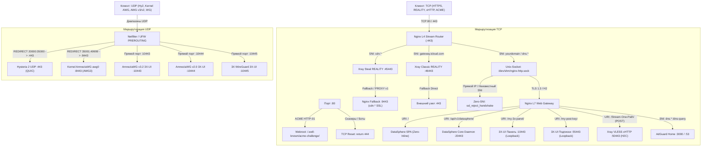

# 🛡️ Hardened Master Engine v3.5 DataSphere Ultra

Техническая документация узла сетевой маскировки и туннелирования трафика: OS Hardening, TCP BBR, Nginx L4 Stream Router, 3X-UI, Xray Core v26.7.28 (Pinned), VLESS xHTTP (Native H2C Stream-One / ML-KEM-768), VLESS REALITY (Steal-Oneself & Classic), Hysteria 2, AdGuard Home DoH, нативный сервер AmneziaWG в ядре Linux (DKMS Bare-Metal, профиль AWG3) и шлюз управления DataSphere SSO Hub.

---

## 📑 Содержание

1. [Сетевая топология и архитектура](#1-сетевая-топология-и-архитектура)
2. [Матрица сетевых сокетов и портов](#2-матрица-сетевых-сокетов-и-портов)
3. [Веб-маскировка и административный шлюз (DataSphere SSO)](#3-веб-маскировка-и-административный-шлюз-datasphere-sso)
4. [Параметры обфускации AmneziaWG (Профиль AWG3)](#4-параметры-обфускации-amneziawg-профиль-awg3)
5. [Системные требования и развёртывание](#5-системные-требования-и-развёртывание)
6. [Параметры мастера установки](#6-параметры-мастера-установки)
7. [Конфигурации инбаундов Xray-core, Nginx и ядра awg0](#7-конфигурации-инбаундов-xray-core-nginx-и-ядра-awg0)
8. [Клиентские подписки и логика назначения DNS](#8-клиентские-подписки-и-логика-назначения-dns)
9. [Интеграция приватного DoH AdGuard Home](#9-интеграция-приватного-doh-adguard-home)
10. [Диагностика, аудит и мониторинг](#10-диагностика-аудит-и-мониторинг)
11. [Резервное копирование и восстановление](#11-резервное-копирование-и-восстановление)

---

## 1. Сетевая топология и архитектура

Входящий трафик разделен на два изолированных контура:

1. **TCP-контур:**
   * **Порт 80:** Обслуживает исключительно верификацию доменов Certbot ACME HTTP-01 (`/.well-known/acme-challenge/`). Запросы без валидного заголовка `Host` и сканеры сбрасываются директивой `return 444`.
   * **Порт 443:** Модуль `ngx_stream_core_module` выполняет L4-маршрутизацию без расшифровки на основе `ssl_preread`:
     * Запросы с основным доменом (`yourdomain.online`) и DNS (`dns.yourdomain.online`) передаются во внутренний Unix-сокет `/dev/shm/nginx-http.sock`;
     * Запросы с поддоменом самокражи (`cdn.yourdomain.online`) направляются на локальный инбаунд Xray Steal REALITY (`127.0.0.1:45443`);
     * Запросы с внешним SNI (`gateway.icloud.com`) направляются на инбаунд Xray Classic REALITY (`127.0.0.1:46443`);
     * Обращения по прямому IP-адресу или неизвестным SNI сбрасываются директивой `ssl_reject_handshake on` (Zero-SNI Shield).
   * **Anti-Loop Fallback (Порт 9443):**
     * Инбаунд Steal REALITY пересылает не-REALITY запросы с заголовком PROXY protocol v1 (`xver: 1`) на виртуальный хост `02-steal-fallback.conf` (`127.0.0.1:9443`). Nginx отвечает легитимным TLS-сертификатом `cdn.*`, предотвращая сброс сессии (`errno 104`).

2. **UDP-контур (Скоростные пулы и туннели):**
   * **Hysteria 2:** Базовый порт `443/udp`. Пул динамического переключения портов `20000:35000/udp` перенаправляется через Netfilter PREROUTING на порт 443.
   * **Native Kernel AmneziaWG (awg0):** Базовый сокет ядра `8443/udp`. Скоростной пул `35001:49999/udp` перенаправляется через Netfilter PREROUTING на порт 8443.
   * **3X-UI UDP Stack:** Изолированные порты `10443/udp` (AWG v3.2), `10444/udp` (AWG v2.0 Legacy) и `10445/udp` (3X WireGuard).


```mermaid
flowchart TD
    ClientTCP["Клиент: TCP (HTTPS, REALITY, xHTTP, ACME)"] -->|TCP 80 / 443| NginxL4["Nginx L4 Stream Router (:443)"]
    ClientUDP["Клиент: UDP (Hy2, Kernel AWG, AWG v3/v2, WG)"] -->|Диапазоны UDP| Netfilter["Netfilter / UFW PREROUTING"]

    subgraph TCP_Pipeline ["Маршрутизация TCP"]
        Port80["Порт :80"] -->|ACME HTTP-01| ACME["Webroot: /.well-known/acme-challenge/"]
        Port80 -->|Сканеры / Боты| Drop444["TCP Reset: return 444"]

        NginxL4 -->|"SNI: cdn.*"| XraySteal["Xray Steal REALITY :45443"]
        NginxL4 -->|"SNI: gateway.icloud.com"| XrayClassic["Xray Classic REALITY :46443"]
        NginxL4 -->|"SNI: yourdomain / dns.*"| SockRAM["Unix-Socket: /dev/shm/nginx-http.sock"]

        XraySteal -->|"Fallback / PROXY v1"| VhostFallback["Nginx Fallback :9443 (cdn.* SSL)"]
        XrayClassic -->|"Fallback Direct"| ExtTarget["Внешний узел :443"]

        SockRAM -->|"Прямой IP / Неизвестный SNI"| ZeroSNI["Zero-SNI: ssl_reject_handshake"]
        SockRAM -->|"TLS 1.3 / H2"| NginxL7["Nginx L7 Web Gateway"]

        NginxL7 -->|"URI: /"| Decoy["DataSphere SPA (Zero-Inline)"]
        NginxL7 -->|"URI: /api/v1/datasphere/"| CoreDaemon["DataSphere Core Daemon :20443"]
        NginxL7 -->|"URI: /my-3x-panel/"| PanelUI["3X-UI Панель :10443 (Loopback)"]
        NginxL7 -->|"URI: /my-post-key/"| SubServer["3X-UI Подписки :55443 (Loopback)"]
        NginxL7 -->|"URI: /Stream-One-Path/ (POST)"| XrayXHTTP["Xray VLESS xHTTP :50443 (H2C)"]
        NginxL7 -->|"SNI: dns.* /dns-query"| AGH["AdGuard Home :3000 / :53"]
    end

    subgraph UDP_Pipeline ["Маршрутизация UDP"]
        Netfilter -->|"REDIRECT 20000:35000 -> :443"| XrayHy2["Hysteria 2 UDP :443 (QUIC)"]
        Netfilter -->|"REDIRECT 35001:49999 -> :8443"| KernelAWG["Kernel AmneziaWG awg0 :8443 (AWG3)"]
        Netfilter -->|"Прямой порт :10443"| AWG3["AmneziaWG v3.2 3X-UI :10443"]
        Netfilter -->|"Прямой порт :10444"| AWG2["AmneziaWG v2.0 3X-UI :10444"]
        Netfilter -->|"Прямой порт :10445"| WG3X["3X WireGuard 3X-UI :10445"]
    end
```

---

## 2. Матрица сетевых сокетов и портов

| Протокол / Служба | L4 Сокет | Область видимости | Назначение |
| :--- | :--- | :--- | :--- |
| **ACME Bootstrap** | `80/tcp` | Публичная | Валидация сертификатов Certbot HTTP-01 |
| **Nginx L4 Ingress** | `443/tcp` | Публичная | Единая входная точка TLS/TCP, роутинг по SNI |
| **Nginx Fallback** | `127.0.0.1:9443` | Изолированная | Терминация fallback-трафика Steal REALITY (`cdn.*`) |
| **DataSphere Core** | `127.0.0.1:20443`| Изолированная | Демон аутентификации SSO и API управления `awg0` |
| **3X-UI Web Panel** | `127.0.0.1:10443`| Изолированная | Интерфейс администратора 3X-UI |
| **3X-UI Subscriptions**| `127.0.0.1:55443`| Изолированная | Сервер выдачи клиентских подписок |
| **VLESS xHTTP** | `127.0.0.1:50443`| Изолированная | H2C бэкенд xHTTP Stream-One (ML-KEM-768) |
| **VLESS Steal REALITY**| `127.0.0.1:45443`| Изолированная | Инбаунд Steal-Oneself REALITY (PROXY proto v1) |
| **VLESS Classic REALITY**| `127.0.0.1:46443`| Изолированная | Инбаунд Classic REALITY (`gateway.icloud.com`) |
| **AdGuard Home Web** | `127.0.0.1:3000` | Изолированная | Веб-интерфейс управления AdGuard Home |
| **AdGuard Home DNS** | `127.0.0.1:53` / `10.9.0.1:53` | Изолированная | Локальный и туннельный DNS-резолвер |
| **Hysteria 2** | `443/udp` | Публичная | Базовый порт Hysteria 2 (QUIC) |
| **Hy2 Hopping Pool**| `20000:35000/udp`| Публичная | Пул динамической ротации портов Hysteria 2 |
| **Kernel AmneziaWG** | `8443/udp` | Публичная | Базовый сокет ядра `awg0` (DKMS Bare-Metal) |
| **AWG Native Pool** | `35001:49999/udp`| Публичная | Скоростной мультипортовый пул для `awg0` |
| **3X-UI AWG v3.2** | `10443/udp` | Публичная | User-space инбаунд AWG v3.2 (подсеть `10.8.1.0/24`) |
| **3X-UI AWG v2.0** | `10444/udp` | Публичная | User-space инбаунд AWG v2.0 (подсеть `10.8.2.0/24`) |
| **3X WireGuard** | `10445/udp` | Публичная | User-space инбаунд WireGuard (подсеть `10.8.3.0/24`) |

---

## 3. Веб-маскировка и административный шлюз (DataSphere SSO)

* **Фронтенд DataSphere Analytics Enterprise:**
  * Развернут в `/var/www/html`. Реализует SPA-маскировку платформы распределенной обработки данных.
  * Архитектура Zero-Inline: строгая политика Content Security Policy (`default-src 'self'`), отсутствие инлайн-скриптов в HTML, локальные ресурсы `/assets/css/datasphere.css` и `/assets/js/datasphere.js`.
  * В исходном коде и структуре файлов отсутствуют ключевые слова, ассоциируемые с прокси-серверами и VPN.
* **In-Memory SSO Gateway:**
  * Кнопка «Консоль» в заголовке сайта открывает модальное окно авторизации узла.
  * Запрос валидируется сервисом `datasphere-core.py` (`127.0.0.1:20443`). Пароль сверяется с базой данных 3X-UI алгоритмом `hmac.compare_digest` в константное время.
  * После авторизации клиентский JavaScript динамически рендерит в памяти браузера интерфейс **DataSphere Infrastructure Hub**:
    1. Прямой защищенный переход в панель 3X-UI;
    2. Панель управления пирами нативного ядра `awg0` (мониторинг трафика в реальном времени, добавление клиентов, выгрузка `.conf` и темный QR-код);
    3. Переход в веб-интерфейс AdGuard Home.
  * Разметка панели администратора не сохраняется на диске и не существует в DOM до успешного ответа сервера с кодом 200.

---

## 4. Параметры обфускации AmneziaWG (Профиль AWG3)

Для исключения сигнатурных блокировок ТСПУ и устранения коллизий длин пакетов в нативном ядре `awg0` и инбаундах 3X-UI применен профиль AWG3:

$$\mathbf{S1 + 56 \neq S2} \quad (72 + 56 = 128 \neq 56) \quad \text{— исключает совпадение длин Init (148B) и Response (92B)}$$
$$\mathbf{S3 \neq S2 + 28} \quad (32 \neq 56 + 28 = 84) \quad \text{— исключает коллизию Response (92B) и Cookie (64B)}$$
$$\mathbf{S1, S2, S3, S4 \ge 12} \quad \text{— обеспечивает извлечение 12-байтного ChaCha20 Nonce в AWG 3.x}$$

* **Спецификация параметров:**
  * `MTU = 1360` (с фиксацией `TCPMSS 1320` в таблице `*mangle`);
  * `Jc = 4`, `Jmin = 40`, `Jmax = 70` (рандомизация мусорных пакетов перед хэндшейком);
  * `S1 = 72`, `S2 = 56`, `S3 = 32`, `S4 = 16`;
  * `H1..H4`: Уникальные псевдослучайные 32-битные скаляры в диапазоне от $10^7$ до $2147483647$. Использование скаляров вместо диапазонов обеспечивает совместимость с маршрутизаторами KeeneticOS / OpenWrt и десктопными клиентами.
  * `AllowedIPs = 0.0.0.0/0`: Исключение `::/0` предотвращает сброс маршрутизации клиентами при отключенном IPv6 на сервере.

---

## 5. Системные требования и развёртывание

### Поддерживаемые операционные системы:
* Ubuntu 22.04 LTS (Jammy)
* Ubuntu 24.04 LTS (Noble)
* Ubuntu 26.04 LTS
* Debian 12 (Bookworm)
* Debian 13 (Trixie)

### Предварительные условия:
* Права суперпользователя `root`.
* DNS A-записи домена и поддоменов (`yourdomain.online`, `cdn.yourdomain.online`, `dns.yourdomain.online`) должны указывать на IP сервера.
* В панели Cloudflare для всех записей должен быть установлен режим **DNS-Only (Серое облако)**. Проксирование Cloudflare не поддерживает REALITY и L4 Stream.

### Команда запуска:
```bash
bash <(curl -fsSL https://raw.githubusercontent.com/Itman75/Nginx-L4-Stream-Router-Mask-for-3x-ui/main/install.sh)
```

> [!IMPORTANT]
> После завершения работы скрипта проверьте подключение по SSH в отдельном окне терминала и перезагрузите сервер командой `reboot` для активации модуля ядра `amneziawg`, правил Netfilter и оптимизаций `sysctl`.

---

## 6. Параметры мастера установки

| Параметр | Значение по умолчанию | Описание |
| :--- | :--- | :--- |
| **Режим установки** | `2` (при наличии БД) | `1` — Clean Install (полная переустановка); `2` — Safe Migration (сохранение клиентов, ключей, UUID, бэкап `.tar.gz`). |
| **Гео-профиль** | Автоопределение | Назначение системных DNS (Яндекс 77.88.8.8 для РФ / Cloudflare 1.1.1.1 для зарубежных узлов). |
| **Основной домен** | — | FQDN узла (например, `yourdomain.online`). |
| **Порт SSH** | Текущий активный | Опциональная смена порта, генерация ключей Ed25519, интеграция с Fail2ban. |
| **Пути и порты 3X-UI** | `:10443`, `:55443` | Внутренние сокеты панели и подписок на `127.0.0.1`. |
| **VLESS xHTTP** | `:50443`, `/Stream-One-Path/` | Внутренний сокет и секретный URI полнодуплексного стриминга. |
| **Steal REALITY** | `:45443` | Поддомен `cdn.yourdomain.online`, Fallback на Nginx `:9443` (PROXY proto v1). |
| **Classic REALITY** | `:46443` | Внешний SNI `gateway.icloud.com` (Apple) с замером задержки RTT. |
| **Hysteria 2** | `:443/udp` | Включение пула Port Hopping `20000:35000/udp`. |
| **Kernel AmneziaWG** | `:8443/udp` | Активация интерфейса ядра `awg0` и пула `35001:49999/udp`. |
| **3X-UI UDP Туннели** | `:10443`, `:10444`, `:10445` | Выделенные порты для AWG v3.2, AWG v2.0 и Native WireGuard. |
| **AdGuard Home DoH** | `dns.yourdomain.online` | Установка приватного DoH с авторизацией по токену `ClientID`. |
| **SSL Движок** | Certbot HTTP-01 | Нативный выпуск сертификатов Let's Encrypt через веб-рут `/var/www/html`. |

---

## 7. Конфигурации инбаундов Xray-core, Nginx и ядра awg0

<details>
<summary><b>1. VLESS xHTTP Stream-One + ML-KEM-768 (Внутренний порт :50443)</b></summary>

```json
{
  "listen": "127.0.0.1",
  "port": 50443,
  "protocol": "vless",
  "tag": "in-xhttp-stream",
  "settings": {
    "clients": [
      {
        "id": "КЛИЕНТСКИЙ_UUID",
        "flow": "xtls-rprx-vision",
        "email": "Test",
        "subId": "SUB_Test",
        "enable": true
      }
    ],
    "decryption": "mlkem768_СЕРВЕРНЫЙ_КЛЮЧ_ДЕШИФРОВАНИЯ",
    "encryption": "mlkem768_КЛИЕНТСКИЙ_КЛЮЧ_ШИФРОВАНИЯ"
  },
  "sniffing": {
    "enabled": true,
    "destOverride": ["http", "tls", "quic", "fakedns"]
  },
  "streamSettings": {
    "network": "xhttp",
    "xhttpSettings": {
      "path": "/Stream-One-Path/",
      "host": "yourdomain.online",
      "mode": "stream-one",
      "noSSEHeader": true,
      "xPaddingBytes": "120-1120",
      "xPaddingObfsMode": true,
      "xPaddingKey": "X-Amz-Meta-Trace",
      "xmux": {
        "maxConcurrency": "0",
        "maxConnections": "1-3",
        "cMaxReuseTimes": "300-600",
        "hMaxRequestTimes": "600-900",
        "hMaxReusableSecs": "1800-3000",
        "hKeepAlivePeriod": 600
      },
      "enableXmux": true
    },
    "security": "none",
    "externalProxy": [
      {
        "dest": "yourdomain.online",
        "port": 443,
        "forceTls": "tls",
        "sni": "yourdomain.online",
        "fingerprint": "firefox",
        "alpn": ["h2"],
        "remark": "VLESS xHTTP"
      }
    ]
  }
}
```
</details>

<details>
<summary><b>2. VLESS REALITY Steal-Oneself (Порт :45443, Fallback :9443, xver 1)</b></summary>

```json
{
  "listen": "127.0.0.1",
  "port": 45443,
  "protocol": "vless",
  "tag": "in-steal-reality",
  "settings": {
    "clients": [
      {
        "id": "КЛИЕНТСКИЙ_UUID",
        "flow": "xtls-rprx-vision",
        "email": "Test",
        "subId": "SUB_Test",
        "enable": true
      }
    ],
    "decryption": "none"
  },
  "sniffing": {
    "enabled": true,
    "destOverride": ["http", "tls", "quic", "fakedns"]
  },
  "streamSettings": {
    "network": "tcp",
    "security": "reality",
    "tcpSettings": {
      "acceptProxyProtocol": true,
      "header": { "type": "none" }
    },
    "realitySettings": {
      "show": false,
      "xver": 1,
      "target": "127.0.0.1:9443",
      "dest": "127.0.0.1:9443",
      "serverNames": ["cdn.yourdomain.online"],
      "privateKey": "СЕРВЕРНЫЙ_PRIVATE_KEY",
      "minClientVer": "1.0.0",
      "shortIds": ["SHORT_ID_HEX"],
      "settings": {
        "publicKey": "СЕРВЕРНЫЙ_PUBLIC_KEY",
        "fingerprint": "firefox",
        "serverName": "cdn.yourdomain.online",
        "spiderX": "/"
      }
    },
    "externalProxy": [
      {
        "dest": "yourdomain.online",
        "port": 443,
        "forceTls": "same",
        "sni": "cdn.yourdomain.online",
        "remark": "REALITY-443"
      }
    ]
  }
}
```
</details>

<details>
<summary><b>3. VLESS REALITY Classic External (Порт :46443, Target gateway.icloud.com:443)</b></summary>

```json
{
  "listen": "127.0.0.1",
  "port": 46443,
  "protocol": "vless",
  "tag": "in-classic-reality",
  "settings": {
    "clients": [
      {
        "id": "КЛИЕНТСКИЙ_UUID",
        "flow": "xtls-rprx-vision",
        "email": "Test",
        "subId": "SUB_Test",
        "enable": true
      }
    ],
    "decryption": "none"
  },
  "sniffing": {
    "enabled": true,
    "destOverride": ["http", "tls", "quic", "fakedns"]
  },
  "streamSettings": {
    "network": "tcp",
    "security": "reality",
    "tcpSettings": {
      "acceptProxyProtocol": true,
      "header": { "type": "none" }
    },
    "realitySettings": {
      "show": false,
      "xver": 0,
      "target": "gateway.icloud.com:443",
      "dest": "gateway.icloud.com:443",
      "serverNames": ["gateway.icloud.com"],
      "privateKey": "СЕРВЕРНЫЙ_PRIVATE_KEY",
      "minClientVer": "1.0.0",
      "shortIds": ["SHORT_ID_HEX"],
      "settings": {
        "publicKey": "СЕРВЕРНЫЙ_PUBLIC_KEY",
        "fingerprint": "firefox",
        "serverName": "gateway.icloud.com",
        "spiderX": "/"
      }
    },
    "externalProxy": [
      {
        "dest": "yourdomain.online",
        "port": 443,
        "forceTls": "same",
        "sni": "gateway.icloud.com",
        "remark": "REALITY-Classic"
      }
    ]
  }
}
```
</details>

<details>
<summary><b>4. Hysteria 2 UDP (Порт :443 + Hopping 20000:35000)</b></summary>

```json
{
  "listen": "0.0.0.0",
  "port": 443,
  "protocol": "hysteria",
  "tag": "in-hysteria2",
  "settings": {
    "clients": [
      {
        "id": "ПАРОЛЬ_КЛИЕНТА",
        "auth": "ПАРОЛЬ_КЛИЕНТА",
        "password": "ПАРОЛЬ_КЛИЕНТА",
        "email": "Test",
        "subId": "SUB_Test",
        "enable": true
      }
    ],
    "version": 2
  },
  "streamSettings": {
    "network": "hysteria",
    "hysteriaSettings": {
      "version": 2,
      "udpIdleTimeout": 60,
      "masquerade": { "type": "proxy", "url": "http://127.0.0.1:80" }
    },
    "security": "tls",
    "tlsSettings": {
      "serverName": "yourdomain.online",
      "minVersion": "1.3",
      "maxVersion": "1.3",
      "certificates": [
        {
          "certificateFile": "/etc/letsencrypt/live/yourdomain.online/fullchain.pem",
          "keyFile": "/etc/letsencrypt/live/yourdomain.online/privkey.pem"
        }
      ],
      "alpn": ["h3"]
    },
    "externalProxy": [
      {
        "dest": "yourdomain.online",
        "port": 443,
        "forceTls": "tls",
        "alpn": ["h3"],
        "remark": "Hysteria 2"
      }
    ]
  }
}
```
</details>

<details>
<summary><b>5. Нативный сервер AmneziaWG в ядре Linux (/etc/amnezia/amneziawg/awg0.conf)</b></summary>

```ini
[Interface]
Address = 10.9.0.1/24
ListenPort = 8443
PrivateKey = СЕРВЕРНЫЙ_PRIVATE_KEY
MTU = 1360
Jc = 4
Jmin = 40
Jmax = 70
S1 = 72
S2 = 56
S3 = 32
S4 = 16
H1 = 138104463
H2 = 465648900
H3 = 1351372787
H4 = 138617230
PostUp = iptables -A FORWARD -i awg0 -j ACCEPT; iptables -A FORWARD -o awg0 -m conntrack --ctstate RELATED,ESTABLISHED -j ACCEPT; iptables -t nat -A POSTROUTING -s 10.9.0.0/24 -o eth0 -j MASQUERADE; iptables -t nat -A PREROUTING -p udp --dport 35001:49999 -j REDIRECT --to-ports 8443
PostDown = iptables -D FORWARD -i awg0 -j ACCEPT; iptables -D FORWARD -o awg0 -m conntrack --ctstate RELATED,ESTABLISHED -j ACCEPT; iptables -t nat -D POSTROUTING -s 10.9.0.0/24 -o eth0 -j MASQUERADE; iptables -t nat -D PREROUTING -p udp --dport 35001:49999 -j REDIRECT --to-ports 8443

# --- Client: Test-Client ---
[Peer]
PublicKey = КЛИЕНТСКИЙ_PUBLIC_KEY
AllowedIPs = 10.9.0.2/32
```
</details>

---

## 8. Клиентские подписки и логика назначения DNS

Реквизиты доступа сохраняются в файле `/root/vpn_credentials.txt` (`chmod 600`).

### Точки подключения:
* **Адаптивная подписка (Base64 / Clash Auto-Detect):**  
  `https://yourdomain.online/my-post-key/SUB_Test`
* **Выделенная подписка JSON (Sing-box v1.10+):**  
  `https://yourdomain.online/my-post-key/sub-json/SUB_Test`
* **Выделенная подписка Clash / Mihomo YAML:**  
  `https://yourdomain.online/sub-clash/SUB_Test`
* **Клиентский файл нативного AmneziaWG (awg0):**  
  `/root/amneziawg-client.conf`
* **Клиентский файл 3X WireGuard:**  
  `/root/wireguard-client.conf`

### Клиентский профиль Native Kernel AmneziaWG (`/root/amneziawg-client.conf`):

```ini
[Interface]
Address = 10.9.0.2/32
PrivateKey = КЛИЕНТСКИЙ_PRIVATE_KEY
DNS = 10.9.0.1
MTU = 1360
Jc = 4
Jmin = 40
Jmax = 70
S1 = 72
S2 = 56
S3 = 32
S4 = 16
H1 = 138104463
H2 = 465648900
H3 = 1351372787
H4 = 138617230

[Peer]
PublicKey = СЕРВЕРНЫЙ_PUBLIC_KEY
Endpoint = yourdomain.online:8443
AllowedIPs = 0.0.0.0/0
PersistentKeepalive = 25
```

> [!NOTE]
> Клиент AmneziaWG может использовать в качестве `Endpoint` как базовый порт `:8443`, так и любой порт из пула `:35001-49999` (например, `yourdomain.online:39415`), трафик которого аппаратно перенаправляется ядром на порт 8443.

### Логика назначения параметра `DNS`:
1. **`DNS = 10.9.0.1` (При активном AdGuard Home):** Запросы маршрутизируются в защищенный туннель на локальный резолвер `10.9.0.1:53` с фильтрацией рекламы и шифрованием апстримов.
2. **`DNS = 1.1.1.1, 8.8.8.8` (Зарубежный профиль EU/World):** Прямые нейтральные резолверы Cloudflare и Google без локальной фильтрации.
3. **`DNS = 77.88.8.8, 77.88.8.1` (Российский профиль RU):** Резолверы Яндекс.DNS для исключения блокировок DNS на сетях ТСПУ внутри РФ.

---

## 9. Интеграция приватного DoH AdGuard Home

Сервис AdGuard Home изолирован на `127.0.0.1:3000` и обслуживает клиентов через шлюз Nginx с проверкой токена `ClientID` (`home-router`). Порт 53 закрыт от внешнего сканирования. Доверенные подсети туннелей: `10.8.1.0/24`, `10.8.2.0/24`, `10.8.3.0/24` и `10.9.0.0/24`.

* **Панель управления DNS:** `https://dns.yourdomain.online/`
* **DoH URL для роутеров:** `https://dns.yourdomain.online/dns-query/home-router`

### Настройка роутера Keenetic (KeeneticOS 3.x / 4.x):
1. **Сетевые правила** $\to$ **Интернет-фильтр** (вкладка «Серверы DNS»).
2. **Добавить сервер DNS:**
   * Адрес DNS (Bootstrap): `77.88.8.8` или `1.1.1.1` *(запрещено указывать IP собственного VPS во избежание цикла)*;
   * Протокол: `DNS-over-HTTPS (DoH)`;
   * URL-адрес: `https://dns.yourdomain.online/dns-query/home-router`;
   * SNI: `dns.yourdomain.online`.
3. Включить опцию «Игнорировать DNS провайдера».

### Настройка роутера OpenWrt (Пакет Podkop):
1. **Службы** $\to$ **Podkop** $\to$ **Настройки**.
2. В параметрах DNS указать:
   * Протокол: `DNS через HTTPS (DoH)`;
   * Строка подключения: `dns.yourdomain.online/dns-query/home-router`;
   * Bootstrap DNS: `77.88.8.8` или `1.1.1.1`.
3. Сохранить настройки и перезапустить службу Podkop.

---

## 10. Диагностика, аудит и мониторинг

Команды проверки состояния компонентов:

```bash
# 1. Проверка синтаксиса и статуса Nginx
nginx -t && systemctl status nginx --no-pager

# 2. Проверка изоляции L4 Unix-сокета в RAM
ls -la /dev/shm/nginx-http.sock

# 3. Верификация Zero-SNI (хэндшейк обязан сбрасываться при обращении по IP)
curl -Iv https://ВАШ_IP_СЕРВЕРА 2>&1 | grep -E 'SSL|handshake|alert|Connection reset'

# 4. Проверка изоляции VLESS xHTTP (строгий 404 на GET-запрос)
curl -Iv --http2 https://yourdomain.online/Stream-One-Path/

# 5. Инспекция интерфейса ядра AmneziaWG (awg0) и активных пиров
awg show awg0
ip link show awg0

# 6. Проверка статуса сервиса DataSphere Core SSO Gateway
systemctl status datasphere-core --no-pager
ss -tlnp | grep 20443

# 7. Проверка локальных слушающих сокетов
ss -tlnp | grep -E '10443|55443|50443|45443|46443|9443|3000|20443'

# 8. Проверка открытых UDP-сокетов туннелей
ss -ulnp | grep -E '443|8443|10443|10444|10445'

# 9. Проверка правил UFW, NAT и MSS Clamping
ufw status verbose
iptables -t nat -S PREROUTING
iptables -t nat -S POSTROUTING
iptables -t mangle -S FORWARD

# 10. Мониторинг прохождения трафика туннелей в реальном времени
tcpdump -ni any udp port 8443 -c 10
tcpdump -ni any udp port 443 -c 10
```

---

## 11. Резервное копирование и восстановление

### Создание горячего резервного архива:
```bash
python3 -c "import sqlite3; c=sqlite3.connect('/etc/x-ui/x-ui.db'); c.execute('PRAGMA wal_checkpoint(FULL);'); c.close()" 2>/dev/null || true

tar -czvf /root/backup_vpn_$(date +%F_%H%M%S).tar.gz \
  /etc/x-ui \
  /etc/nginx \
  /etc/letsencrypt \
  /etc/ssl/acme \
  /etc/amnezia/amneziawg \
  /opt/AdGuardHome/AdGuardHome.yaml \
  /var/www/html \
  /etc/ufw/before.rules \
  /root/amneziawg-client.conf \
  /root/wireguard-client.conf 2>/dev/null || true
chmod 600 /root/backup_vpn_*.tar.gz
```

### Восстановление системы из архива:
```bash
systemctl stop x-ui nginx AdGuardHome datasphere-core awg-quick@awg0 2>/dev/null || true
rm -f /etc/x-ui/x-ui.db-wal /etc/x-ui/x-ui.db-shm
tar -xzvf /root/backup_vpn_АРХИВ.tar.gz -C /
nginx -t && systemctl start nginx x-ui AdGuardHome datasphere-core awg-quick@awg0
```

---

## 📄 Лицензия

Проект распространяется на условиях лицензии **MIT**. Полный текст лицензии доступен в файле [LICENSE](LICENSE).
