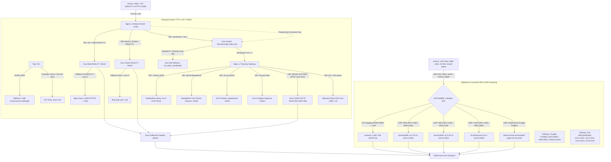

# 🛡️ Hardened Master Engine v3.3.4 Universal (Single-IP Ultra Enhanced)
### Монолитный узел сетевой маскировки и туннелирования: OS Hardening + BBR + Nginx L4/L7 Stream Router + 3X-UI Enterprise + Xray v26.7.28 Pinned + VLESS xHTTP (Native H2C Stream-One) + ML-KEM-768 + Multi-Port REALITY + Stub 11443 + Zero-SNI Shield + Zero-Leak DataSphere SSO Hub + 5x UDP Stack (Native Kernel AWG awg0 Golden Standard) + AdGuard Home DoH

[](https://ubuntu.com)
[](https://github.com/XTLS/Xray-core)
[](https://github.com/mhsanaei/3x-ui)
[](LICENSE)
[](LICENSE)

<p align="center">
  <b>Высокопроизводительный инженерный комплекс автоматизированного развёртывания скрытной, устойчивой к цензуре и криптографически защищенной прокси-инфраструктуры.</b><br>
  Реализует архитектуру Single-IP Ultra Enhanced, сквозную постквантовую криптографию ML-KEM-768, L4/L7 мультиплексирование Nginx Mainline, защиту от активного зондирования Zero-SNI Shield, выделенный Stub 11443 с PROXY protocol v1 для Steal-Oneself, скрытый административный шлюз Zero-Leak DataSphere SSO Hub, нативный сервер AmneziaWG в ядре Linux (Bare-Metal DKMS, MTU 1360 / MSS 1320 Golden Standard) и приватный DNS AdGuard Home со Split-маршрутизацией.
</p>

---

## 📑 Содержание

1. [Архитектура и сетевая топология Single-IP Ultra Enhanced](#-архитектура-и-сетевая-топология-single-ip-ultra-enhanced)
2. [Концепция нулевой видимости: Zero-Leak DataSphere SSO Hub](#-концепция-нулевой-видимости-zero-leak-datasphere-sso-hub)
3. [Ключевые функциональные и защитные возможности](#-ключевые-функциональные-и-защитные-возможности)
4. [Системные требования и быстрый старт](#-системные-требования-и-быстрый-старт)
5. [Параметры мастера установки](#-параметры-мастера-установки)
6. [Боевые конфигурации инбаундов Xray-core и ядра awg0](#-боевые-конфигурации-инбаундов-xray-core-и-ядра-awg0)
7. [Подписки и клиентская экосистема](#-подписки-и-клиентская-экосистема)
8. [Приватный DNS AdGuard Home (DoH) со Split-маршрутизацией](#-приватный-dns-adguard-home-doh-со-split-маршрутизацией)
9. [Инженерный аудит, валидация и мониторинг](#-инженерный-аудит-валидация-и-мониторинг)
10. [Резервное копирование, восстановление и откат](#-резервное-копирование-восстановление-и-откат)
11. [Лицензия](#-лицензия)

---

## 🏗️ Архитектура и сетевая топология Single-IP Ultra Enhanced

Инфраструктура узла оптимизирована для работы на единственном публичном IPv4-адресе с сохранением изоляции между легитимными веб-сервисами, административными интерфейсами и скоростными туннелями:

* **Входная группа TCP (Порты 80 и 443):**
  * **Порт :80:** Обслуживает исключительно подтверждение прав владения доменом Certbot ACME HTTP-01 (`/.well-known/acme-challenge/`). Любые сторонние сканеры уязвимостей, боты и запросы без валидного заголовка `Host` сбрасываются мгновенным TCP-разрывом соединения (`return 444;`).
  * **Порт :443:** Терминируется модулем `ngx_stream_core_module` (L4 Stream Router). Анализ SNI без расшифровки трафика (`ssl_preread on;`) распределяет потоки:
    * Основной домен (`yourdomain.online`) и DNS (`dns.yourdomain.online`) направляются в высокоскоростной Unix-сокет оперативной памяти `/dev/shm/nginx-http.sock`;
    * Поддомены маскировки Steal-Oneself (`cdn.yourdomain.online`) направляются на локальный инбаунд Xray Steal REALITY `:45443`;
    * Внешние доверенные SNI (`tbank.ru`) направляются на инбаунд Xray Classic REALITY `:46443`;
    * При недоступности Xray срабатывает директива `backup`, перенаправляющая трафик обратно в Nginx для предотвращения раскрытия сбоя прокси.
* **Изолированный контур ядра (RAM Unix-Socket & Localhost):**
  * Сервер на сокете `/dev/shm/nginx-http.sock` и локальном порту `:9443` применяет директиву `ssl_reject_handshake on;` для любых обращений по прямому IP-адресу или неизвестным доменам (**Zero-SNI Shield**).
  * Авторизованный TLS-трафик основного домена обрабатывается L7-движком Nginx:
    * Корень `/` отдает статическую маскировку корпоративной аналитической платформы DataSphere Analytics Enterprise v3.14 (строгий CSP без инлайн-скриптов);
    * Путь `/api/v1/datasphere/` проксируется на многопоточный Python-демон управления `datasphere-core.service` (`127.0.0.1:20443`);
    * Секретный URI панели управления проксируется на 3X-UI (`127.0.0.1:10443`);
    * Секретные URI подписок направляются на встроенный сервер подписок (`127.0.0.1:55443`);
    * Секретный путь VLESS xHTTP обслуживается в полнодуплексном режиме HTTP/2 Stream-One на инбаунде Xray (`127.0.0.1:50443`).
* **Пятимодульный UDP-стек (Multi-Tunnel UDP Engine):**
  * **Hysteria 2:** Транспорт QUIC на порту `:443/udp` с опциональным пулом ротации **Port Hopping 20000-50000/udp** в таблице `*nat` UFW.
  * **AmneziaWG v3.2 (User-Space 3X-UI):** Порт `:8443/udp`, подсеть `10.8.1.0/24`, Golden MTU 1360 / MSS 1320.
  * **AmneziaWG v2.0 Legacy (User-Space 3X-UI):** Порт `:8444/udp`, подсеть `10.8.2.0/24`, MTU 1360 / MSS 1320 (совместимость с KeeneticOS и OpenWrt).
  * **3X WireGuard (User-Space 3X-UI):** Порт `:47443/udp`, подсеть `10.8.3.0/24`, MTU 1420 / MSS 1380.
  * **Native Kernel AmneziaWG (Bare-Metal):** Выделенный интерфейс ядра **`awg0`** на порту `:51820/udp`, подсеть `10.9.0.0/24`, Golden MTU 1360 / MSS 1320, параметры обфускации $J_c=4, J_{min}=40, J_{max}=70, S_1=64, S_2=56, S_3=32, S_4=16$.


```mermaid
flowchart TD
    ClientTCP["Клиент: Web / TCP (REALITY, xHTTP, ACME)"] -->|TCP 80 / 443| NginxL4["Nginx L4 Stream Router (:443)"]
    ClientUDP["Клиент: UDP (Hy2, AWG v3/v2, 3X-WG, Kernel AWG)"] -->|UDP 443 / 8443 / 8444 / 47443 / 51820| UFW_Engine{"UFW Netfilter / Mangle / NAT"}

    subgraph SG_TCP ["Маршрутизация TCP и L4/L7 Shield"]
        direction TB
        Port80["Порт :80"] -->|ACME Token| ACME_Root["Webroot: /.well-known/acme-challenge/"]
        Port80 -->|Сканеры / Боты / Пустой Host| Drop444["TCP Drop: return 444"]

        NginxL4 -->|"SNI: cdn.* (Steal REALITY)"| XraySteal["Xray Steal REALITY :45443"]
        NginxL4 -->|"SNI: tbank.ru (Classic REALITY)"| XrayClassic["Xray Classic REALITY :46443"]
        NginxL4 -->|"SNI: yourdomain / dns.*"| SockRAM["Unix-Socket: /dev/shm/nginx-http.sock"]
        NginxL4 -.->|"Резерв при остановке Xray"| SockRAM

        XraySteal -->|"Fallback не-REALITY / xver=1"| Stub11443["Nginx Stub :11443 (HTTP/2 -> 404)"]
        XrayClassic -->|"Fallback Direct / xver=0"| ExtTarget["Внешний узел :443"]

        SockRAM -->|"Прямой IP / Неизвестный SNI"| ZeroSNI["Zero-SNI Defense: ssl_reject_handshake"]
        SockRAM -->|"Валидный TLS 1.3"| NginxL7["Nginx L7 Security Gateway"]

        NginxL7 -->|"URI: / (Decoy SPA)"| DecoySite["DataSphere Decoy v3.14 (CSP Strict)"]
        NginxL7 -->|"URI: /api/v1/datasphere/"| CoreDaemon["DataSphere Core Python Daemon :20443"]
        NginxL7 -->|"URI: /my-3x-panel/"| PanelUI["3X-UI Панель управления :10443"]
        NginxL7 -->|"URI: /my-post-key/"| SubServer["3X-UI Сервер подписок :55443"]
        NginxL7 -->|"URI: /Stream-One-Path/ (POST Only H2C)"| XrayXHTTP["Xray VLESS xHTTP :50443 (ML-KEM-768)"]
        NginxL7 -->|"SNI: dns.* /dns-query"| AGH["AdGuard Home DoH Core :3000 / :53"]
    end

    subgraph SG_UDP ["Обработка туннелей UDP и MSS Clamping"]
        direction TB
        UFW_Engine -->|"Port Hopping 20000-50000 -> :443"| XrayHy2["Hysteria 2 UDP :443 (ALPN h3)"]
        UFW_Engine -->|"UDP :8443 (MTU 1360 / MSS 1320)"| AWG3["AmneziaWG v3.2 3X-UI (10.8.1.0/24)"]
        UFW_Engine -->|"UDP :8444 (MTU 1360 / MSS 1320)"| AWG2["AmneziaWG v2.0 3X-UI (10.8.2.0/24)"]
        UFW_Engine -->|"UDP :47443 (MTU 1420 / MSS 1380)"| WG3X["3X WireGuard 3X-UI (10.8.3.0/24)"]
        UFW_Engine -->|"UDP :51820 (Kernel awg0 Golden)"| AWGKernel["Native Kernel AmneziaWG awg0 (10.9.0.0/24)"]
        
        MangleTable["Таблица *mangle: TCPMSS 1320 (AWG) / 1380 (WG) / clamp-to-pmtu"]
        NatTable["Таблица *nat: MASQUERADE 10.8.1.0/24, 10.8.2.0/24, 10.8.3.0/24, 10.9.0.0/24"]
    end

    XraySteal & XrayClassic & XrayXHTTP --> OutboundFreedom["Xray Outbound Freedom (direct)"]
    OutboundFreedom & AWG3 & AWG2 & WG3X & AWGKernel & XrayHy2 --> Internet["Публичная сеть Интернет"]
```

---

## 👁️ Концепция нулевой видимости: Zero-Leak DataSphere SSO Hub

Классические прокси-серверы компрометируют себя наличием открытых веб-панелей, стандартных страниц входа, специфических favicon или ссылок на подписки в коде страниц. В архитектуре **Hardened Master Engine v3.3.4** реализована концепция абсолютной нулевой видимости (**Strict Zero-Knowledge Frontend**):

### 1. Что фиксирует сетевой цензор, сканер ТСПУ или случайный посетитель
* При обращении по адресу `https://yourdomain.online/` браузер загружает аутентичный портал распределенной аналитической среды **DataSphere Analytics Enterprise v3.14**.
* Отображаются динамические графики телеметрии Anycast-сети, пропускная способность магистралей (до 99.8 Gbps), задержка ядра (< 1.2 ms), сертификация криптографических стандартов (ML-KEM-768, SOC 2 Type II).
* **В исходном коде страницы (`index.html`), скриптах (`datasphere.js`) и стилях (`datasphere.css`) физически отсутствуют ключевые слова**: `vpn`, `3x-ui`, `xui`, `xray`, `vless`, `reality`, `wireguard`, `amnezia`, `hysteria`, `proxy`, `adguard`.
* Нажатие на элементы интерфейса («Консоль», «Подключить узел») вызывает стандартную модальную форму корпоративной авторизации вычислительного узла (поля: *Идентификатор узла / Email* и *API Token / Ключ*).
* При отправке произвольных данных бэкенд возвращает реалистичный JSON с кодом `401 Unauthorized`:
  ```json
  {"status": "error", "code": 401, "error": "Недействительный токен кластера или ключ авторизации узла. Доступ запрещен."}
  ```

### 2. Скрытый провал в сервис (Strict Zero-Knowledge RAM Execution)
Управляющие интерфейсы материализуются в браузере исключительно в оперативной памяти после прохождения криптографической аутентификации:

* **Этап 1 (Запрос доступа):** Администратор открывает сайт-маскировку, нажимает кнопку «Консоль» и вводит учетные данные администратора панели 3X-UI.
* **Этап 2 (Бэкенд-верификация):** Запрос передается через Nginx на внутренний сервис `datasphere-core.service` (`127.0.0.1:20443`). Демон сверяет данные с SQLite базой `/etc/x-ui/x-ui.db`. Сравнение логина и хэша пароля производится в константное время алгоритмом `hmac.compare_digest` (с поддержкой `bcrypt`), что исключает атаки по времени (Side-Channel Timing Attacks). При неудаче применяется задержка `time.sleep(0.5)`.
* **Этап 3 (Генерация сессии и сборка DOM в RAM):** При успешной проверке бэкенд генерирует криптографический сессионный токен высокой энтропии (`secrets.token_hex(24)`) со временем жизни 3600 секунд. Клиентский JavaScript получает JSON со статусом `200 OK` и **на лету перестраивает DOM-дерево модального окна в оперативной памяти**, отрисовывая шлюз **DataSphere Infrastructure Hub**:
  1. **Авторизация Панели 3X-UI** — прямой переход к защищенной веб-панели управления ядрами Xray;
  2. **Нативный сервер AmneziaWG** — вызов встроенной панели управления ядром `awg0` (мониторинг активных пиров, объемов трафика Rx/Tx, добавление новых клиентов с автовыделением IP из подсети `10.9.0.0/24`, генерация SVG QR-кодов и выгрузка файлов `.conf`);
  3. **AdGuard Home DNS** — прямой переход к панели управления приватным DNS-over-HTTPS резолвером (если модуль активирован).

До момента ввода мастер-пароля разметки центра управления не существует ни на диске веб-сервера, ни в DOM-дереве браузера — её невозможно обнаружить аудитом исходного кода (Ctrl+U) или статическими веб-краулерами.

---

## ⚙️ Ключевые функциональные и защитные возможности

* **Нативный сервер AmneziaWG в ядре Linux (Bare-Metal DKMS):**  
  Сборка официального модуля ядра `amneziawg` под целевое ядро ОС. Интерфейс `awg0` функционирует вне пространств пользователя с минимальными задержками прерываний. Применен эталонный профиль обфускации: $J_c=4, J_{min}=40, J_{max}=70, S_1=64, S_2=56, S_3=32, S_4=16$, рандомизированные $H_1..H_4$. Реестр пиров сохраняется в атомарном файле `/etc/amnezia/amneziawg/clients.json` с защитой от параллельной записи через `fcntl.flock`.
* **Zero-SNI Defense Shield (`ssl_reject_handshake on`):**  
  Дефолтный сервер Nginx немедленно сбрасывает TCP-сессию на этапе TLS-хэндшейка при обращениях по IP-адресу или чужим доменным именам. Сетевые сканеры (Censys, Shodan, Masscan) не могут извлечь сертификат сервера.
* **Выделенный Stub 11443 для Steal-Oneself REALITY:**  
  Инбаунд Steal REALITY сбрасывает неавторизованные запросы с заголовком PROXY protocol v1 (`xver: 1`) на внутренний виртуальный хост `127.0.0.1:11443` (HTTP/2, безусловный возврат 404). Это полностью исключает зацикливание маршрутизации (Routing Loops) и сбои сопоставления ALPN.
* **VLESS xHTTP (Native H2C Stream-One) + ML-KEM-768:**  
  * Полнодуплексный двусторонний стриминг по нативному HTTP/2 (`proxy_http_version 2;`) с полным отключением буферизации (`proxy_buffering off; proxy_request_buffering off;`).
  * Жесткая изоляция методов: URI xHTTP принимает строго `POST`-запросы, любые `GET`-запросы отдают `404 Not Found`.
  * Интеграция постквантового алгоритма асимметричного шифрования **ML-KEM-768 (Kyber768)** через утилиту `xray vlessenc`.
  * Рандомизированный паддинг `xPaddingBytes: 120-1120`, маскировка служебных заголовков под сервисы AWS (`X-Amz-Meta-Trace`) и мультиплексирование сессий `enableXmux: true`.
* **Эталонный MTU/MSS инжиниринг (Golden Standard):**  
  * AmneziaWG (ядро `awg0` и инбаунды 3X-UI): `MTU 1360` с принудительной фиксацией `TCPMSS 1320` в таблице `*mangle` UFW.
  * 3X WireGuard: `MTU 1420` с фиксацией `TCPMSS 1380`.
  * Глобальное правило `--clamp-mss-to-pmtu` для устранения Path MTU Discovery Blackhole на мобильных сетях.
* **Zero-Log Policy (Анти-форензика):**  
  * Полное отключение журналов клиентского доступа в веб-шлюзе (`access_log off;` в Nginx);
  * Ограничение логирования системных служб оперативной памятью (`Storage=volatile`, `RuntimeMaxUse=64M` в `systemd-journald`). Сетевые метаданные клиентов не сбрасываются на постоянный диск.
* **Комплекс L7-фильтрации WAF v6.0.4 Hardened:**  
  Двухуровневая система карт `$badbot_raw` и `$is_scan_attempt` отсекает сканеры уязвимостей (Nuclei, Gobuster, SQLmap), агрессивные AI-краулеры (GPTBot, ClaudeBot, Perplexity) и попытки поиска файлов конфигураций (`.env`, `.git`) с возвратом `404/444`.
* **Синхронизация схемы ALPN в базе SQLite (3X-UI Zod Validator Fix):**  
  Автоматический пре-миграционный скрипт нормализует параметры `externalProxy.alpn` во всех записях SQLite, трансформируя строковые значения в строгие JSON-массивы `["h2"]` / `["h3"]`, что исключает сбои валидатора схем Zod при обновлении панели 3X-UI.

---

## 🚀 Системные требования и быстрый старт

### Требования к серверу:
* **Архитектура процессора:** x86_64 (amd64) или ARM64 (aarch64).
* **Операционная система:** Ubuntu 22.04 / 24.04 / 26.04 LTS или Debian 12 / 13.
* **Минимальные ресурсы:** 1 vCPU, 1 ГБ RAM (при 512 МБ обязателен swap от 1 ГБ), 10 ГБ на SSD/NVMe.
* **Сеть:** 1 публичный статический IPv4-адрес.
* **DNS-конфигурация:** Основной домен и поддомены (`yourdomain.online`, `cdn.yourdomain.online`, `dns.yourdomain.online`) должны иметь A-записи, указывающие на IP сервера.

> [!CAUTION]
> ### ⚠️ Настройка DNS в панели Cloudflare
> Все A-записи домена и поддоменов в личном кабинете Cloudflare должны находиться строго в режиме **DNS-Only (Серое облако)**.  
> Проксирование через Cloudflare (Оранжевое облако) блокирует протоколы семейства REALITY, нарушает мультиплексирование L4 Stream и полностью отсекает входящий UDP-трафик.

### Запуск развёртывания:

Выполните команду на сервере под учетной записью суперпользователя `root`:

```bash
bash <(curl -fsSL https://raw.githubusercontent.com/ВАШ_АККАУНТ/РЕПОЗИТОРИЙ/main/install.sh)
```

Резервная команда через `wget`:

```bash
wget -qO- https://raw.githubusercontent.com/ВАШ_АККАУНТ/РЕПОЗИТОРИЙ/main/install.sh | bash
```

---

## 📋 Параметры мастера установки

| Этап | Конфигурируемый параметр | Значение по умолчанию | Назначение и логика работы |
| :--- | :--- | :--- | :--- |
| **Режим** | Режим работы установщика | `2` (при наличии БД) | `1` — Clean Install (сброс базы, новые ключи, генерация клиента Test); `2` — Safe Migration (100% сохранение клиентов, ключей, UUID, горячий бэкап `.tar.gz` и авто-патч схемы ALPN). |
| **0** | Сетевой гео-профиль | Автодетект (RU / World) | Оптимизация резолверов (Яндекс DNS 77.88.8.8 vs Cloudflare 1.1.1.1) и зеркал загрузки бинарников. |
| **1** | Основной домен | — | Базовый FQDN сертифицируемой зоны (например, `yourdomain.online`). |
| **1** | Email Let's Encrypt | Enter (без почты) | Регистрационный адрес Certbot для выпуска и продления SSL-сертификатов. |
| **2** | Системный Hardening | `y` | Тюнинг TCP BBR, FQ, somaxconn 65535, loose `rp_filter=2`, отключение IPv6 во избежание утечек. |
| **2** | Порт службы SSH | Текущий порт | Смена порта SSH, блокировка входа по паролю, генерация ключей Ed25519, интеграция с Fail2ban. |
| **3** | Внутренние порты и пути 3X-UI | `:10443`, `:55443` | Изоляция веб-панели и сервера выдачи подписок на сокетах loopback. |
| **3** | VLESS xHTTP порт и URI | `:50443`, `/Stream-One-Path/` | Локальный порт xHTTP и закрытый путь двустороннего H2C-стриминга. |
| **4** | Steal-Oneself REALITY | `y` (порт `:45443`) | Поддомен `cdn.yourdomain.online`, Anti-Loop Fallback на Stub `:11443` (PROXY proto v1). |
| **4** | Classic External REALITY | `y` (порт `:46443`) | Внешние SNI с автоматическим замером задержки RTT и TLS 1.3 до целевых серверов. |
| **6** | Hysteria 2 (UDP) | `y` (`:443`, Режим 2) | QUIC-транспорт. Режим 2 активирует Dynamic Port Hopping (`20000:50000/udp`). |
| **6** | AmneziaWG v3.2 / v2.0 (3X-UI) | `y` (`:8443` / `:8444`) | User-Space инбаунды 3X-UI: v3.2 для ПК/смартфонов, Legacy v2.0 для маршрутизаторов. |
| **6** | 3X WireGuard (3X-UI) | `y` (порт `:47443`) | Чистый WireGuard RFC (`MTU 1420`, MSS Clamping 1380, подсеть `10.8.3.0/24`). |
| **6** | Native Kernel AmneziaWG | `y` (порт `:51820`) | Bare-Metal сервер на модуле ядра Linux (`awg0`, подсеть `10.9.0.0/24`, Golden MTU 1360). |
| **7** | Приватный AdGuard Home DoH | `y` (`dns.yourdomain.online`)| Локальный DoH со сплит-DNS и роутерной авторизацией через токен `ClientID`. |
| **8** | Метод выпуска SSL | `1` | `1` — Нативный Certbot HTTP-01 (APT); `2` — acme.sh DNS-01 (Cloudflare API). |

> [!IMPORTANT]
> **Обязательные действия после завершения развёртывания:**  
> 1. Откройте **новое отдельное окно терминала** и проверьте доступ к серверу по SSH на установленном порту.  
> 2. В исходной консоли выполните команду: `reboot`.  
> После перезагрузки сетевые оптимизации sysctl, модуль ядра `amneziawg`, трансляция NAT/Mangle в UFW и фоновые демоны активируются в стабильном режиме.

---

## 📄 Боевые конфигурации инбаундов Xray-core и ядра awg0

<details>
<summary><b>1. VLESS xHTTP Stream-One + ML-KEM-768 + XMUX + Vision (Порт :50443)</b></summary>

```json
{
  "listen": "127.0.0.1",
  "port": 50443,
  "protocol": "vless",
  "tag": "in-xhttp-stream",
  "settings": {
    "clients": [
      {
        "id": "ВАШ_UUID",
        "flow": "xtls-rprx-vision",
        "email": "Test",
        "subId": "SUB_Test",
        "enable": true
      }
    ],
    "decryption": "mlkem768_СЕРВЕРНЫЙ_КЛЮЧ_ДЕШИФРОВАНИЯ",
    "encryption": "mlkem768_КЛИЕНТСКИЙ_КЛЮЧ_ШИФРОВАНИЯ"
  },
  "sniffing": {
    "enabled": true,
    "destOverride": ["http", "tls", "quic", "fakedns"]
  },
  "streamSettings": {
    "network": "xhttp",
    "xhttpSettings": {
      "path": "/Stream-One-Path/",
      "host": "yourdomain.online",
      "mode": "stream-one",
      "noSSEHeader": true,
      "xPaddingBytes": "120-1120",
      "xPaddingObfsMode": true,
      "xPaddingKey": "X-Amz-Meta-Trace",
      "xmux": {
        "maxConcurrency": "0",
        "maxConnections": "1-3",
        "cMaxReuseTimes": "300-600",
        "hMaxRequestTimes": "600-900",
        "hMaxReusableSecs": "1800-3000",
        "hKeepAlivePeriod": 600
      },
      "enableXmux": true
    },
    "security": "none",
    "externalProxy": [
      {
        "dest": "yourdomain.online",
        "port": 443,
        "forceTls": "tls",
        "sni": "yourdomain.online",
        "fingerprint": "firefox",
        "alpn": ["h2"],
        "remark": "VLESS xHTTP"
      }
    ]
  }
}
```
</details>

<details>
<summary><b>2. VLESS REALITY Steal-Oneself (Порт :45443, Stub Target :11443, xver 1)</b></summary>

```json
{
  "listen": "127.0.0.1",
  "port": 45443,
  "protocol": "vless",
  "tag": "in-steal-reality",
  "settings": {
    "clients": [
      {
        "id": "ВАШ_UUID",
        "flow": "xtls-rprx-vision",
        "email": "Test",
        "subId": "SUB_Test",
        "enable": true
      }
    ],
    "decryption": "none"
  },
  "sniffing": {
    "enabled": true,
    "destOverride": ["http", "tls", "quic", "fakedns"]
  },
  "streamSettings": {
    "network": "tcp",
    "security": "reality",
    "tcpSettings": {
      "acceptProxyProtocol": true,
      "header": { "type": "none" }
    },
    "realitySettings": {
      "show": false,
      "xver": 1,
      "target": "127.0.0.1:11443",
      "dest": "127.0.0.1:11443",
      "serverNames": ["cdn.yourdomain.online"],
      "privateKey": "ВАШ_PRIVATE_KEY",
      "minClientVer": "1.0.0",
      "maxClientVer": "",
      "maxTimediff": 0,
      "shortIds": ["ВАШ_16_HEX_SHORT_ID"],
      "settings": {
        "publicKey": "ВАШ_PUBLIC_KEY",
        "fingerprint": "firefox",
        "serverName": "",
        "spiderX": "/"
      }
    },
    "externalProxy": [
      {
        "dest": "yourdomain.online",
        "port": 443,
        "forceTls": "same",
        "remark": "REALITY-443"
      }
    ]
  }
}
```
</details>

<details>
<summary><b>3. VLESS REALITY Classic External (Порт :46443, Target:443, xver 0)</b></summary>

```json
{
  "listen": "127.0.0.1",
  "port": 46443,
  "protocol": "vless",
  "tag": "in-classic-reality",
  "settings": {
    "clients": [
      {
        "id": "ВАШ_UUID",
        "flow": "xtls-rprx-vision",
        "email": "Test",
        "subId": "SUB_Test",
        "enable": true
      }
    ],
    "decryption": "none"
  },
  "sniffing": {
    "enabled": true,
    "destOverride": ["http", "tls", "quic", "fakedns"]
  },
  "streamSettings": {
    "network": "tcp",
    "security": "reality",
    "tcpSettings": {
      "acceptProxyProtocol": true,
      "header": { "type": "none" }
    },
    "realitySettings": {
      "show": false,
      "xver": 0,
      "target": "tbank.ru:443",
      "dest": "tbank.ru:443",
      "serverNames": ["tbank.ru"],
      "privateKey": "ВАШ_PRIVATE_KEY",
      "minClientVer": "1.0.0",
      "maxClientVer": "",
      "maxTimediff": 0,
      "shortIds": ["ВАШ_16_HEX_SHORT_ID"],
      "settings": {
        "publicKey": "ВАШ_PUBLIC_KEY",
        "fingerprint": "firefox",
        "serverName": "",
        "spiderX": "/"
      }
    },
    "externalProxy": [
      {
        "dest": "yourdomain.online",
        "port": 443,
        "forceTls": "same",
        "remark": "REALITY-Classic"
      }
    ]
  }
}
```
</details>

<details>
<summary><b>4. Hysteria 2 UDP (Порт :443 + Port Hopping 20000-50000)</b></summary>

```json
{
  "listen": "0.0.0.0",
  "port": 443,
  "protocol": "hysteria",
  "tag": "in-hysteria2",
  "settings": {
    "clients": [
      {
        "id": "ВАШ_ПАРОЛЬ_АВТОРИЗАЦИИ",
        "auth": "ВАШ_ПАРОЛЬ_АВТОРИЗАЦИИ",
        "password": "ВАШ_ПАРОЛЬ_АВТОРИЗАЦИИ",
        "email": "Test",
        "subId": "SUB_Test",
        "enable": true
      }
    ],
    "version": 2
  },
  "sniffing": {
    "enabled": true,
    "destOverride": ["http", "tls", "quic", "fakedns"]
  },
  "streamSettings": {
    "network": "hysteria",
    "hysteriaSettings": {
      "version": 2,
      "udpIdleTimeout": 60,
      "masquerade": { "type": "proxy", "url": "http://127.0.0.1:80" }
    },
    "security": "tls",
    "tlsSettings": {
      "serverName": "yourdomain.online",
      "minVersion": "1.3",
      "maxVersion": "1.3",
      "certificates": [
        {
          "certificateFile": "/etc/letsencrypt/live/yourdomain.online/fullchain.pem",
          "keyFile": "/etc/letsencrypt/live/yourdomain.online/privkey.pem"
        }
      ],
      "alpn": ["h3"]
    },
    "externalProxy": [
      {
        "dest": "yourdomain.online",
        "port": 443,
        "forceTls": "tls",
        "alpn": ["h3"],
        "remark": "Hysteria 2"
      }
    ]
  }
}
```
</details>

<details>
<summary><b>5. AmneziaWG v3.2 в 3X-UI (Подсеть 10.8.1.0/24, Golden MTU 1360 — Порт :8443)</b></summary>

```json
{
  "listen": "0.0.0.0",
  "port": 8443,
  "protocol": "amneziawg",
  "tag": "in-8443-udp",
  "settings": {
    "clients": [
      {
        "privateKey": "CLIENT_PRIVATE_KEY",
        "publicKey": "CLIENT_PUBLIC_KEY",
        "allowedIPs": ["10.8.1.3/32"],
        "email": "Test",
        "subId": "SUB_Test",
        "enable": true
      }
    ],
    "server": {
      "contentPaddingAddition": "0",
      "disableCookies": true,
      "h1": "СЛУЧАЙНОЕ_ЧИСЛО_H1",
      "h2": "СЛУЧАЙНОЕ_ЧИСЛО_H2",
      "h3": "СЛУЧАЙНОЕ_ЧИСЛО_H3",
      "h4": "СЛУЧАЙНОЕ_ЧИСЛО_H4",
      "jc": 4,
      "jmin": 40,
      "jmax": 70,
      "s1": 64,
      "s2": 56,
      "s3": 32,
      "s4": 16,
      "mtu": 1360,
      "primaryDns": "77.88.8.8",
      "secondaryDns": "77.88.8.1",
      "privateKey": "SERVER_PRIVATE_KEY",
      "publicKey": "SERVER_PUBLIC_KEY",
      "randomTrailers": false,
      "rejectAfterTime": "600-900",
      "rekeyAfterTime": "300-500",
      "rekeyTimeout": "10-15",
      "keepaliveTimeout": "20-25",
      "maxHandshakeAttempts": "10-15",
      "subnetCidr": 24,
      "subnetIp": "10.8.1.0"
    }
  },
  "streamSettings": {
    "externalProxy": [
      {
        "dest": "yourdomain.online",
        "port": 8443,
        "remark": "AmneziaWG v3"
      }
    ]
  }
}
```
</details>

<details>
<summary><b>6. 3X WireGuard в 3X-UI (Подсеть 10.8.3.0/24, MTU 1420 — Порт :47443)</b></summary>

```json
{
  "listen": "0.0.0.0",
  "port": 47443,
  "protocol": "wireguard",
  "tag": "in-wireguard-native",
  "settings": {
    "secretKey": "SERVER_PRIVATE_KEY",
    "peers": [
      {
        "publicKey": "CLIENT_PUBLIC_KEY",
        "allowedIPs": ["10.8.3.3/32"],
        "keepAlive": 25,
        "email": "Test"
      }
    ],
    "mtu": 1420,
    "noKernelTun": false
  },
  "streamSettings": {
    "externalProxy": [
      {
        "dest": "yourdomain.online",
        "port": 47443,
        "remark": "3X WireGuard"
      }
    ]
  }
}
```
</details>

<details>
<summary><b>7. Конфигурация нативного сервера AmneziaWG в ядре Linux (/etc/amnezia/amneziawg/awg0.conf)</b></summary>

```ini
[Interface]
Address = 10.9.0.1/24
ListenPort = 51820
PrivateKey = SERVER_PRIVATE_KEY
MTU = 1360
Jc = 4
Jmin = 40
Jmax = 70
S1 = 64
S2 = 56
S3 = 32
S4 = 16
H1 = 149419586
H2 = 878791997
H3 = 1251051976
H4 = 1657628296

# --- Client: Test-Client ---
[Peer]
PublicKey = CLIENT_PUBLIC_KEY
AllowedIPs = 10.9.0.2/32
```
</details>

<details>
<summary><b>8. Исходящий шлюз Freedom (direct) со Split-маршрутизацией 4 подсетей</b></summary>

```json
{
  "tag": "direct",
  "protocol": "freedom",
  "settings": {
    "finalRules": [
      { "action": "allow", "ip": ["127.0.0.1"], "port": "53" },
      { "action": "allow", "ip": ["10.8.1.0/24", "10.8.2.0/24", "10.8.3.0/24", "10.9.0.0/24"] },
      { "action": "block", "ip": ["geoip:private"] },
      { "action": "allow" }
    ]
  },
  "streamSettings": {
    "sockopt": { "domainStrategy": "ForceIPv4" }
  }
}
```
</details>

---

## 📱 Подписки и клиентская экосистема

Все авторизационные реквизиты доступа фиксируются в файле `/root/vpn_credentials.txt` (`chmod 600`).  
В режиме чистой установки генерируются следующие ссылки и конфигурационные файлы:

* **Адаптивная подписка (Base64 / Clash Auto-Detect):**  
  `https://yourdomain.online/my-post-key/SUB_Test`  
  *(Клиенты Clash/Mihomo автоматически получают YAML, v2rayNG/Happ — Base64, браузеры — веб-интерфейс с QR-кодами).*
* **Выделенная подписка JSON (Sing-box v1.10+ / SFI / Karing):**  
  `https://yourdomain.online/my-post-key/sub-json/SUB_Test`
* **Выделенная подписка Clash / Mihomo YAML:**  
  `https://yourdomain.online/sub-clash/SUB_Test`
* **Клиентский файл нативного AmneziaWG (Kernel awg0):**  
  `/root/amneziawg-client.conf` (Golden MTU 1360 / MSS 1320).
* **Клиентский файл 3X WireGuard:**  
  `/root/wireguard-client.conf` (MTU 1420 / MSS 1380).

### Клиентский профиль Native Kernel AmneziaWG (`/root/amneziawg-client.conf`):

```ini
[Interface]
Address = 10.9.0.2/32
PrivateKey = CLIENT_PRIVATE_KEY
DNS = 77.88.8.8
MTU = 1360
Jc = 4
Jmin = 40
Jmax = 70
S1 = 64
S2 = 56
S3 = 32
S4 = 16
H1 = 149419586
H2 = 878791997
H3 = 1251051976
H4 = 1657628296

[Peer]
PublicKey = SERVER_PUBLIC_KEY
Endpoint = yourdomain.online:51820
AllowedIPs = 0.0.0.0/0, ::/0
PersistentKeepalive = 25
```

### Матрица совместимости клиентских платформ:

| Клиентское ПО | Платформа | VLESS xHTTP (ML-KEM-768) | VLESS REALITY (Vision) | Hysteria 2 (UDP) | AmneziaWG v3.2 / v2.0 | Native Kernel AWG (awg0) | 3X WireGuard |
| :--- | :--- | :---: | :---: | :---: | :---: | :---: | :---: |
| **Amnezia VPN Client** | Win, macOS, Linux, Android, iOS | ❌ | ❌ | ❌ | ✔️ | ✔️ (Импорт .conf / QR) | ✔️ |
| **Happ Proxy / Streisand** | iOS, iPadOS | ✔️ | ✔️ | ✔️ | ✔️ | ✔️ | ✔️ |
| **v2rayNG / v2rayN** | Android, Windows | ✔️ | ✔️ | ✔️ | ❌ | ❌ | ❌ |
| **NekoBox (NB+)** | Android | ❌ | ✔️ | ✔️ | ✔️ | ✔️ | ✔️ |
| **Clash Verge Rev / Mihomo**| Desktop | ✔️ | ✔️ | ✔️ | ❌ | ❌ | ❌ |
| **KeeneticOS / OpenWrt Podkop**| Маршрутизаторы | ✔️ | ✔️ | ✔️ | ✔️ (v2.0) | ✔️ (.conf) | ✔️ (.conf) |
| **Официальный WireGuard Client**| Все платформы | ❌ | ❌ | ❌ | ❌ | ❌ | ✔️ (.conf) |

---

## 🌐 Приватный DNS AdGuard Home (DoH) со Split-маршрутизацией

Локальный резолвер AdGuard Home изолирован на интерфейсе `127.0.0.1:3000` и обслуживает запросы DoH через шлюз Nginx с проверкой токена `ClientID` (по умолчанию `home-router`). Прямой порт 53 снаружи заблокирован. Пул доверенных подсетей охватывает все туннели: `10.8.1.0/24`, `10.8.2.0/24`, `10.8.3.0/24` и `10.9.0.0/24`.

* **Панель управления DNS:** `https://dns.yourdomain.online/`
* **DoH URL для роутеров и клиентов:** `https://dns.yourdomain.online/dns-query/home-router`

### 1. Настройка маршрутизаторов Keenetic (KeeneticOS 3.x / 4.x):
1. Перейдите в раздел **«Сетевые правила»** -> **«Интернет-фильтр»** (вкладка «Серверы DNS»).
2. Нажмите **«Добавить сервер DNS»**:
   * **Адрес DNS (Bootstrap):** `77.88.8.8` или `1.1.1.1` *(внимание: запрещено вводить публичный IP VPS во избежание циклического запроса)*;
   * **Протокол:** `DNS-over-HTTPS (DoH)`;
   * **URL-адрес:** `https://dns.yourdomain.online/dns-query/home-router`;
   * **SNI:** `dns.yourdomain.online`.
3. Активируйте опцию **«Игнорировать DNS провайдера»** и сохраните конфигурацию.

### 2. Настройка маршрутизаторов OpenWrt (Пакет Podkop):
1. В интерфейсе LuCI откройте **«Службы»** -> **«Podkop»** -> **«Настройки»**.
2. В блоке параметров DNS укажите:
   * **Протокол:** `DNS через HTTPS (DoH)`;
   * **Строка подключения:** `dns.yourdomain.online/dns-query/home-router` (без схемы `https://`);
   * **Bootstrap DNS сервер:** `77.88.8.8` или `1.1.1.1`.
3. Сохраните конфигурацию и перезапустите службу Podkop.

---

## 🩺 Инженерный аудит, валидация и мониторинг

Комплексный чек-лист проверки состояния компонентов системы после развёртывания:

```bash
# 1. Проверка синтаксиса и статуса Nginx Mainline L4/L7
nginx -t && systemctl status nginx --no-pager

# 2. Инспекция наличия и прав L4 Unix-сокета в оперативной памяти (RAM)
ls -la /dev/shm/nginx-http.sock

# 3. Верификация Zero-SNI Defense (TLS-хэндшейк обязан сбрасываться при прямом запросе по IP)
curl -Iv https://ВАШ_IP_СЕРВЕРА 2>&1 | grep -E 'SSL|handshake|alert|Connection reset'

# 4. Проверка изоляции VLESS xHTTP (строгий возврат 404 Not Found на GET-запрос)
curl -Iv --http2 https://yourdomain.online/Stream-One-Path/

# 5. Проверка ответа Stub 11443 для Steal-Oneself (должен отдавать HTTP/2 404)
curl -Iv --http2 http://127.0.0.1:11443 2>&1 | head -n 15

# 6. Инспекция состояния нативного модуля ядра AmneziaWG (awg0)
awg show awg0
ip link show awg0

# 7. Проверка статуса фонового сервиса DataSphere Core SSO Gateway
systemctl status datasphere-core --no-pager
ss -tlnp | grep 20443

# 8. Проверка локальных слушающих сокетов внутренних служб
ss -tlnp | grep -E '10443|55443|50443|45443|46443|11443|9443|3000|20443'

# 9. Инспекция UDP-сокетов (Hysteria 2, WireGuard, AmneziaWG v2/v3, Kernel awg0)
ss -ulnp | grep -E '443|8443|8444|47443|51820'

# 10. Проверка правил UFW, NAT-трансляции 4 подсетей и MSS Clamping
ufw status verbose
iptables -t nat -L POSTROUTING -n -v
iptables -t mangle -L FORWARD -n -v

# 11. Проверка версии зафиксированного бинарника Xray Core
/usr/local/x-ui/bin/xray version

# 12. Инспекция записей БД 3X-UI SQLite
sqlite3 /etc/x-ui/x-ui.db "SELECT id, remark, port, protocol, enable FROM inbounds;"
sqlite3 /etc/x-ui/x-ui.db "SELECT id, email, sub_id, enable FROM clients;"
sqlite3 /etc/x-ui/x-ui.db "SELECT id, remark, address, port, path, alpn FROM hosts;"
```

---

## 💾 Резервное копирование, восстановление и откат

### Создание атомарного горячего бэкапа:
```bash
# Принудительный сброс WAL-журнала базы SQLite перед архивацией
python3 -c "import sqlite3; c=sqlite3.connect('/etc/x-ui/x-ui.db'); c.execute('PRAGMA wal_checkpoint(FULL);'); c.close()" 2>/dev/null || true

# Формирование защищенного архива
tar -czvf /root/backup_vpn_$(date +%F_%H%M%S).tar.gz \
  /etc/x-ui \
  /etc/nginx \
  /etc/letsencrypt \
  /etc/ssl/acme \
  /etc/amnezia/amneziawg \
  /opt/AdGuardHome/AdGuardHome.yaml \
  /var/www/html \
  /etc/ufw/before.rules \
  /root/amneziawg-client.conf \
  /root/wireguard-client.conf 2>/dev/null || true
chmod 600 /root/backup_vpn_*.tar.gz
```

### Восстановление системы из архива:
```bash
systemctl stop x-ui nginx AdGuardHome datasphere-core awg-quick@awg0 2>/dev/null || true
rm -f /etc/x-ui/x-ui.db-wal /etc/x-ui/x-ui.db-shm
tar -xzvf /root/backup_vpn_ГГГГ-ММ-ДД_ЧЧММСС.tar.gz -C /
nginx -t && systemctl start nginx x-ui AdGuardHome datasphere-core awg-quick@awg0
```

---

## 📄 Лицензия

Проект распространяется на условиях открытой лицензии **MIT**. Полный юридический текст изложен в файле [LICENSE](LICENSE).
